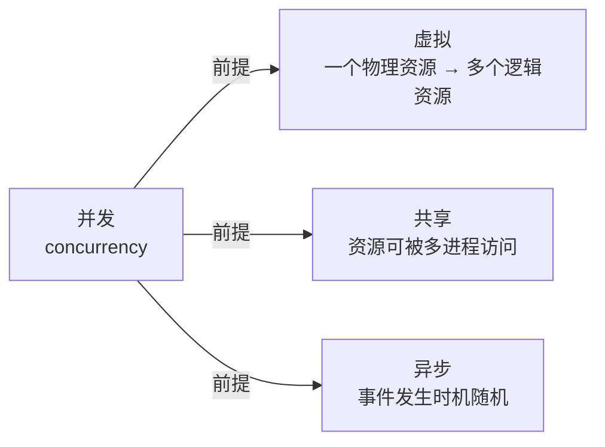
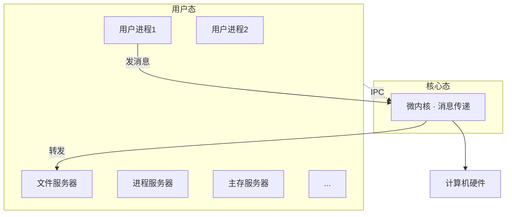
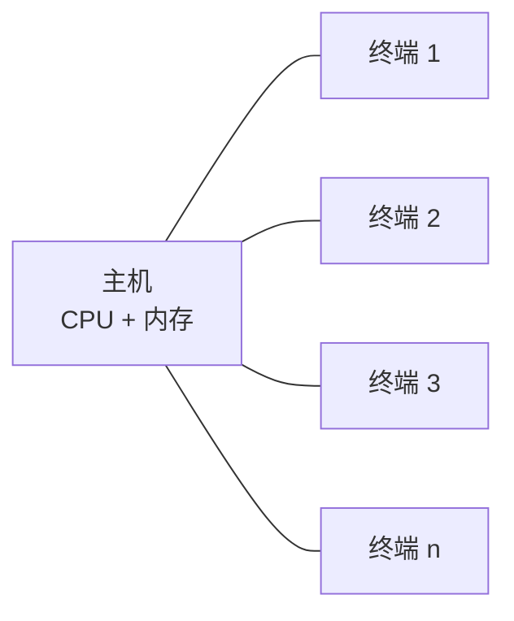
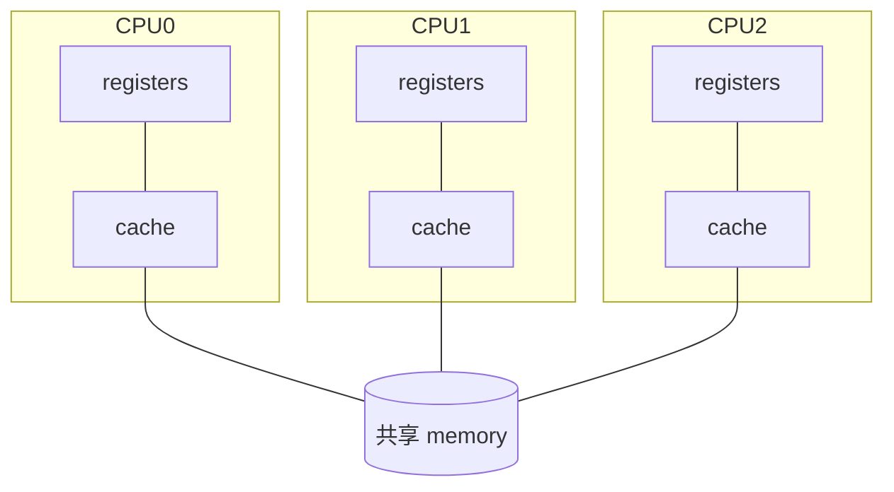

# 第 1 章 操作系统概论 — 整理笔记

> 来源: `index.md`（167 张幻灯片）+ 1 张保留图（CPU 利用率曲线）+ 4 张 mermaid 化结构图
> 配图说明: 装饰漫画/重复结构图已删除；关键关系图（四特性、微内核分层、SMP、分时主机-终端）转 mermaid 直接渲染；CPU 利用率曲线（数值密集）保留为 jpg
> 阅读对象: 北邮电信本科生，零基础学 OS，目标过期末 + 求职面试
> 写作风格: 先日常类比 → 再技术定义 → 关键考点用 ** 突出

---

## 1.1 什么是操作系统

### 一句话定义

**操作系统 (Operating System, OS) 是管理系统资源、控制程序执行、改善人机界面、提供各种服务，并为用户方便有效地使用计算机提供良好运行环境的一种系统软件。**

教材里另一种更短的说法：**用以控制和管理系统资源、方便用户使用计算机的程序集合。**

### 日常类比

把一台计算机想象成一座大型餐厅：
- **硬件** = 厨房的灶台、冰箱、刀具（物理设备，本身不会自己工作）
- **应用软件** = 各种菜品订单（QQ、微信、Chrome、游戏，都是"想完成的事"）
- **操作系统** = 餐厅经理 + 服务员

订单不会直接冲进后厨抢锅；它通过经理（OS）登记、排队、分配灶台。**用户和应用从不直接碰硬件，必须经过 OS 这个中介。**

### OS 在计算机系统中的位置（重要分层图）

```
            用户
             ↓
        应用软件     （Chrome / 微信 / Word ...）
             ↓
        操作系统     ← 三类接口对上：系统调用 / 命令 / GUI
             ↓
        计算机硬件   （CPU / 内存 / 键盘 / 鼠标 / 磁盘）
```

OS 是**承上启下**的双向桥梁：
- **对上** 给应用提供统一接口，让应用不用关心硬件细节（比如不管你是固态盘还是机械盘，应用统一调 `write()`）
- **对下** 统一管硬件资源，让多个应用能"和平共享"同一套硬件而不打架

### OS 的四种观察视角（考点：背熟这四个观点）

教材给出**四个观察视角**，考试常出"OS 的作用 / 角色"简答题：

| 观点 | 角色 | 强调什么 |
|------|------|---------|
| **服务用户观点** | 用户接口 + 公共服务程序 | 提供友善人机接口 |
| **进程交互观点** | 进程执行的控制者和协调者 | 管并发、互斥、通信、死锁 |
| **系统实现观点** | 扩展机 / 虚拟机 | 把裸机改造成更好用的机器 |
| **资源管理观点** | 资源管理者和控制者 | 分配/回收/调度软硬件资源 |

也可以记成两个角色：**对内是"管理员"**（管资源、调度进程），**对外是"服务员"**（给用户和应用提供接口）。

---

## 1.2 OS 的功能与特性

### 五大功能（考点）

| 功能 | 主要内容 |
|------|---------|
| **处理器管理** | 进程控制/同步/互斥/通信/死锁、线程管理、调度（高/中/低三级） |
| **存储管理** | 内存分配、地址转换、存储保护、内存共享、存储扩充（虚存） |
| **设备管理** | 中断处理、缓冲区管理、设备独立性、分配回收、设备驱动调度、虚拟设备 |
| **文件管理** | 文件的逻辑/物理组织、存取方法、目录管理、共享和安全、存储空间管理 |
| **网络与通信管理** | 网络资源管理、数据通信、应用服务、网络管理 |

第 2~6 章会一一展开。

### 四大特性（考点 + 关系图）

幻灯片 51 用一张图说明四特性的因果关系：**并发是前提**，由它派生出虚拟、共享、异步三性。



逐个看：

**1. 并发性 (concurrency)** — 两个或两个以上事件**在同一时间间隔内**发生

- 类比：你左手写作业、右手吃饭、嘴里聊天，三件事在"这 5 分钟内"都在推进——这就是并发
- **并发 ≠ 并行**：并行 (parallelism) 要求**同一时刻**真的同时发生（必须有多个物理 CPU）；并发只要求**时间间隔重叠**，单 CPU 通过时间片切换也能做到
- **关系**：并行是并发的特例，并发是并行的扩展。"并行的一定并发，并发的不一定并行"

**2. 共享性 (sharing)** — 系统资源被多个并发进程使用

- 两种共享方式：
  - **透明共享** (资源隔离 + 授权访问) — 如内存：每个进程感觉独占，互不干扰
  - **显式共享** (临界资源 + 独占访问) — 如打印机：同一时刻只能一个进程用
- 衍生问题：分配策略、信息保护、存取控制（第 3、4、5 章细讲）

**3. 虚拟性 (virtual)** — 一个物理实体映射成若干逻辑实体（分时或分空间）

- CPU → 每个进程的"虚处理器"（感觉自己独占 CPU）
- 内存 → "虚拟存储器"（每个进程独占自己的地址空间）
- 屏幕 → 多窗口 / 虚拟终端

**4. 异步性 (asynchrony)** — 事件发生时机具有随机性

- 进程何时执行、何时暂停、推进速度多快——都是随机的
- 中断、异常、用户按键、I/O 完成，时机都不可预测
- OS 的核心任务：**捕捉任何随机事件，正确处理任何事件序列**，否则产生"与时间有关的错误"（time-related bug，难调试）

---

## 1.3 资源管理三大技术：复用 / 虚拟 / 抽象

这是 1.1 节的**精髓**，几乎每年考。三种技术解决的问题不同：

| 技术 | 解决什么问题 | 一句话理解 |
|------|------------|-----------|
| **复用 (multiplexing)** | 物理资源数量不足 | 让有限的资源被多个进程**共享**使用 |
| **虚拟 (virtualization)** | 数量不足 + 提高服务能力 | "无中生有"——物理 1 个变逻辑 N 个 |
| **抽象 (abstraction)** | 系统复杂、易用性差 | 屏蔽细节，提供简单统一的接口 |

### (1) 复用：分割共享一个物理资源

两种子方式：

- **空分复用** — 把资源切成多个小单元，每个进程拿一块。例：内存被切成多个分区，A 进程占 100~200MB，B 占 200~400MB
- **时分复用** — 资源整体作为分配单元，按时间段轮流占用：
  - **时分独占式**：进程拿到后用完一个完整周期才释放（如磁带——你要从头读到尾）
  - **时分共享式**：进程随时可能被剥夺（如 CPU、磁盘——典型的抢占式）

类比：教室是空分复用（每个人占一张桌子）；公共篮球场是时分复用（你打半小时下场让别人）。

### (2) 虚拟：创造"虚假但好用"的资源

通过转化、模拟、整合，把物理上的 1 个资源变成逻辑上的 N 个（或反过来）。

**虚拟 vs 复用 的区别**：复用是切分**已存在的物理资源**；虚拟是**虚构假想的同类资源**。

经典例子：
- **虚拟设备** (SPOOLing 假脱机)
- **虚拟主存** (你写程序感觉有 4GB 内存，实际可能只有 2GB 物理内存 + 用磁盘当替补)
- **虚拟文件**
- **虚拟屏幕** (终端复用 / 多窗口)
- **虚拟信道**

### (3) 抽象：屏蔽硬件细节，提供易用接口

**抽象不解决"数量"问题，解决"易用性"问题。** 通过软件包装硬件，让用户/程序员不需要懂硬件就能用。

类比：你按手机相机 App 的拍照按钮，背后涉及 CMOS 传感器、ISP 处理、文件存储——但你只看到一个"咔嚓"按钮。这就是抽象。

**单级抽象例子**：把磁盘 I/O 包装成一个 `write()` 系统调用：

```c
void write(char *block, int length, int device, int track, int sector) {
    load(block, length, device);   // 装载数据
    seek(device, track);            // 定位磁道
    out(device, sector);            // 输出到扇区
}
```

调用者不再关心磁道、扇区，只要给数据、长度、设备号。

**多级抽象例子**：`fprintf()` 调用 `write()`，再往下一层调底层 I/O——一层层往上，每层都更易用：

```c
int fprintf(fileID, "%s", datum) {
    ...
    write(...);   // 内部还是依赖底层 write
    ...
}
```

### (4) 三技术的组合使用

实际系统对一类资源往往**多种技术叠加**：

| 资源 | 用了哪些技术 |
|------|-------------|
| 虚拟设备 | 抽象 + 虚拟 |
| 虚拟主存 | 复用 + 虚拟 |
| 虚拟屏幕 | 抽象 + 虚拟 |

### OS 三大基础抽象（考点）

OS 提供**三个最核心的抽象**，分别对应三种硬件资源：

| 抽象 | 对应硬件 | 给用户的"假象" |
|------|---------|--------------|
| **进程 (process)** | 处理器 (CPU) | 每个进程感觉自己独享一颗 CPU |
| **虚存 (virtual memory)** | 内存 + 外存 | 每个进程感觉自己独占一段连续的大地址空间，不受物理内存限制 |
| **文件 (file)** | 磁盘等设备 | 用户感觉信息总能方便地存取，不用关心字节落在哪个物理块 |

**包含关系**（重要，幻灯片 40）：从外向内逐层封装

```
   文件抽象 ⊃ 虚存抽象 ⊃ 进程抽象
   (设备)     (内存)     (CPU)
```

文件依赖虚存（要把数据加载到地址空间），虚存依赖进程（要在某个执行上下文里访问）。

### OS 虚拟机概念

**OS 虚拟机 = 裸机 + 操作系统**

裸机只懂机器语言，几乎不可用。加上 OS 后，程序员看到一台"功能更强、更易用、更安全"的机器，包含：

- 虚处理器
- 虚拟内存
- 虚拟辅存（磁盘抽象）
- 虚拟设备

**注意**：这里说的"OS 虚拟机"是**抽象层级上的虚拟机**（OS 提供给应用的"放大版机器"），跟"VMware/VirtualBox 那种虚拟机软件"不是一回事——后者是 1.5 节会讲的"虚拟机结构 OS"。

---

## 1.4 OS 接口：用户怎么和 OS 打交道

OS 提供**两类接口**：

| 接口 | 调用者 | 实现形式 |
|------|--------|---------|
| **程序接口** | 运行中的程序 | **系统调用 (system call)** 集合 |
| **操作接口** | 用户（人） | 操作命令、GUI、作业控制语言 (JCL) |

### 1.4.1 程序接口与系统调用

**核心定义**：内核提供一系列实现预定功能的**内核函数**，通过一组叫**系统调用**的接口暴露给用户程序。

**关键性质**：**系统调用是应用程序获得 OS 服务的唯一途径**。

类比：去政府办事大厅，你不能自己跑进档案库翻文件（直接碰硬件），必须通过窗口（系统调用）让工作人员（内核）替你办——这样既保证安全（内核检查权限），又屏蔽细节（你不用懂内部流程）。

**系统调用的作用**：
1. 内核基于权限和规则裁决资源访问 → 安全性
2. 封装资源抽象、提供一致接口 → 编程方便、避免错误

**系统调用 vs 函数调用**（考点）：

| 维度 | 函数调用 | 系统调用 |
|------|---------|---------|
| 调用形式 | 跳转语句含目标地址 | 仅给"功能号"，按号查表 |
| 代码位置 | 调用者和被调用者在同一程序 | 处理代码在 OS 中（用户程序之外） |
| 提供方 | 编译系统提供，可变 | OS 提供，固定不变 |
| 是否进核态 | 否 | **是**（要从用户态陷入核心态） |

**系统调用处理流程**（流程图记忆）：

```
用户程序
  ↓ 陷入指令 (trap)
[系统调用陷入机构]
  ↓ 保护 CPU 现场
  ↓ 取系统功能号
  ↓ 查入口地址表 → 找到对应处理子程序
[系统调用处理子程序]
  ↓ 完成具体功能
  ↓ 恢复现场
  ↓ 返回用户程序
```

**参数传递三种方式**：
1. **直接参数**：访管/陷入指令自带参数
2. **寄存器传递**：CPU 通用寄存器存参数
3. **专用堆栈区域**：在主存开辟堆栈传参

**API、库函数、系统调用的关系**：
- 应用程序很少直接用系统调用（太底层、复杂、跨平台困难）
- 通常用**库函数**（如 C 标准库 `printf`），库函数内部再调系统调用
- **POSIX 标准** 规定了系统调用接口，让应用可移植

调用链：`应用 → 库函数 (API) → 系统调用 → 内核`

**系统调用分类**（6 类）：进程/作业管理、文件操作、设备管理、主存管理、信息维护、进程通信。

### 1.4.2 操作接口与系统程序

**作业控制方式**两种：

| 方式 | 谁来控制 | 实现 |
|------|---------|------|
| **联机作业控制** | 用户实时交互 | 操作控制命令（命令行/批命令/图形化） |
| **脱机作业控制** | 提前写好作业说明书 | **作业控制语言 JCL** (Job Control Language) |

JCL 时代典型例子（IBM 370）——一段作业说明书像这样：

```
// HAROLD JOB,WILSON,MSGLEVEL=(2,0),PRTY=6,CLASS=B
// COMP EXEC PGM=IEYFORT          ← 用 Fortran 编译器
// SYSPRINT DD SYSOUT=A
// SYSIN DD*
   <SOURCE PROGRAM CARDS>          ← 源代码
/*
// GO EXEC PGM=FORTLINK            ← 链接
...
```

整本"作业说明书 + 源代码 + 数据"打包提交，系统自动跑完。**这是早期批处理的工作方式**——后面 1.6 节会讲为什么需要这个。

**命令解释程序** (shell)：
- 简单命令：shell 自带处理代码（如 `cd`、`echo`）
- 复杂命令：调用独立的"实用程序"文件（如 `ls`、`grep`）
- Linux shell 就是典型例子

**系统程序 / 实用程序 (Utilities)**：不属于内核，但必不可少。分类：
- 文件管理（cp、rm、ls）
- 状态信息（ps、top）
- 程序设计语言支持（gcc、make）
- 程序装入和执行支持（ld、strip）
- 通信（ssh、wget）
- 其它工具

---

## 1.5 OS 结构：单内核 vs 微内核

### 1.5.1 四种 OS 结构

教材列出 4 种结构，但**只有单内核和微内核是当今主流**，前两种主要是历史：

| 结构 | 特点 | 典型代表 |
|------|------|---------|
| 1. 单体（整体）式 | 早期 OS，模块间随意调用 | 早期 DOS |
| 2. 层次式 | 严格分层，下层服务上层 | THE 系统 |
| 3. 虚拟机结构 | 在硬件上加 VM 层，每个 VM 跑独立 OS | IBM CP/CMS, VMware |
| 4. **微内核** | 内核只留最基本功能，其他放用户态 | Mach, QNX, HarmonyOS |

### 1.5.2 内核 (kernel) 概念

**定义**：内核是作为可信软件，提供进程并发执行的基本功能和基本操作的一组程序模块。

**性质**：
- 驻留**内核空间**，运行于**核心态**（特权模式）
- 能访问全部硬件和主存
- **唯一能执行特权指令的程序**

**内核功能（4 项，考点）**：
1. 中断处理
2. 时钟管理
3. 短程调度（短程 = 进程级调度）
4. 原语管理（不可中断的操作）

**内核属性（4 条）**：
- 由中断驱动
- 不可抢占（执行时不会被其他进程打断，但可被中断打断）
- 可在屏蔽中断状态下执行
- 可使用特权指令

**内核分两类**：单内核（宏内核） vs 微内核——这是重点。

### 1.5.3 单内核（宏内核, Monolithic Kernel）

把内核**整体作为一个大进程**，所有内核服务运行在**同一个地址空间**，互相**直接调用函数**。

代表：**Linux**、传统 UNIX。

涵盖范围广：进程管理、内存管理、文件系统、设备驱动、网络协议栈——**全部塞进内核**。

| 优点 | 缺点 |
|------|------|
| 模块间直接调函数，**效率高** | 模块间无隔离，一个 bug 可能拖垮整个内核 |
| 实现简单 | 稳定性差、可维护性差 |

类比：一家什么都自己做的小餐馆，老板兼厨师兼服务员，效率高但一个人病了店就关了。

### 1.5.4 微内核 (Microkernel)

内核**只保留最基本功能**：进程调度、内存管理、IPC（进程间通信）。

文件系统、设备驱动、网络协议栈——**全部移到用户态**，作为"服务进程"运行。进程间通过**消息传递 (IPC)** 通信。

代表：**Windows NT、Mac OS X (Darwin/Mach)、HarmonyOS、Minix、QNX**。

**结构图**（基于幻灯片 88 内嵌图）：



**调用流程**：用户进程要读文件 → 通过微内核发消息给"文件服务器" → 文件服务器处理 → 经微内核回消息。

| 优点 | 缺点 |
|------|------|
| 模块化高，一个服务挂了不影响其他 | 大量消息传递，**性能开销大** |
| 安全性高、易扩展、易维护 | 实现复杂 |

类比：一家分工明确的连锁餐厅，前台只做接待（微内核），厨房、库房、清洁各自独立（用户态服务进程）；某天清洁出问题，餐厅照常开业。但每件事要经多次电话传递，效率不如夫妻店。

### 1.5.5 OS 运行模型

OS 程序怎么在 CPU 上跑？两种模型：

| 模型 | 描述 |
|------|------|
| **嵌入应用进程中运行** | OS 代码"借"应用进程的执行流（系统调用进核态后，仍是这个进程在跑 OS 代码） |
| **作为独立进程运行** | OS 服务作为单独进程存在（典型微内核做法） |

---

## 1.6 OS 发展历史

### 时间线

| 时代 | 年代 | 硬件 | 工作方式 |
|------|------|------|---------|
| 第一代 | 1946-1955 | 真空管 | **无 OS**（手工操作） |
| 第二代 | 1955-1965 | 晶体管 | **执行系统**（早期单道批处理） |
| 第三代 | 1965-1980 | 集成电路 | **多道程序设计** |
| 第四代 | 1980-至今 | 大规模 IC | **分时系统**，并行/分布/网络/智能化 |

每个阶段诞生的关键技术，都为了解决上一阶段的痛点。

### 1.6.1 人工操作阶段（电子管，1946~50s）

**工作方式**：用户既是程序员又是操作员；用机器语言；通过纸带/卡片输入。

**两个致命问题**：
- **用户独占全机** → 资源利用率极低
- **CPU 等用户**（计算前后都要人工装卸纸带） → CPU 大量闲置

幻灯片 107 的卡通画就是这个时代的写照：人坐在机器前，手工准备纸带、装入、取出。

### 1.6.2 执行系统阶段（晶体管，50s 末~60s 中）

**关键技术：脱机输入输出**

把作业用磁带打包成"作业批"，由**监督程序 (Monitor)** 自动一个个跑，省去人工干预。

**优点**：自动化批处理 → 改善 CPU 和 I/O 设备利用率，提高吞吐量。

**缺点**：
- 磁带还是要人工装卸
- 作业还得人工分类
- 监督程序容易被用户程序破坏（那时还没有内存保护）

### 1.6.3 多道程序设计与 OS 形成（集成电路，60s 中后）

**关键技术：通道 + 中断**

- **通道**：独立于 CPU 的 I/O 控制器，启动后能自己干活，**实现 CPU 与 I/O 并行**
- **中断**：CPU 处理完外部事件后，能自动回到原位继续——**让 CPU 能被随时"打断切换"**

有了这两件神器，**多道程序设计**才成为可能（这是后续所有 OS 概念的源头）。

### 多道程序设计（核心概念，考点中的考点）

**定义**：允许多个程序**同时进入主存**并启动计算的方法。

**起因**：**高速 CPU 与低速 I/O 设备不匹配**——单道时 CPU 大量等 I/O，浪费严重。

**根本目的**：
- 提高 CPU 利用率
- 提高内存利用率
- 提高 I/O 利用率
- 增加系统吞吐量

**多道运行特征（背诵）**：
- **多道**：内存中同时存放几个作业
- **宏观上并行**：都处于运行状态，都没运行完
- **微观上串行**：单 CPU 上各作业交替使用 CPU

#### 单道 vs 多道 对比（考点必出）

把时间轴画出来一目了然（fallback slide-113 描述）：

**单道批处理（程序排队）**：

```
时间轴 →
A: [CPU][I/O][CPU][I/O][CPU]
B:                              [CPU][I/O][CPU]
C:                                                  [CPU][I/O]
                                              ↑ 大量空白时间
```
A 等 I/O 时整机闲置，B、C 在排队。

**多道批处理（程序并发）**：

```
时间轴 →
A: [CPU][I/O      ][CPU][I/O      ][CPU]
B:      [CPU][I/O      ][CPU][I/O      ]
C:           [CPU][I/O      ][CPU][I/O ]
       CPU 几乎被填满
```
A 等 I/O 时 CPU 切去跑 B，B 等 I/O 时切去跑 C——**CPU 永不闲置**。

| 对比维度 | 单道批处理 | 多道批处理 |
|---------|----------|----------|
| 主要解决 | CPU/内存/I/O **利用率不足** | I/O 时 CPU **闲置** |
| 内存中作业数 | 1 | 多 |
| CPU 利用率 | 低 | 高 |

**记忆点**：单道是"程序排队"；多道是"程序并发"。**多道引入的关键就是"当一个程序阻塞在 I/O 时，CPU 切到另一个就绪程序"——这就是后续"进程""调度"概念的源头**。

#### CPU 利用率公式（必背）

设单个程序等待 I/O 的时间占运行时间比例为 p，主存中有 n 道程序时：

```
所有程序都在等 I/O 的概率 = p^n
CPU 利用率 = 1 − p^n
```

**典型例题**（幻灯片 125）：
- 计算机 1MB 主存，OS 占 200KB，剩余空间允许 4 道程序共享
- 若 80% 时间用于 I/O 等待 (p=0.8)
- CPU 利用率 = 1 − 0.8⁴ = **59%**
- 加 1MB 内存后能跑 9 道：CPU 利用率 = 1 − 0.8⁹ = **87%**
- 第二个 1MB 提升 47% 的 CPU 利用率——**多道+扩内存性价比极高**


幻灯片 123 这张图是 CPU 利用率随道数变化的曲线：
- 横轴：多道程序道数（1~10）
- 纵轴：CPU 利用率（%）
- 三条曲线分别是 20%、50%、80% I/O 等待——**I/O 等待越多，越需要更多道才能拉满 CPU**

读图要点：
- p=20%（I/O 等待少）：n=2 已经接近饱和
- p=50%：n=4~5 才能拉满
- p=80%：n=10 都没拉满（曲线还在涨）

#### 多道程序设计的代价

> **优点：提高 CPU/内存/I/O 利用率，提高吞吐量。
> 缺点：单个作业的周转时间变长。**

类比：一个人专心做一件事 30 分钟搞定；同时做三件事可能每件 1 小时——总产出多了，但每件慢了。

#### 多道程序 vs 多重处理

- **多道程序设计** = 软件层面的"同时多个程序在主存"，**单 CPU 也能做**
- **多重处理 (multi-processor)** = 硬件层面有**多个物理 CPU**，能真正并行

**关系**：多重处理系统**必须采用**多道程序设计才能发挥威力；但多道不需要多重处理。

#### 实现多道要解决的 3 个问题

1. **存储保护与程序浮动**（多个程序在内存里不能互相破坏）
2. **处理器的管理和调度**（怎么决定哪个程序何时拿 CPU）
3. **系统资源的管理和调度**

——这三个问题的解决方案就构成了**现代 OS 的雏形**。

### 1.6.4 分时系统（70s）

**为什么需要分时？** 批处理两大痛点：
- 用户交互性差（要等整个作业跑完才能调试）
- 短作业周转慢（要排队等长作业跑完）

**分时操作系统 (Time-Sharing OS)**：用分时技术实现多道程序设计。一台主机连多个终端，**每个用户感觉自己独占主机**。

**核心机制**（fallback slide-134 描述的架构图）：



CPU 时间片按 `1 → 2 → 3 → ... → n → 1` 轮转分给各终端，**响应时间 ≈ 时间片 × 终端数**。

CPU 时间被切成**时间片**，按**轮转方式**分配给各终端。如果终端数不太多、时间片够小，每个用户都感觉独占——这就是"分时"的来历。

**记忆公式**：响应时间 ≈ 时间片 × 终端数

**分时四大特征（考点必背）**：
- **同时性** — 多用户同时使用
- **独立性** — 每个用户感觉独占
- **及时性** — 响应迅速（秒级以内）
- **交互性** — 用户能边算边看边改

**代表系统**：CTSS、TSS、Multics、**UNIX**。

#### 分时 vs 批处理（考点对比）

| 维度 | 批处理 | 分时 |
|------|-------|------|
| **目标** | 高吞吐量 | 快响应 |
| **作业性质** | 长作业、计算密集 | 短作业、交互密集 |
| **资源使用率** | 高 | 略低 |
| **作业控制方式** | JCL 提前写好 | 用户实时交互 |

### 1.6.5 实时系统

**实时操作系统 (RTOS)**：对外部事件**在规定时间内**完成响应。

类比：分时系统像饭馆——慢点没关系；实时系统像 ICU 监护仪——超时一秒可能出人命。

**三种典型 RTOS**：
- 过程控制系统（生产线、自动驾驶）
- 信息查询系统（情报检索）
- 事务处理系统（银行业务）

**处理流程**：数据采集 → 加工处理 → 操作控制 → 反馈处理。

### 1.6.6 进一步发展：网络/分布式/并行/嵌入式/云

**网络操作系统**：在 OS 基础上加网络通信和服务功能（数据传输、资源管理、文件共享、网络管理、互操作）。

**并行操作系统** (multi-processor)：1975 前后出现。配多个 CPU，分两类：
- **SMP（对称多处理）** — 每个 CPU 跑相同 OS，地位平等。**现代多核 CPU 都是 SMP**
- **AMP（非对称多处理）** — 主从架构，主 CPU 调度从 CPU

幻灯片 145 的图：3 个 CPU 各自带 registers + cache，共享同一块 memory——**这就是 SMP 的标准结构**。



**分布式操作系统**：松散耦合系统。每台机器有自己的本地存储，通过网络通信。

**分布式 OS vs 网络 OS（考点对比）**：

| 维度 | 分布式 OS | 网络 OS |
|------|----------|--------|
| **耦合程度** | 紧耦合，OS 同质 | 松耦合，可异构（协议同质） |
| **并行性** | 进程可在各机间迁移 | 各机进程独立 |
| **透明性** | 资源调度对用户透明 | 要明确指定资源在哪台机 |
| **健壮性** | 要求强容错（运行时重构） | 较弱 |

**嵌入式操作系统**：运行在嵌入式设备上，受**大小、内存、能源**严格限制。代表：TinyOS（伯克利智能传感器）、智能卡 OS、各种 IoT OS。

**普适计算**：M. Weiser 提出，让计算融入生活空间，由数字化设备 + 传感器 + I/O + 无线网络组成的 Smart Space。

**云计算 (Cloud Computing)**：Google 提出，是并行计算+分布式计算+网格计算的商业实现。
- 狭义：IT 基础设施按需获取
- 广义：服务按需获取
- 核心：把处理能力集中到"云"，终端简化为输入输出设备

**框计算 (Box Computing)**：李彦宏 2009 年提出，强调前端用户需求；与云计算的"后台资源整合"是两端的设计哲学。

---

## 1.7 常见 OS 类型一览

| 类型 | 代表 |
|------|------|
| **桌面 OS** | MS-DOS, Windows 3.x/95/XP/Vista/7/8/10/11, Mac OS, Linux |
| **服务器 OS** | Windows NT/200X/Server, UNIX, Novell Netware, OS/2, Linux |
| **嵌入式 OS** | Windows CE/Mobile, PalmOS, uCLinux, uC/OS-II, VxWorks, pSOS, QNX, Symbian, **Android** |
| **WebOS** | Google Chrome OS（基于 Linux 内核） |

---

## 1.8 章末考试要点速查

### 必背名词解释

1. **操作系统**：管理资源、控制程序、改善人机界面、提供服务的系统软件
2. **多道程序设计**：允许多个程序同时进入主存并启动计算的方法
3. **并发 vs 并行**：同时间间隔 vs 同时刻；并行是并发的特例
4. **系统调用**：应用程序获得 OS 服务的**唯一**途径，用户态陷入核心态的接口
5. **内核**：运行于核心态、能执行特权指令的可信软件模块
6. **单内核 vs 微内核**：所有服务在内核 vs 仅基本服务在内核+其余在用户态
7. **分时系统**：通过时间片轮转让多用户共享主机的 OS
8. **实时系统**：在规定时间内完成响应的 OS
9. **OS 虚拟机**：裸机 + OS，对应用呈现的"放大版"机器

### 必背概念辨析

| 易混对 | 区分要点 |
|--------|---------|
| 并发 vs 并行 | 时间间隔 vs 时刻 |
| 复用 vs 虚拟 | 切分已有 vs 虚构同类 |
| 抽象 vs 虚拟 | 解决易用性 vs 解决数量 |
| 系统调用 vs 函数调用 | 跨态切换 vs 同态调用；功能号 vs 直接地址 |
| 单内核 vs 微内核 | 单地址空间 vs 多服务进程 + IPC |
| 多道程序 vs 多重处理 | 软件层多程序 vs 硬件层多 CPU |
| 分时 vs 批处理 | 响应快 vs 吞吐高 |
| 分布式 OS vs 网络 OS | 紧耦合同质 vs 松耦合异构 |

### 必背计算

**CPU 利用率公式**：1 − pⁿ（p=I/O 等待比例，n=多道道数）

会算：给 p、n 求利用率；给目标利用率求 n。

### 必背关系图

1. **四特性关系**：并发是前提，派生虚拟、共享、异步
2. **三抽象包含关系**：文件 ⊃ 虚存 ⊃ 进程
3. **OS 分层位置**：用户 → 应用 → **OS** → 硬件
4. **系统调用流程**：陷入指令 → 保护现场 → 查表 → 处理 → 恢复现场 → 返回

### 高频简答题套路

- "OS 的定义和作用？" → 一句话定义 + 四观点（服务用户/进程交互/系统实现/资源管理）
- "OS 五大功能？" → 处理器/存储/设备/文件/网络
- "OS 四大特性？" → 并发（前提）、虚拟、共享、异步
- "为什么需要多道程序设计？" → CPU/I/O 速度不匹配 → 提高利用率
- "单道 vs 多道？" → 排队 vs 并发；解决利用率不足 vs CPU 闲置
- "系统调用与函数调用区别？" → 三点（形式/位置/提供方）+ 跨态
- "单内核与微内核的优缺点？" → 效率 vs 稳定性
- "分时与批处理区别？" → 4 维度（目标/作业性质/利用率/控制方式）
- "分布式 OS vs 网络 OS？" → 4 维度（耦合/并行/透明/健壮）

---

## 附录：对应原始幻灯片范围映射表

| 本笔记小节 | 原始幻灯片范围 | 配图处理 |
|----------|--------------|---------|
| 1.1 什么是 OS | slide 1~27 | OS 分层位置已 ASCII 化 |
| 1.2 功能与特性 | slide 43~59 | 四特性关系 → mermaid（在 1.2 节） |
| 1.3 三大资源管理技术 | slide 28~42 | — |
| 1.4 OS 接口 | slide 60~81 | — |
| 1.5 OS 结构 | slide 82~102 | 微内核分层 → mermaid（在 1.5.4 节） |
| 1.6 OS 发展历史 | slide 103~166 | CPU 利用率曲线保留（slide-123 jpg）；分时主机-终端、SMP 三 CPU 共享内存 → mermaid |
| 1.7 常见 OS 类型 | slide 167 | — |
| 1.8 考试要点速查 | （提炼自全章） | — |

> **图片清理说明**（5/15）：原 53 张内嵌图 + 5 张 fallback 中，删除 57 张装饰漫画/低密度图（slide-114 卡片处理 23 张子图全是 < 500B 占位符；slide-107 人工操作卡通；slide-141 网络装饰；slide-151~166 普适计算/云计算装饰图集；fallback slide-012/017/113/134/141 已主线 ASCII 化或 mermaid 化）；保留 1 张（slide-123 CPU 利用率曲线，数值密集难 mermaid 化）；4 张关键结构图转 mermaid（slide-051 四特性关系、slide-088 微内核分层、slide-145 SMP、fallback slide-134 分时主机-终端）。目录体积 6.1M → 180K。

---

## 写作中遗留的疑问点

1. **OS 虚拟机 vs 虚拟机结构 OS** —— 这是两个不同概念，但教材都用"虚拟机"一词，初学时易混。本笔记在 1.3 末尾做了提示，但课程后续是否会更明确区分需要留意。
2. **图 slide-051**（四特性关系图）我读出来是"并发→虚拟/共享/异步"的"前提"关系；但教材文字（幻灯片 50）只是平铺四特性。这种因果归纳是图作者的整理，考试若问"四特性的关系"建议按图回答，以"并发是前提"破题。
3. **slide-019** 的复杂研究方法图（系统/用户角度 + 静态/动态观察方法 + 4 观点）信息密度高，本笔记简化为"四观点"。如果考试出"如何研究 OS"这类宏观题，再回查原图。

---

## 1.9 对话补充：考前秒答技巧

### OS 干啥 vs 应用干啥（识别题套路）

考场常见识别题："下面哪些是 OS 在做的事？"

**判断口诀**：

> **凡是涉及"分配/协调/管理硬件资源"的，都是 OS；凡是"业务逻辑"的，都是应用自己。**

| 是 OS 干的（资源管理） | 是应用干的（业务逻辑） |
|-----------------------|----------------------|
| 决定谁先用 CPU、用多久 | 微信编码消息发给服务器 |
| 把 I/O 请求排队等磁盘空闲 | Chrome 渲染 HTML/CSS |
| 给新进程分配内存段 | 视频应用解码 H.264 帧 |
| 用 SPOOLing 把打印任务排队 | Word 计算文档分页 |

### CPU 利用率公式秒算

考场没计算器，记几个常用值：

```
0.8² = 0.64    0.8³ = 0.512    0.8⁴ ≈ 0.41    0.8⁵ ≈ 0.328
0.5² = 0.25    0.5³ = 0.125    0.5⁴ = 0.0625
0.7² = 0.49    0.7³ = 0.343
```

**反推题套路**（"利用率不低于 80% 至少需要几道？"）：

```
1 − 0.8ⁿ ≥ 0.8 → 0.8ⁿ ≤ 0.2

试值：0.8⁵ ≈ 0.328 > 0.2，不够
      0.8⁶ ≈ 0.262 > 0.2，不够
      0.8⁸ ≈ 0.168 < 0.2，足够 → n ≥ 8
```

### 简答题三段式模板（CPU 利用率类）

**问**：为什么多道程序设计能提高 CPU 利用率？

**满分版三段式**：

> **段 1（说单道问题）**：单道程序运行时，CPU 在程序等待 I/O 期间只能空闲等待，利用率低。
> **段 2（说多道机制）**：多道程序设计在内存中同时保存多个程序，当一个程序因 I/O 阻塞时，OS 立即调度另一个就绪程序占用 CPU，把原本浪费的 I/O 等待时间转换成 CPU 有效工作时间。
> **段 3（用数据佐证）**：例如 p=0.75 时，1 道利用率 25%，4 道升至 68.4%。

**金句**：**"用 I/O 等待时间换 CPU 工作时间"**——8 字概括本质。

### 易错点 Top 5

1. **"并发 = 并行"** ❌ — 并发是同时间段，并行是同时刻
2. **"系统调用比函数调用快"** ❌ — 反了，系统调用要切态、切栈、保护更多现场
3. **printf 是系统调用** ❌ — printf 是 C 标准库函数，内部最终调用 write 系统调用
4. **"分时系统追求吞吐量"** ❌ — 分时追求**响应时间**，批处理才追求吞吐量
5. **"硬件中断 vs 软件中断 = 内中断 vs 外中断"** ❌ — 划分依据是**信号源在 CPU 内 vs 外**，不是硬件软件
