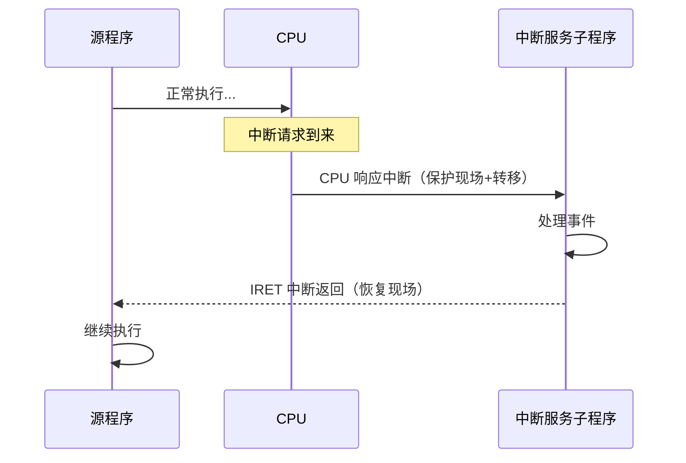
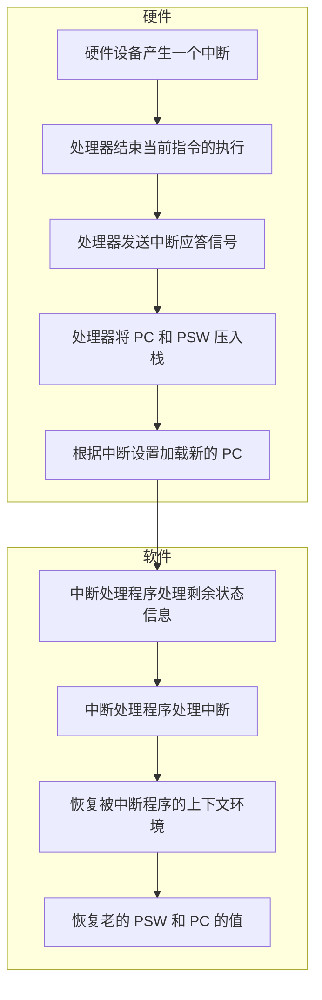

# 第 2 章 处理器管理 — 章节笔记

> 来源：`raw/ch2-处理器管理.pptx`（173 张幻灯片，已融合整理）
> 教材风格：北邮 OS 教材
> 写给：零基础学 OS 的实习生（有 Java 基础）

---

## 0. 章节导览

操作系统四大件管理对象之首是 **CPU**——所有程序最后都要在 CPU 上跑，谁先跑、谁后跑、跑多久、被打断了怎么办，都是这章的事。

学完这章你应该能回答：

1. 一台 CPU 怎么知道"现在是 OS 在跑还是用户程序在跑"？（→ 2.3 处理器状态）
2. 为什么 CPU 能"边算 1+1 边响应键盘"？（→ 2.2 中断）
3. "进程"和"程序"到底差在哪？（→ 2.4 进程引入）
4. 进程被切来切去时，OS 是怎么记住每个进程"上次跑到哪了"？（→ 2.5 PCB）
5. 进程有几种状态？怎么转？（→ 2.6 必考）
6. 线程比进程"轻"在哪？（→ 2.8）
7. 多个进程抢一个 CPU，OS 用什么算法决定谁先跑？（→ 2.10 必考计算题）

---

## 2.1 处理器的硬件结构

### 寄存器（CPU 内部的小型仓库）

**类比**：CPU 是厨师，主存是冰箱。寄存器就是厨师手边的"小调料盘"——容量小（几十个），但拿放飞快（远快于跑去冰箱）。

Intel x86 寄存器分类（slide 5-6）：

| 类别 | 例子 | 用途 |
|---|---|---|
| 通用寄存器 | EAX、EBX、ECX、EDX | 临时存数 |
| 指针/变址 | ESP、EBP、ESI、EDI | 栈指针、数组下标 |
| 段选择符 | CS、DS、SS、ES、FS、GS | 内存分段 |
| 指令/标志 | EIP（指令指针）、EFLAGS（标志位） | 指向"下一条指令"+ 状态 |
| 控制寄存器 | CR0~CR3 | 系统级控制 |

寄存器组成了"**处理器现场**"——切换进程时要把这些值整组保存起来。

### 指令系统（slide 7-9）

每台机器的"机器指令集合"叫**指令系统**，分 5 类：

1. 数据处理类（算术/逻辑）
2. I/O 类（启动外设）
3. 寄存器-存储器交换类
4. 转移类（跳转）
5. 处理器控制类

**关键二分：特权指令 vs 非特权指令**

- **特权指令**：只有 OS 核心才能用。例：启动 I/O、设时钟、改中断屏蔽位、加载 PSW。
- **非特权指令**：用户程序也能用。

> **思考**（slide 8）：单道程序里用户程序可以直接 I/O，多道程序里行不行？
> 不行——多个程序乱抢硬件会冲突，必须经 OS 中转。这是引入"特权指令 + 双态"的根本动机。

---

## 2.2 处理器状态（管态 / 目态）

### 双态机制（slide 10-12）

| 状态 | 别名 | 能干什么 |
|---|---|---|
| **管态**（核心态/特态/内核态） | supervisor mode | 全部指令 + 所有资源 |
| **目态**（用户态/常态） | user mode | 只能执行非特权指令 |

CPU 怎么知道自己当前是哪种？→ 看 **PSW（程序状态字）** 里的状态位。

### 状态切换（slide 11，必考）

**目态 → 管态**（只有这两条路！）：

1. **系统调用**：用户程序主动请求 OS 服务（如 `read()`）
2. **中断 / 异常**：被动打断

> 两条路本质都是"中断机制"——这是双向门户的唯一通道。

**管态 → 目态**：执行特权指令 `iret`（Intel x86）加载 PSW，把控制权交回应用进程。

### Intel x86 的 4 个保护级（slide 18）

Pentium 实际有 0/1/2/3 四级，0 级权限最高：

- 0 级：OS 内核（I/O、内存管理）
- 1 级：系统调用处理程序
- 2 级：共享库
- 3 级：用户程序（保护最少）

> 实际上 Windows 只用 0 级和 3 级（精简方案）。

### 用户栈 vs 核心栈（slide 13）

- **用户栈**：在用户进程空间里，存函数调用的参数/返回值/局部变量。
- **核心栈**：在 OS 空间里，存中断现场 + OS 内部函数调用。
- **栈指针**：硬件只有一个 SP，**两个栈共用一个栈指针**，靠状态切换时换值。

### PSW（程序状态字，slide 14-19）

PSW 是 CPU 里的一个寄存器，记录"当前程序的状态"。包括：

1. **程序基本状态**：PC（程序计数器）、条件码、处理器状态位（管/目）
2. **中断码**：当前发生的中断事件
3. **中断屏蔽位**：哪些中断当前不响应

每个进程都有自己的 PSW，进程切换时 PSW 也要换。

> **Java 类比**：PSW 像 JVM 的"线程上下文 + 程序计数器"打包成一个寄存器。

---

## 2.3 中断机制

### 为什么要有中断（slide 21-24）

**类比**：你在做菜（执行用户程序），快递员按门铃（外设事件）。你不能让锅一直转着不管门铃，也不能盯着门一动不动不做菜——所以需要一个"按了铃我立刻应一下，处理完回来继续做菜"的机制。这就是**中断**。

四种典型场景：

1. 同步操作：快 CPU + 慢外设并行工作
2. 故障处理：硬件错误应急
3. 实时处理：工业控制
4. 请求系统服务（系统调用）

**中断定义**：程序执行时遇急事，**暂停现行程序 → 转去执行事件处理程序 → 完事返回原处或调度其他程序**。

中断转移示意（slide-22）：



### 中断系统组成（slide 25）

- **中断装置**（硬件）：发现中断源 → 提请求 → 保护现场 → 启动处理程序
- **中断处理程序**（软件）：处理事件 → 恢复现场

### 中断分类（slide 33-35，重点区分）

| | 外中断（中断/异步中断） | 内中断（异常/同步中断） |
|---|---|---|
| 来源 | 处理器**外**的信号 | 处理器**内**，与当前指令相关 |
| 例子 | 时钟、键盘、网卡 | 除零、缺页、非法访问 |
| 触发时机 | 与现行指令无关 | 现行指令引起 |
| 响应时机 | 两条指令**之间** | 指令执行**期间**也可响应 |
| 服务对象 | 通常**不是**当前进程 | 就是当前进程 |
| 能否阻塞 | **不能阻塞** | 可以阻塞 |
| 嵌套 | 允许嵌套 | 大多一重 |

子分类：

- **外中断** = 可屏蔽中断 + 不可屏蔽中断
- **异常** = 故障 fault + 陷阱 trap + 终止 abort + 编程异常

> 异常处理可被中断打断，但中断处理**绝不**被异常打断（slide 35）。

### 中断响应 4 步（slide 36，必背）

1. **发现中断源**
2. **保护现场**（PSW、PC、寄存器入栈）
3. **转向处理程序**
4. **恢复现场**

CPU 响应中断的 4 个条件（slide 38）：

1. 设置中断请求触发器（有中断请求）
2. 设置中断屏蔽触发器允许（屏蔽位为 1）
3. CPU 处于开中断状态（IF=1）
4. 当前指令执行完

### 中断处理过程（slide 60-62，硬件 + 软件协作）

**硬件部分**：
1. 设备发中断信号
2. CPU 当前指令做完才响应
3. 发确认信号
4. 保存上下文（PSW + PC + 寄存器）→ 入核心栈
5. 切到管态，根据中断号查中断向量表 → 跳到处理程序

**软件部分**：
6. 中断处理程序执行（操纵 I/O / 传数据等）
7. 检测到 IRET 指令 → 弹出上下文
8. 恢复 PSW 和 PC → 继续被中断的程序

slide-62 流程图（硬件 5 步 + 软件 4 步）：



### 中断向量表（slide 30-32, 52-54）

**类比**：像电话本——256 个中断号 = 256 个电话号码 = 256 个处理程序入口。

8086 中断向量表：

- 在内存最前 1KB（00000H ~ 003FFH）
- 256 个向量，每个 4 字节（IP 2 字节 + CS 2 字节）
- 向量地址 = **中断号 × 4**

8086 中断向量表内存布局（slide-31）：

| 地址 | 内容 | 说明 |
|---|---|---|
| 0000H | 类型 0 (IP) | 类型 0 中断向量（除法错） |
| 0002H | 类型 0 (CS) | |
| 0004H | 类型 1 (IP) | 类型 1 中断向量（单步） |
| 0006H | 类型 1 (CS) | |
| 0008H | 类型 2 (IP) | 类型 2 中断向量（非屏蔽中断） |
| 000AH | 类型 2 (CS) | |
| 000CH | 类型 3 (IP) | 类型 3 中断向量（断点） |
| 000EH | 类型 3 (CS) | |
| 0010H | 类型 4 (IP) | 类型 4 中断向量（溢出中断 INTO） |
| 0012H | 类型 4 (CS) | |
| ... | ... | |
| 4×N | 类型 N (IP/CS) | 类型 N 中断向量 |
| 003FH | ... | （末尾 256 项 × 4 字节 = 1KB） |

Intel x86 256 个向量分配（slide-54，对应 Silberschatz 教材表）：

| 向量号 | 含义 |
|---|---|
| 0 | divide error（除零） |
| 1 | debug exception |
| 2 | null interrupt（NMI） |
| 3 | breakpoint |
| 4 | INTO-detected overflow |
| 5 | bound range exception |
| 6 | invalid opcode |
| 7 | device not available |
| 8 | double fault |
| 9 | coprocessor segment overrun (reserved) |
| 10 | invalid task state segment |
| 11 | segment not present |
| 12 | stack fault |
| 13 | general protection |
| 14 | page fault |
| 15 | (Intel reserved) |
| 16 | floating-point error |
| 17 | alignment check |
| 18 | machine check |
| 19–31 | (Intel reserved) |
| 32–255 | maskable interrupts（外设/软中断） |

简记：

- 0~31：异常 + 不可屏蔽中断（固定）
- 32~47：屏蔽中断（外设用）
- 48~255：软中断

### 多重中断与优先级（slide 27-29, 46-51）

- **优先级**：紧迫程度，高优先级先响应
- **中断屏蔽**：临时禁止响应某些中断
- **多重中断（嵌套）**：高优先级可打断正在处理的低优先级中断
- 三种处理方式：串行 / 嵌套 / 即时

### 时钟中断（slide 44-45）

OS 调度的"心跳"。Linux 三种间隔定时器：

| 类型 | 计时方式 | 信号 |
|---|---|---|
| real | 实际经过时间，进程挂起也计 | SIGALRM |
| virtual | 仅用户态计时 | SIGVTALRM |
| profile | 用户态+核心态都计 | SIGPROF |

时钟中断让分时进程时间片轮转、定时唤醒/阻塞进程、记账。

### 中断处理程序的 3 大特点（slide 63）

1. **异步**：可能打断关键代码甚至其他中断
2. **屏蔽态运行**：可能禁止所有中断
3. **不能阻塞**：要快速结束（中断上下文里没"进程"概念）

---

## 2.4 进程的引入

### 为什么需要"进程"这个新概念（slide 71-75）

**程序**只是静态指令文件（如 `.exe`），它不能描述"正在运行的某次活动"。多道程序系统里需要一个新概念来刻画：

**原因 1：刻画并发性**
- 多个程序走走停停穿插执行，"程序"概念太静态。
- 进程 = 程序在某数据集上的**一次**计算活动。

**原因 2：解决资源共享**
- "可再入程序"（纯代码）能被多人同时调用——同一段程序可对应多个执行实例。
- 程序与执行不再一一对应，所以需要"进程"来区分**每次具体执行**。

### 进程定义（slide 71）

> **进程 = 可并发执行的程序在某数据集合上的一次计算活动，是 OS 进行资源分配和保护的基本单位。**

**做菜类比**：
- **程序** = 菜谱（静态文字）
- **进程** = 你正在按菜谱做的这盘菜（动态过程，有起锅时间、有当前进度、占用某口锅）
- 同一份菜谱可同时被两个人按着做 → 两个独立进程

### 进程的 5 个属性（slide 75，必背）

| 属性 | 含义 |
|---|---|
| **动态性** | 有生命周期（创建/运行/等待/撤销）；地址空间动态变化 |
| **共享性** | 同程序作用于不同数据 = 不同进程 |
| **独立性** | 资源分配 + 调度的基本单位；地址空间相互隔离 |
| **制约性** | 并发进程间需互相等待/通信 |
| **并发性** | 各进程独立、不可预知速度推进；导致执行**不可再现** |

---

## 2.5 进程的描述（PCB 与组成）

### 进程映像（slide 85，进程的"完整画像"）

某时刻进程的全部内容 + 状态，包括 4 块：

1. **进程控制块 PCB**：标识 + 现场 + 控制信息（OS 唯一抓手）
2. **进程程序块**：执行的代码
3. **进程核心栈**：保中断现场、OS 函数调用栈
4. **进程数据块**：私有数据 + 用户栈

### 进程上下文（slide 86-88）

**进程上下文 = 物理实体 + 运行环境**。OS 调度新进程 = **上下文切换**。

三层上下文：

- **用户级**：程序块、数据块、共享内存、用户栈（用户虚存）
- **系统级**：PCB、内存管理信息、核心栈
- **寄存器级**：PSW、PC、SP、通用寄存器

Linux 实现（slide 88）：

| 层 | 内容 |
|---|---|
| 用户级 | text、data、shared memory、user stack |
| 寄存器级 | general register、PC、EFLAGS、ESP |
| 系统级 | task_struct、mm_struct、vm_area_struct、pgd/pmd/pte、kernel stack |

### PCB（进程控制块，slide 89，重中之重）

> **PCB 是 OS 用于记录和刻划进程状态的数据结构，是 OS 掌握进程的唯一资料结构。**

**Java 类比**：相当于 Java 的 `Thread` 对象——你看不见线程本身，OS 只能通过这个对象认识它。

PCB 三类信息：

1. **标识信息**：PID、父进程 PID、用户 ID
2. **现场信息**：PSW、PC、寄存器副本
3. **控制信息**：状态、优先级、调度参数、资源占用

### 进程队列（slide 90-91）

**同状态进程的 PCB 串成队列**。组织方式：

- 线性
- 链接（最常用）
- 索引

进程入队/出队即对 PCB 队列做插入/删除。

---

## 2.6 进程状态及转换（必考）

### 三态模型（slide 76）

```
        ┌──────────────┐
        │  运行 Running │  占有 CPU
        └──────┬───────┘
       (时间片到/被抢) │ ▲ (调度选中)
                ▼ │
        ┌──────────────┐         ┌──────────────┐
        │  就绪 Ready  │ ◀──事件─│ 等待 Blocked │
        │  等 CPU      │   发生   │ 等 I/O 等    │
        └──────────────┘         └──────────────┘
                                        ▲
                                  请求 I/O 等
                                  ┌──────┘
                          (运行进程发起)
```

| 状态 | 含义 | 触发 |
|---|---|---|
| 运行 Running | 占用 CPU | 数 ≤ CPU 数；无可执行时跑 idle 进程 |
| 就绪 Ready | 万事俱备只欠 CPU | 可按优先级分多队列 |
| 等待 Blocked | 等事件（I/O 等），CPU 空闲也跑不了 | 等待 I/O / 进程同步 |

### 4 种状态转换（slide 78-79）

| 转换 | 触发 |
|---|---|
| 就绪 → 运行 | 调度程序选中 |
| 运行 → 就绪 | 时间片到 / 被高优先级抢占 |
| 运行 → 等待 | 主动等事件（I/O、IPC、资源不可得）|
| 等待 → 就绪 | 所等事件发生 |

> **注意**：没有"等待 → 运行"！必须经过就绪。

### 因果变迁思考（slide 80）

判断对错：

1. **运行→就绪 一定引起 就绪→运行**？❌ 不一定，可能没就绪进程。
2. **运行→阻塞 一定引起 运行→就绪**？❌ 同一进程的状态变迁，不同进程不存在"运行→就绪"。这条本身写错了——应该是"是否引起其他进程从就绪→运行"，那是肯定的（CPU 空了要找下家）。
3. **阻塞→就绪 一定引起 就绪→运行**？❌ 当前运行进程未必让出 CPU。

### 五态模型（slide 81，加入新建 + 终止）

```
新建 → 就绪 → 运行 → 终止
        ↑↓
        等待
```

- **新建 New**：刚 fork 出来，PCB 已建但还没入就绪队列
- **终止 Terminated**：执行完或异常退出，PCB 待回收

### 七态模型（带挂起，slide 82-84）

**挂起**：把进程从内存换出到外存（swap），暂时不参与调度。

为啥要挂起？
- 平滑系统负荷（内存吃紧时把不活跃进程换出）
- 用户/父进程要求暂停

挂起后产生两种新状态：

- **就绪挂起**：原本就绪 → 被换出
- **等待挂起**（阻塞挂起）：原本等待 → 被换出

挂起进程的 4 个特征：

1. 不能立即被执行
2. 等待事件独立于挂起条件（事件来了也不能直接跑）
3. 由 OS / 父进程 / 自己挂起
4. 只能由 OS / 父进程解除挂起

### CPU 状态 × 进程状态时序图（slide 103，全章最重要的一张图）

两个进程 P1、P2 在调度下运行的完整时序：

```
时间轴 ──▶
┌─────┬────┬─────┬────┬─────┬─────┬─────┬──────┬─────┬────┬─────┬────┐
│OS调 │P1运│OS调 │P2运│OS调 │P1运 │OS中 │PRINT │OS调 │P2运│OS调 │P1运│
│0.1ms│1ms │0.1ms│1ms │0.1ms│0.5ms│断响 │显示  │0.1ms│1ms │0.1ms│0.5 │
│     │    │     │    │     │     │应   │服务  │     │    │     │ms  │
└─────┴────┴─────┴────┴─────┴─────┴─────┴──────┴─────┴────┴─────┴────┘
 管态 目态 管态 目态 管态  目态  管态  单内核管态  管态 目态 管态 目态
                                       /微内核目态

事件标注（蓝箭头）：
  ↑时钟中断  ↑时钟中断  ↑自陷中断 PRINT("hello")
                              ↑中断服务结束信号  ↑P2 运行结束 ↑P1 运行结束

进程状态（三栏队列）：
  运行队列：  P1   P2  P1            P2   P1
  就绪队列：P1 P2 P2P1 P1 P1P2 P2  P2 P2 P2P1 P1 P1
  等待队列：              P1 P1
```

**这张图把 4 件事用一根时间轴串起来**：
1. OS 调度的真实开销（每次 0.1ms）
2. 管态 ↔ 目态切换
3. 三种队列的演变（运行/就绪/等待）
4. 中断驱动调度（时钟中断 → 切换；自陷中断 → 进等待；I/O 完成信号 → 回就绪）

> **考试若考"画出两个进程的状态变化图"或"标注 CPU 状态切换"，这张图就是模板。**

---

## 2.7 进程控制（原语）

### 原语（slide 105）

> **原语 = 在管态下执行、完成系统特定功能的过程，执行不可中断、不可分割。**

**Java 类比**：相当于 Java 的 `synchronized` 块——里面的操作要么全做要么不做，不能被打断。

### 6 种主要原语（slide 106-110）

#### 1. 进程创建（slide 107）

1. PCB 池申请空 PCB，分配 PID
2. 分配地址空间
3. 分配其他资源
4. 初始化 PCB（状态、优先级）
5. 置就绪态，入就绪队列
6. 通知相关模块（记账等）

Linux 三种创建（slide 108）：

- `fork()`：父子独立
- `clone()`：父子可共享资源（线程实质）
- `vfork()`：子进程"租用"父进程地址空间

#### 2. 进程撤销（slide 109）

1. 找到 PCB 并出队
2. 回收资源给父进程或 OS
3. 先撤销所有子进程（防孤儿失控）
4. 回收 PCB

#### 3. 进程阻塞（slide 110）

1. 停执行，保现场到 PCB
2. 改 PCB 状态为等待态，入等待队列
3. 转调度程序

#### 4. 进程唤醒（slide 110）

1. 等待队列移出
2. 改 PCB 为就绪态，入就绪队列
3. 若优先级高于当前运行进程，置重调度标志

#### 5/6. 挂起 / 激活：略（对应五/七态模型转换）

### 进程上下文切换 7 步（slide 92-94）

1. 保存被中断进程的现场
2. 修改 PCB（状态等）
3. PSW 入相关队列
4. 选下一个进程
5. 修改新进程 PSW
6. 设地址转换 + 存储保护
7. 恢复新进程现场

> Linux 用 `TIF_NEED_RESCHED` 标志位表示"需要重调度"，置位后延迟到合适时机才真正切换。

### Linux 调度时机（slide 95-97）

**主动调度**：进程调用 `schedule()` 让出 CPU（如 `read/write/exit` 系统调用导致阻塞或退出）。

**被动调度**（4 种情况置 `TIF_NEED_RESCHED`）：

1. 时钟中断 `scheduler_tick()` 发现时间片用完
2. `try_to_wake_up()` 唤醒高优先级进程
3. 设置 nice 值、创建新进程、SMP 负载均衡
4. `sched_setscheduler()`、`sched_yield()`、`pause()` 等系统调用

---

## 2.8 线程

### 为什么要线程（slide 112-115）

进程的局限：

1. 创建/撤销/切换开销大 → 限制并发度
2. 单进程一时刻只用一个 CPU → 没法用多核
3. 进程间通信效率低（要走内核）

**核心思想**：把进程的两项功能拆开（slide 115）：

- 进程 = 资源分配单位（不频繁切换）
- 线程 = 调度执行单位（轻装上阵，频繁切换）

### 线程概念（slide 119）

> **线程是进程中能独立执行的实体（控制流），是 CPU 调度和分派的基本单位。**

**做菜类比**：
- **进程** = 一桌满汉全席的菜单 + 厨房资源
- **线程** = 同时在炒菜、切菜、煮汤的多个厨师手脚——共享同一个厨房（地址空间），各自有自己的进度

每个进程**至少一个线程**。Linux 例外（线程实现方式不同，见 KLT/ULT）。

### 线程组成（slide 121）

1. 唯一 ID + 状态（运行/就绪/等待/终止）
2. 独立的 PC + 上下文
3. 独立的执行栈 + 私有局部变量
4. 共享所属进程的内存与资源

### 线程状态（slide 122）

类似进程：运行 / 就绪 / 等待 / 终止。

> 线程**没有挂起态**——挂起的话整个进程一起挂（线程共享地址空间，不能单独换出）。

### 多线程组织模式（slide 123）

1. **调度员/工作者**：一个 dispatch 线程 + N 个 worker（如 web 服务器）
2. **组模式**：一组对等线程协作
3. **流水线**：A 输出给 B，B 输出给 C

应用：前后台、C/S、异步处理、加速计算、UI。

### 线程实现的 3 种方式（slide 124-131）

| | 用户级 ULT | 内核级 KLT | 混合式 |
|---|---|---|---|
| 谁管 | 用户库 | OS 内核 | 两者结合 |
| 切换速度 | 快（不进内核）| 慢（要内核态切换） | 中 |
| 调度算法 | 应用自定义 | 受 OS 限制 | 灵活 |
| 多核利用 | ❌ 不能 | ✅ 可以 | ✅ 可以 |
| 阻塞影响 | 一个线程阻塞→整个进程阻塞 | 仅该线程阻塞 | 灵活 |
| 代表 | Java（早期）、Informix | Windows NT、OS/2 | Solaris |

#### ULT 优缺点

✅ 切换不调内核、调度算法灵活、可移植到任何 OS（只要装线程库）
❌ 系统调用阻塞 → 全进程挂；不能利用多核

#### KLT 优缺点

✅ 多核可同时跑同进程多线程；阻塞在线程一级；内核例程多线程
❌ 同进程内切换也要进内核 → 比 ULT 慢

#### 关键对比（slide 130）

ULT 下：进程 A（1 线程）vs 进程 B（100 线程） → A 的线程比 B 快（A 的线程独占整个时间片，B 的 100 个线程要平分 1 个时间片）

KLT 下：B 的总速度比 A 快（100 个线程各拿独立时间片）

### Windows NT 线程 API（slide 132）

- `CreateThread()` 创建
- `ExitThread()` 结束
- `SuspendThread()` 挂起
- `ResumeThread()` 恢复（递减挂起计数，到 0 才真正恢复）

---

## 2.9 处理器调度

### 三级调度模型（slide 133-136）

| 级别 | 别名 | 频率 | 选择对象 |
|---|---|---|---|
| **高级调度** | 作业调度 / 长程调度 | 低（分钟级） | 后备队列 → 内存 |
| **中级调度** | 平衡负载调度 | 中 | 内存 ↔ 外存（挂起/激活） |
| **低级调度** | 进程/线程调度 / 短程调度 | 高（毫秒级） | 就绪队列 → CPU |

**类比**（医院挂号）：
- 高级 = 分诊台（让你进医院）
- 中级 = 病床调度（住院/出院）
- 低级 = 医生叫号（轮到谁看病）

实时系统/分时系统多采用两级调度（无作业调度）。

### 调度算法的 5 个评价指标（slide 137-142）

| 指标 | 公式/定义 | 适用 |
|---|---|---|
| **CPU 利用率** | 有效工作时间 / 总时间 | 通用 |
| **响应时间** | 提交命令 → 收到响应 | 分时/实时 |
| **周转时间** | 完成时刻 - 提交时刻 | 批处理 |
| **吞吐率** | 单位时间完成作业数 | 批处理 |
| **公平性** | 不饿死 | 通用 |

#### 周转时间相关公式（必背）

```
周转时间        ti = tf - ts        （完成-提交）
                  = 等待时间 + 运行时间
带权周转时间    wi = ti / tk         （tk 是运行时间，wi 总 ≥ 1）
平均周转时间    T  = (Σti) / n
平均带权周转    W  = (Σwi) / n
```

> **wi 越接近 1**说明等待时间越短（短作业等的少更优）。

---

## 2.10 调度算法（必考计算题）

### 计算题通用模板

> **拿到题先做这 4 件事**：
> 1. 列表：作业/进程名、提交时刻、所需 CPU 时间
> 2. 按算法规则排出执行顺序
> 3. 画 Gantt 图（横向时间条）
> 4. 算每个的完成时刻 → 周转时间 ti → 带权 wi → 平均

---

### 1. FCFS 先来先服务（slide 154-155）

**规则**：按进入后备队列的先后次序选作业。

**特点**：
- 简单，对长作业有利
- 平均周转时间**与提交顺序强相关**

**例题**（slide 154）：3 个作业同时到达，CPU 时间 J1/28、J2/9、J3/3。

| 顺序 | 平均周转时间 |
|---|---|
| 1, 2, 3 | 35 |
| 2, 1, 3 | 29 |
| 3, 2, 1 | **18** ← 短作业先做最优 |

---

### 2. SJF 最短作业优先（slide 156-158）

**规则**：选估计 CPU 时间最短的。

**特点**：
- 平均周转时间最优（理论最优）
- ❌ 长作业可能**饿死**
- ❌ 需要预知 CPU 时间（实际上估算）

**例题**（slide 157）：4 个作业同时到，J1/9、J2/4、J3/10、J4/8。

- SJF 顺序：J2、J4、J1、J3 → T=17, W=1.98
- FCFS：T=19, W=2.61

#### 估算 CPU 时间（指数平滑，slide 159-160）

```
τ(n+1) = α · t(n) + (1 - α) · τ(n)
```

- `t(n)`：最近实际 CPU 周期
- `τ(n)`：估计值
- `α`（0~1）：新值权重，越大越看重最近行为

---

### 3. SRTF 最短剩余时间优先（slide 161-162）

**规则**：SJF 的**抢占式**版本。新作业到达，若其 CPU 时间 < 当前剩余 → 抢占。

**例题**（slide 162）：4 个作业到达/CPU 时间：J1-0/8、J2-1/4、J3-2/9、J4-3/5

- SRTF 平均等待时间 = 6.5 ms
- SJF 平均等待时间 = 7.75 ms

---

### 4. HRRF 最高响应比优先（slide 163-166）

**规则**：每次选**响应比最高**的作业。

```
响应比 = 1 + 已等待时间 / 估计运行时间
       = (等待时间 + 运行时间) / 运行时间
```

**特点**：
- 短作业容易高响应比（运行时间小）
- 长作业等久了响应比也高 → **不会饿死**
- 折衷 FCFS 和 SJF

**例题**（slide 165）：J1-0/20、J2-5/15、J3-10/5、J4-15/10

| 算法 | 顺序 | T | W |
|---|---|---|---|
| SJF | 1,3,4,2 | 25 | 2.25 |
| FCFS | 1,2,3,4 | 28.75 | 3.125 |
| HRRF | 1,3,2,4 | 26.25 | 2.46 |

> 注意：HRRF **每次调度时**才计算响应比，不是一次算完。

---

### 5. 优先级调度（slide 167-168）

#### 静态优先级
- 频繁用外设的高（提效率）
- 重要计算高（利用户）
- 进入时间长的高（缩短完成）
- 交互式高（响应快）

#### 动态优先级
- 占 CPU 时间越长 → 优先级越**低**（防止霸占）
- 等 CPU 时间越长 → 优先级越**高**（防止饿死）

---

### 6. 时间片轮转 RR（slide 169-171）

**规则**：每个就绪进程轮流跑一个时间片 q（如 100ms），用完到队尾。

#### 时间片长度的影响

```
T(响应) = N(进程数) × q(时间片)
```

| q 太长 | q 太短 |
|---|---|
| 退化为 FIFO | 上下文切换频繁 |
| 响应慢 | 响应反而慢（切换开销） |

**确定 q 的因素**：
- 就绪进程数：越多 q 越小（保响应时间）
- 系统处理能力：让用户输入通常一个 q 内能处理完

**例题**（slide 171，q=20）：

| 进程 | 突发周期 |
|---|---|
| P1 | 53 |
| P2 | 17 |
| P3 | 68 |
| P4 | 24 |

平均周转时间比 SJF 大，但**响应较快**。

---

### 7. 多级反馈队列（slide 172-173）

**规则**：

1. 多个就绪队列，优先级递减
2. 高级队列时间片**短**，低级队列时间片**长**
3. 新进程入最高级队列
4. 一个时间片没跑完 → 降到下一级
5. CPU 调度从高到低找

**类比**：医院**急诊 → 普通 → 慢病科**分级——急的先看（短时间片确认），不急的慢慢看（长时间片）。

**优点**：
- 短作业快速完成（在前几级队列就跑完）
- 长作业不饿死（最后总能轮到）
- I/O 密集型保持高优先级（每次 I/O 后回最高级）

> 这是现代 OS（Linux CFS、Windows 调度器）思想的雏形。

---

### 调度算法对比速查

| 算法 | 抢占? | 饿死? | 平均周转 | 适用 |
|---|---|---|---|---|
| FCFS | 否 | 否 | 差（看顺序） | 批处理 |
| SJF | 否 | **会** | **优** | 批处理 |
| SRTF | **是** | 会 | **最优** | 批处理 |
| HRRF | 否 | 否 | 良 | 批处理 |
| 优先级 | 看实现 | 静态会 | 看实现 | 通用 |
| RR | 是 | 否 | 较差 | 分时 |
| 多级反馈 | 是 | 否 | 良 | 通用现代 OS |

---

## 2.11 Linux 进程与任务（slide 104）

> Linux 的特殊设计：
> - **任务（task）** = 内核空间运行的程序
> - **进程** = 用户空间运行的程序
> - 实质是同一个进程的两个侧面（用 `task_struct` 描述）
> - 系统进程 / 用户进程：执行不同程序，映射不同物理地址，使用不同栈

Linux 中线程也是用 `task_struct` 表示（"轻量级进程"），通过 `clone()` 创建时共享父进程资源。这就是为什么 Linux 没有严格的"进程 vs 线程"二分。

调度算法层面，Linux 早期用 O(1)，现在用 **CFS（完全公平调度器）**——本质是带权时间片轮转的多级反馈思想。

---

## 2.12 章末考试要点速查

### 必背概念

| 主题 | 必记 |
|---|---|
| 处理器状态 | 管态/目态、特权指令、PSW 内容 |
| 状态切换 | 目态→管态唯有"系统调用 + 中断/异常"两条路 |
| 中断分类 | 外中断/内中断 区别 6 条 |
| 中断响应 4 步 | 发现/保护/转向/恢复 |
| 进程定义 | 程序在数据集上的一次计算活动 |
| 进程 5 属性 | 动态/共享/独立/制约/并发 |
| PCB 三类信息 | 标识/现场/控制 |
| 进程状态 | 三态、五态、七态各自转换图 |
| 原语 | 不可中断、不可分割 |
| 线程 | 调度单位、共享地址空间、3 种实现 |
| 调度三级 | 作业/中级/进程 |
| 5 个评价指标 | 利用率/响应/周转/吞吐/公平 |

### 必会公式

```
周转时间       ti = tf - ts
带权周转       wi = ti / tk
平均周转       T  = Σti / n
平均带权       W  = Σwi / n
响应比         R  = 1 + 等待时间/运行时间
RR 响应时间    T  = N × q
SJF 估算       τ(n+1) = α·t(n) + (1-α)·τ(n)
中断向量地址   = N × 4    (8086)
```

### 必画图

1. **进程三态/五态/七态转换图**
2. **slide-103 CPU 状态 × 进程状态时序图**（理解上下文切换最关键）
3. **中断处理流程图**（硬件 5 步 + 软件 4 步）
4. **调度算法的 Gantt 图**

### 计算题答题模板

```
1. 列原始信息表（提交时刻 ts、CPU 时间 tk）
2. 按算法规则推执行顺序
3. 画 Gantt 图（横轴时间，标完成时刻 tf）
4. 算 ti = tf - ts
5. 算 wi = ti / tk
6. 求 T = ΣTi / n  和  W = Σwi / n
7. 比较多种算法（如题目要求）
```

### 易错点

- **没有"等待→运行"的状态转换**（必经过就绪）
- **挂起态对线程没意义**（线程挂起=整个进程挂起）
- **HRRF 的响应比需在每次调度时重算**，不是一次算完
- **SJF/SRTF 会饿死长作业**，HRRF 不会
- **时间片过长退化为 FCFS**，过短切换开销大
- **特权指令例子**：启动 I/O、改时钟、改中断屏蔽位、加载 PSW（不是所有"重要"指令都是特权指令）
- **中断与异常的区别**：来源、可否阻塞、是否服务当前进程

---

## 笔记中的疑点 / 待澄清

1. **slide-80 的 3 个判断题**：第 (2) 题说法本身可能有问题（"运行→阻塞 引起 运行→就绪"逻辑不自洽，疑为教材笔误，应理解为"是否引起其他进程从就绪→运行"）。
2. **slide-160 估算 CPU 时间例子**：实际值和估算值的对应关系不太清晰（数据列错位），需对照原图。
3. **slide-103 PRINT 显示服务的"单内核管态/微内核目态"**：教材说微内核里 PRINT 是用户态服务（IPC 调用），单内核里在内核态执行——这是单/微内核架构的差异点，第 1 章应已铺垫。
4. **作业调度 vs 进程调度**：现代 OS（Linux/Windows）已无独立"作业调度"概念，主要存在于早期批处理系统的考试题里。

---

## 对话补充：考前秒答 + 易错点扩展

### 进程切换 5 步流程（必默写）

考场看到"画出进程切换的步骤"必须能写出 5 步——每步都点到 PCB：

```
1. 保存现场：CPU 寄存器值、PC、PSW 保存到 A 的 PCB
2. 入队更新：A 的 PCB 状态改为"就绪"或"阻塞"，挂到对应队列
3. 选择新进程：调度器从就绪队列选中 B
4. 恢复现场：从 B 的 PCB 读出寄存器/PC，写回 CPU
5. 上 CPU：B 的 PCB 状态改"运行"，CPU 从 B 的 PC 继续执行
```

**记忆口诀**：**保存 → 入队 → 选下一个 → 恢复 → 上 CPU**

### 三态转换图 4 个箭头（必背反例）

| # | 转换 | 触发 |
|---|------|------|
| ① | 就绪 → 运行 | OS 调度选中 |
| ② | 运行 → 就绪 | 时间片用完 / 被高优先级抢占（**抢占式才有**） |
| ③ | 运行 → 阻塞 | 进程主动等 I/O / 信号量 / 子进程结束 |
| ④ | 阻塞 → 就绪 | 等待事件发生（I/O 完成、V 操作） |
| **❌ 反例** | **阻塞 → 运行不存在！** | 必经就绪态，否则破坏调度公平性 |

**类比记忆**：海底捞排队（就绪）→ 入店吃饭（运行）→ 中途打电话（阻塞）→ **打完电话不能直接闯回去吃，必须重新排队**。

### 进程 vs 线程 5 维对比（必背简答表）

| 维度 | 进程 | 线程 |
|------|------|------|
| 资源拥有 | 完整资源（独立地址空间） | **共享**所属进程的资源 |
| 私有内容 | 整套资源 | 只有寄存器 + 栈 + PC |
| 切换开销 | 大（PCB + 内存映射） | **小**（只切寄存器/栈） |
| 通信方式 | IPC（管道/消息队列等） | **直接读写共享变量** |
| 故障隔离 | 高（一个崩不影响其他进程） | 低（一个崩可能拖死整个进程） |

**核心精确表述**（必背）：

> 没有线程的系统：进程是**资源分配 + 调度**的基本单位
> 有线程的系统：**进程 = 资源分配的基本单位，线程 = CPU 调度的基本单位**

### ULT vs KLT vs 混合（高频简答）

| | 内核感知线程 | 切换是否进核心态 | 切换速度 | 一线程阻塞影响 | 多核利用 |
|---|---|---|---|---|---|
| ULT | ❌ | ❌ | 最快 | **整个进程阻塞** | ❌ |
| KLT | ✅ | ✅ | 慢 | 不影响其他线程 | ✅ |
| 混合 | 部分 | 视情况 | 中 | 不影响 | ✅ |

**ULT 整进程阻塞的因果链**（必背 4 步）：

> 1. 内核只看到进程，不知道有线程
> 2. 某线程调用阻塞 I/O，**内核以为是"进程"在等 I/O**
> 3. 内核把整个进程挂起到阻塞态
> 4. 同进程所有线程一起被冻结

### 线程切换为什么比进程切换快（必考辨析）

**错误答案**：线程切换不需要保存寄存器值。❌

**正确答案**：线程切换**也要**保存寄存器值，**真正快**在于：

> 同一进程内的线程**共享地址空间**，切换时**不需要切换页表，TLB 不会失效**——省掉了进程切换最贵的一笔开销。

**口诀**：**进程切寄存器 + 切地址空间，线程只切寄存器**

### 调度算法 5 维终极对比（必背）

同一组作业（4 个），4 个算法对比：

| 算法 | 特点 | 平均周转 | 平均带权 | 抢占？ | 缺陷 |
|------|------|---------|---------|--------|------|
| FCFS | 先来先服务 | 7.75 | 2.625 | 否 | 短作业不公平 |
| **SJF** | 短作业优先 | **6.75** | **1.89** | 否 | **长作业饥饿** |
| HRRF | 响应比优先 | 7.0 | 2.1 | 否 | 反 SJF 饥饿，但需预知运行时间 |
| RR | 时间片轮转 | 9.25 | 2.81 | 是 | 平均周转差，**但响应时间最好** |

**反直觉考点**：**RR 的 T 和 W 都比 FCFS、SJF 差**——RR 真正价值在响应时间，**适合分时系统不适合批处理**。

### HRRF 平局规则

> R 相同时，按 **FCFS 思路**——**先提交的优先**（保留早到优势）。

### 易错点 Top 8 扩展

1. **阻塞→运行不存在**（必经就绪态）
2. **就绪→阻塞不存在**（不在 CPU 上跑怎么会主动等 I/O？阻塞只能从运行态来）
3. **HRRF 响应比公式漏 "1+"**：R = 1 + 等待/运行，不是 等待/运行；**R 永远 ≥ 1** 是 sanity check
4. **带权周转时间分子分母搞反**：wi = ti / tk（实际花时 / 理论运行）；**wi 永远 ≥ 1**
5. **时间片用完是抢占式**：FCFS/SJF 非抢占版没有"时间片"概念
6. **SRTF 是 SJF 的抢占版**——新到达若剩余时间更短，立即抢占
7. **抢占式和非抢占式的物理基础是时钟中断**——没时钟中断，OS 无法夺回 CPU
8. **同步信号量 V 必须由"事件触发方"做**——不能自己 V 自己等的（绕过同步语义）
