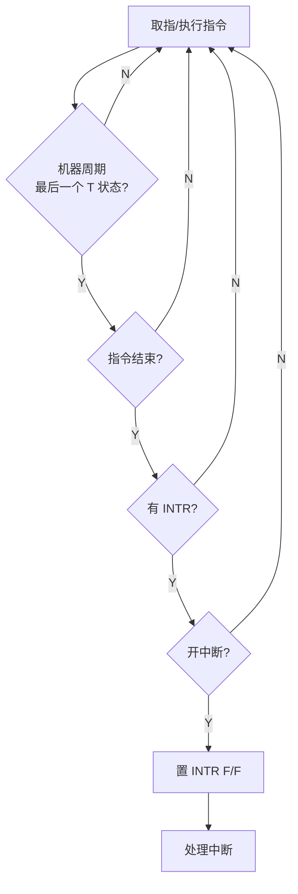
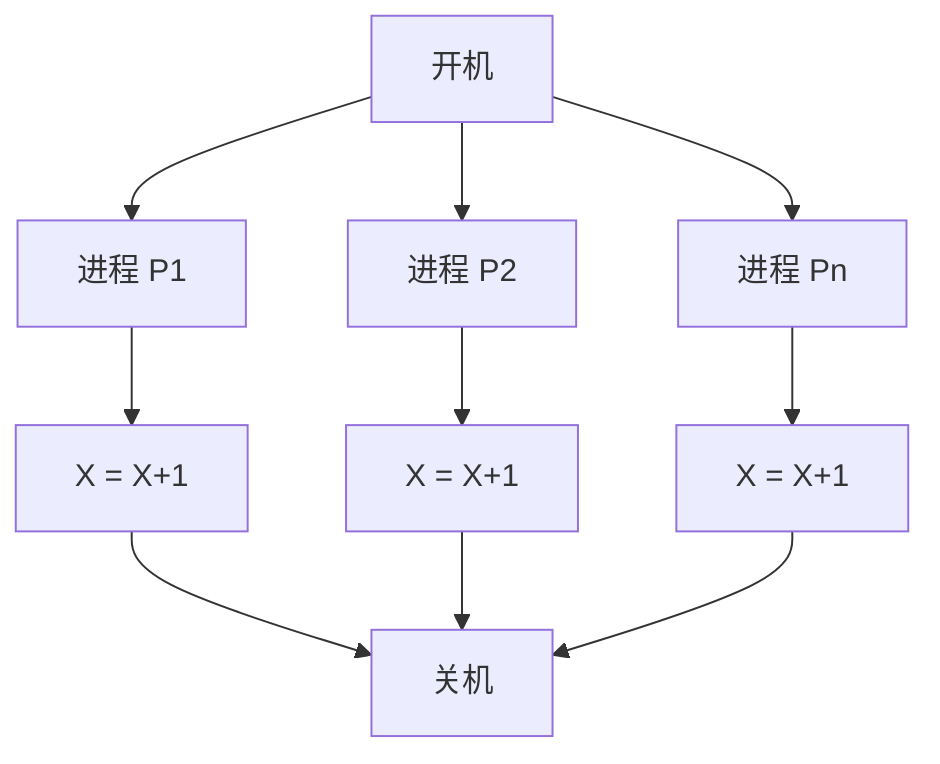
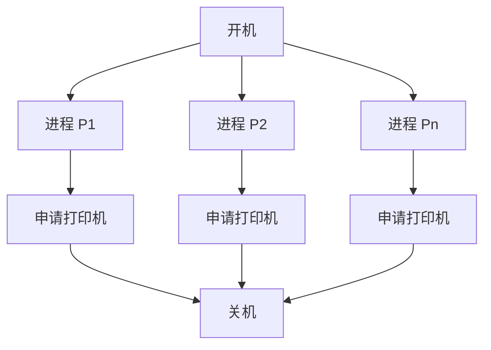
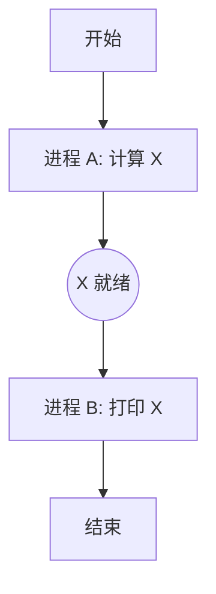
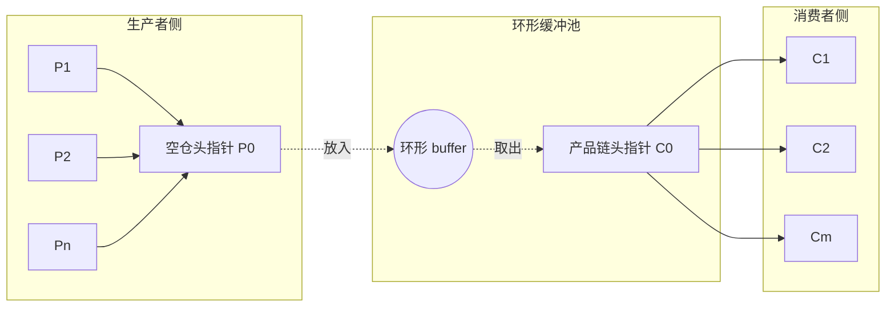

# 第 3 章 同步、通信与死锁（前半，1-95 页）— 章节笔记

> 来源：`raw/ch3-进程同步与互斥.pdf`（共 182 页，本笔记覆盖前 95 页）
> 教材风格：北邮 OS 教材
> 写给：零基础学 OS 的实习生（有 Java 基础）

---

## 0. 章节导览

第 2 章把"一个进程在 CPU 上怎么跑"讲清楚了。但现实里 OS 同时养着几十上百个进程，它们**会互相打架**——抢同一个变量、抢同一台打印机、互相等对方先动手。这章就是讲**怎么让并发的进程不互相打成一团**。

学完前半你应该能回答：

1. 两个进程同时改一个变量，为什么会算错？（→ 3.1）
2. 什么是"临界区"？为啥它要被"保护"？（→ 3.2）
3. 单 CPU 时代，靠"关中断"就能互斥吗？多 CPU 呢？（→ 3.3）
4. 硬件的 TestAndSet / Swap 指令凭啥能"原子"？（→ 3.3）
5. **PV 操作**到底在干嘛？P 是申请，V 是释放，记不住怎么办？（→ 3.5，必考）
6. 解互斥用 1 个信号量，解同步要不要也用 1 个？（→ 3.6, 3.7）
7. 生产者-消费者问题：单缓冲、多缓冲，分别要几个信号量？P 顺序能换吗？（→ 3.8，必考）

**核心心法**：本章 80% 的题最后都归结为"**给我列出几个信号量、写出 PV 调用顺序**"。会写 PV 模板，这章就赢一半。

---

## 3.1 并发进程的基本错误

### 顺序 vs 并发：先把名词搞清

**顺序程序设计**：一个程序从头执行到尾，前一步没做完后一步不开始。
- 三个特点：环境封闭（外界不打扰）、过程可重现（同输入同结果）、结果确定。
- **类比**：一个人按食谱做菜，1 步切菜 → 2 步炒锅 → 3 步装盘，谁也不打断他。

**并发程序设计**：多个程序段在时间上重叠执行。
- 单核 CPU：宏观并发（一个时间段几个进程都在"运行中"），微观仍是串行（同一瞬间只有 1 个在 CPU 上）。
- 多核：才真正"同时"。
- **类比**：一个厨师同时管 3 口锅——切菜、炒菜、装盘交替进行。

### 为什么要并发？（第 28-29 页）

- I/O 设备和 CPU 速度差几个数量级，让 CPU 干等是浪费。并发能让 I/O 和 CPU 同时干活。
- 多核时代，并发能利用所有核。
- **并发程序设计是多道程序设计的基础**——多道的本质就是把并发引入系统。

### 并发进程分两类（第 24 页）

| 类型 | 含义 | 是否有问题 |
|---|---|---|
| 无关并发 | 各进程操作不同变量集 | 安全，结果与执行顺序无关 |
| 交往并发 | 共享变量、互相影响 | **可能出错**，本章重点 |

**Bernstein 条件**（无关并发的判定）：
- `R(p)` = 进程 p 读的变量集；`W(p)` = 进程 p 写的变量集。
- 两个进程"无关"等价于：`R(p1)∩W(p2) = ∅` **且** `R(p2)∩W(p1) = ∅` **且** `W(p1)∩W(p2) = ∅`。
- 通俗：**A 写的 B 不读、B 写的 A 不读、A B 不同时写**。
- 例子：`S1: a:=x+y; S2: b:=z+1` → R(S1)={x,y}, W(S1)={a}, R(S2)={z}, W(S2)={b} → 三个交集都空 → S1、S2 可放心并发。

### 与时间有关的错误（第 30 页，本章核心痛点）

并发进程的执行速度无法相互控制，会出现两类错误：

1. **结果不唯一**（race condition）
2. **永远等待**（deadlock 死锁的雏形）

#### 错误一：结果不唯一 — 飞机票售票问题（第 31 页）

两个售票点同时卖第 j 班次：

```c
void T1() {                  void T2() {
  // 找到 Aj                    // 找到 Aj
  int X1 = Aj;                 int X2 = Aj;
  if (X1 >= 1) {               if (X2 >= 1) {
    X1--;                        X2--;
    Aj = X1;                     Aj = X2;
    // 输出一张票                 // 输出一张票
  }                            }
}
```

设 Aj=1（只剩 1 张），T1、T2 同时跑：
- 各自读到 X1=X2=1 → 都判 ≥1 → 都减到 0 → 都"输出一张票" → **卖了两张票，但库存只有 1 张**！

**画成时序图**（原图见 img-032-001，已转 ASCII）：

```
情况一（串行）：
A: R1=X → R1=R1+1 → X=R1
                              B: R2=X → R2=R2+1 → X=R2
结果: X = X+2 ✓

情况二（交错）：
A: R1=X → R1=R1+1 → X=R1
              B: R2=X → R2=R2+1 → X=R2
结果: X = X+1 ✗（一次更新被吞了）
```

**根因**：`X=X+1` 不是原子操作，被编译成"读-改-写"3 步，两个进程把 3 步交错执行就出错。这就是著名的 **lost update**（丢失更新）。

#### 错误二：永远等待 — 内存申请归还问题（第 33-34 页）

```c
int X = memory;  // 剩余内存

void borrow(int B) {
  if (B > X) { 进程进等待队列; }
  X = X - B;
  // 修改内存分配表
}
void return(int B) {
  X = X + B;
  // 修改内存分配表
  // 释放等待进程
}
```

时序：
- 进程 A 已占 300M，运行后申请 150M；
- 进程 B 已占 200M，运行后申请 120M；
- 用户区共 600M，已被占 500M，**剩 100M**。
- A 申请 150M → 100<150 → 进等待队列；
- B 申请 120M → 100<120 → 进等待队列；
- 两个都不还内存就一直等 → **互相饿死**。

### 进程交往的两种关系（第 35-42 页）

| 关系 | 别名 | 本质 |
|---|---|---|
| **竞争**（互斥） | 间接制约 | 抢独占资源（打印机、共享变量） |
| **协作**（同步） | 直接制约 | 协调先后次序（生产先于消费） |

**互斥伴生的两个病**：
- **死锁**：互相等对方释放资源 → 永远卡住
- **饥饿**：某进程一直被忽略 → 等到天荒地老

**互斥 vs 同步对比**（重要概念表）：

| 维度 | 同步 | 互斥 |
|---|---|---|
| 关系 | 进程-进程 | 进程-资源-进程 |
| 触发 | 时间次序上有要求 | 抢同一资源 |
| 知不知道对方 | 清楚（要交换信息） | 不一定清楚 |
| 例子 | 生产-消费、写-读 | 十字路口、共享变量 |

**关键洞察**：互斥可以看成一种特殊的同步——"对资源使用次序的协调"。所以最终都用同一套工具（信号量）解决。

---

## 3.2 临界资源与临界区

### 三个核心名词（第 38, 44 页）

- **临界资源**（critical resource）：一次只能被一个进程使用的共享资源。例：共享变量、打印机、磁带机。
- **临界区**（critical section / region）：进程中**访问临界资源的那段代码**。
- **互斥**（mutual exclusion）：一次只让一个进程进自己的临界区。

**注意**：临界区是**代码段**，不是资源本身。同一个共享变量，在 P1 的代码里有它的临界区，在 P2 的代码里也有它的临界区。

**类比**：单人厕所是临界资源；进厕所要做的事（开门→关门→上厕所→出门）是临界区；一次只一个人在里面就是互斥。

### 临界区调度的 4+1 原则（第 45 页，必背）

| 原则 | 含义 |
|---|---|
| **互斥使用** | 一次最多一个进程在临界区 |
| **有空让进** | 临界区空闲时，请求进入的应立即进入 |
| **忙则等待** | 已有进程在内，其他进程必须等 |
| **有限等待** | 等待时间有上限，不能无限期等 |
| **择一而入** | 多个等待者中选一个 |
| **算法可行** | 不能要求进程速度有特定关系 |

口诀：**互斥使用、有空让进、忙则等待、有限等待**。

### 临界区代码骨架（第 46 页）

```c
while (1) {
    进入区;     // entry section: 检查能不能进
    临界区;     // critical section
    退出区;     // exit section: 标记我出来了
    其余区;     // remainder section
}
```

### 软件方法的失败尝试（第 47-49 页）

#### 尝试一：双标志，先检查后表态（第 47 页）

```c
bool inside1 = false, inside2 = false;
P1: while (inside2);  // 等
    inside1 = true;   // 表态
    /* 临界区 */
    inside1 = false;
P2: while (inside1);  // 等
    inside2 = true;
    /* 临界区 */
    inside2 = false;
```

**问题**：违背互斥。两进程同时通过 `while`（都看到对方=false），同时表态进临界区。

#### 尝试二：双标志，先表态后检查（第 48 页）

```c
P1: inside1 = true;
    while (inside2);  // 等
P2: inside2 = true;
    while (inside1);
```

**问题**：违背"有空让进"。两进程都先表态，结果谁也进不去 → 死锁。

#### Peterson 算法（第 49 页）：终于对了

```c
bool inside[2] = {false, false};
int turn;

P0: inside[0] = true;
    turn = 1;                        // 谦让：让对方先
    while (inside[1] && turn == 1);  // 对方在且让我等才等
    /* 临界区 */
    inside[0] = false;
P1: inside[1] = true;
    turn = 0;
    while (inside[0] && turn == 0);
    /* 临界区 */
    inside[1] = false;
```

**关键**：turn 变量打破对称——两个进程同时表态时，**最后一个写 turn 的会被卡住**，让另一个先进。

但软件方法实现复杂、易错，不是工业方案。下面看硬件方案。

---

## 3.3 实现互斥的硬件方法

### 方法一：关中断（第 50-52 页）

```c
while (1) {
    屏蔽中断;       // 进入区：不让任何中断打断我
    临界区;
    恢复中断;       // 退出区
    其余区;
}
```

**为啥能互斥**：单 CPU 下，进程切换必须靠中断（时钟中断、I/O 中断）触发调度。**关了中断就不能切换** → 当前进程独占 CPU 跑完临界区。

**3 个致命缺点**：
1. **代价高**：临界区里所有中断都被屏蔽，影响并发性。
2. **不安全**：把"关中断"权交给用户进程，普通进程可以借此"霸占" CPU。
3. **不适用多 CPU**：进程只能关本 CPU 的中断，别的 CPU 上的进程照样能进临界区。

所以现代 OS 不用这个做用户态互斥（内核短临界区还会用）。

### 方法二：硬件指令（第 53-59 页）

**思路**：CPU 提供一条**原子指令**，把"读+改+写"压成不可分割的一步。**执行时锁内存总线**——别的 CPU 此时不能访问内存。

CPU 中断检测时序（原图见 img-053-006，已转 mermaid）：CPU 在每条指令的"机器周期最后一个 T 状态"才检测中断。微指令执行中**不响应中断**，所以原子。



#### TestAndSet（TS 指令）（第 54-55 页）

伪代码（注意这是**硬件**保证原子，C 写法只是表达语义）：

```c
bool TS(bool &x) {       // 硬件原子
    if (x) {             // 如果资源可用（x=true 表示空闲）
        x = false;       // 占住
        return true;     // 我抢到了
    } else {
        return false;    // 没抢到
    }
}
```

用 TS 实现 n 进程互斥：

```c
bool s = true;           // true=空闲
cobegin
process Pi() {           // i=1..n
    while (!TS(s));      // 上锁：抢不到就死循环
    /* 临界区 */
    s = true;            // 开锁
}
coend
```

#### Swap 指令（对换指令）（第 56-57 页）

```c
void SWAP(bool &a, bool &b) {  // 硬件原子
    bool tmp = a; a = b; b = tmp;
}
```

用 Swap 实现互斥（每个进程**自带一把私钥** keyi）：

```c
bool lock = false;       // 全局锁
cobegin
process Pi() {
    bool keyi = true;
    do {
        SWAP(keyi, lock);   // 把我的 key 和锁交换
    } while (keyi);         // 换回 true 说明锁原本是 true（被占），继续转
    /* 临界区 */
    SWAP(keyi, lock);       // 还锁：把我的 false 还给 lock
}
coend
```

**理解**：lock=false 表示"钥匙在锁孔里没人取"。第一个 SWAP 来的进程把 false 取走（keyi 变 false 跳出循环），同时把自己的 true 放进 lock（表示已被占）。

### 硬件指令的优劣（第 58-59 页）

**优点**：
- 单 CPU、SMP 多 CPU 都适用
- 简单有效
- 可以多临界区独立管理（每段一把锁）

**缺点**：
- **忙等待**（busy-waiting / spin）：抢不到锁就死循环，浪费 CPU。
- **饥饿**：随机从等待者中选下一个，可能某个进程总抢不上。
- 需要 CPU 支持。

→ 引出 3.4：信号量机制能让等待的进程**真正睡觉**而不是空转。

---

## 3.4 信号量机制（Semaphore）

### 历史与设计动机（第 67 页）

1965 年 Dijkstra（提出"哲学家就餐"那位大佬）提出**信号量 + PV 操作**，解决两个痛点：
1. 忙等待浪费 CPU；
2. 把"会不会进临界区"的责任丢给应用层不安全。

**核心思想**：把锁做成 OS 内核维护的对象，进程通过 OS 提供的原语 P/V 来申请/释放，进不去就**睡眠**进等待队列，被叫醒才回来。

### 信号量的数据结构（第 68-69 页）

**信号量**（semaphore）是一种**软件资源**，本质是带等待队列的整型变量。

```c
typedef struct semaphore {
    int value;              // 当前值
    struct pcb *list;       // 等待该信号量的进程队列
};
```

**原语**（primitive）：内核中执行时**不可被中断**的过程。P 操作和 V 操作都是原语。

> 名字由来：P 来自荷兰语 Proberen（测试），V 来自 Verhogen（增加）。中文也常写成 wait（P）、signal（V）。

### 信号量分类（第 70 页）

| 类型 | 取值 | 用途 |
|---|---|---|
| **二元信号量** | 仅 0 或 1 | 互斥（=锁） |
| **一般（计数）信号量** | 任何整数（含负数） | 同步、多资源管理 |

### 一般信号量的 PV 定义（第 71-72 页，必背）

```c
void P(semaphore &s) {
    s.value--;
    if (s.value < 0) sleep(s.list);  // 睡到 list 队列
}

void V(semaphore &s) {
    s.value++;
    if (s.value <= 0) wakeup(s.list); // 唤醒一个
}
```

**注意符号**：
- P 的判断是 `< 0`（先减后判）
- V 的判断是 `<= 0`（先加后判，等于 0 说明加之前是负数，有进程在等）

### 二元信号量的 BP/BV（第 73-74 页）

```c
void BP(binary_sem &s) {
    if (s.value == 1) s.value = 0;
    else sleep(s.list);
}
void BV(binary_sem &s) {
    if (s.list is empty) s.value = 1;
    else wakeup(s.list);
}
```

二元信号量的 value 永远只有 0/1，不会出现负数。

### 信号量的物理意义（第 75-77 页，理解关键）

设资源总数 m，进程数 n：

| s.value 取值 | 含义 |
|---|---|
| s = m（初值） | m 个资源全空闲 |
| s > 0 | 还剩 s 个资源可分配 |
| s = 0 | 资源刚好用完，且没人在等 |
| s < 0 | 资源已用完，**\|s\| 个进程在等待队列里** |

**变化范围**：`-(n-m) <= s <= m`

**例子**（第 77 页，4 个进程抢 2 台打印机，s 初值=2）：

| 操作 | s 变化 | 含义 |
|---|---|---|
| P1: P(s) | 2→1 | 拿走 1 台，还剩 1 |
| P2: P(s) | 1→0 | 拿走 1 台，刚好分完 |
| P3: P(s) | 0→-1 | 没了，P3 进等待 |
| P4: P(s) | -1→-2 | P4 也进等待，队列 2 人 |
| P1: V(s) | -2→-1 | P1 还回，唤醒 P3 |
| P2: V(s) | -1→0 | P2 还回，唤醒 P4 |
| P3: V(s) | 0→1 | P3 用完还回 |
| P4: V(s) | 1→2 | P4 用完还回，回到初值 |

**记忆口诀**：
- **P = 申请 = -1**，不够就睡
- **V = 释放 = +1**，欠的话就叫醒一个

---

## 3.5 PV 操作核心规则（必考）

### 写 PV 解题的标准步骤

1. **找出谁和谁有什么关系**：互斥？同步？谁等谁？
2. **每个关系定义一个信号量**：起好名（mutex/empty/full/...），写明含义和初值。
3. **每个进程写主体**：在合适位置加 P、V。
4. **检查**：P/V 必须**配对**、**顺序正确**、**不重复不遗漏**。

### 三个铁律（第 84 页）

1. **必须成对**：少 P 没互斥；少 V 资源没释放。
2. **顺序不能错**：互斥 P 通常在同步 P **之外**（详见生产者-消费者）。
3. **同一信号量的 P 和 V 一般在不同进程里**（同步场景）；互斥场景同一进程里成对。

---

## 3.6 PV 解互斥问题

### 模型（第 78-80 页）

n 个进程都要执行 `X = X+1`，必须互斥（原图见 img-078-007，已转 mermaid）：



**信号量设置**：
- `mutex`：保护临界资源 X
- 初值 = 1（资源 1 份）

**模板**：

```c
semaphore mutex = 1;
cobegin
process Pi() {  // i=1..n
    while (1) {
        ...
        P(mutex);       // 进入临界区
        X = X + 1;      // 临界区
        V(mutex);       // 退出临界区
        ...
    }
}
coend
```

### 多份资源的互斥（第 81-83 页）

n 个进程抢 m 台打印机（原图见 img-081-008，已转 mermaid）：



```c
semaphore s = m;        // 初值 = 资源数
cobegin
process Pi() {
    P(s);               // 申请一台打印机
    申请打印机使用;
    V(s);               // 用完归还
}
coend
```

**变化范围**：s ∈ [-(n-m), m]

**关键**：只要资源**互相等价**（比如 m 台一模一样的打印机），用 1 个计数信号量就够；如果是不同资源（打印机+磁带机），要 2 个独立信号量。

---

## 3.7 PV 解同步问题

### 模型（第 85-86 页）

**经典场景**（原图见 img-085-009，已转 mermaid）：进程 A 计算出 X，进程 B 打印 X。**B 必须等 A 算完才能开始**。



**信号量设置**：
- `s`：表示"X 是否就绪"
- 初值 = 0（一开始 X 还没算出来）

**模板**：

```c
semaphore s = 0;
cobegin
process A() {
    计算 X;
    V(s);               // 我算完了，通知 B
}
process B() {
    P(s);               // 等 A 算完
    打印 X;
}
coend
```

### 互斥 vs 同步的初值差异（极易考）

| 类型 | 初值 | P 谁写、V 谁写 |
|---|---|---|
| **互斥**（mutex=1） | 1 | 同一个进程里 P-V 配对 |
| **同步**（s=0） | 0 | P 在"等的人"，V 在"通知的人"，分布在不同进程 |

**记忆**：
- 互斥锁初值=1 → "厕所默认空着，第一个进的人 P 一下，出来 V 一下"
- 同步信号初值=0 → "等的人先 P（睡过去），通知的人 V（叫醒）"

---

## 3.8 经典同步问题（前半）：哲学家 + 生产者-消费者

### 哲学家就餐问题（第 87-91 页，过渡题）

**问题**：5 个哲学家围桌坐，桌中央通心面，每两人之间一把叉子（共 5 把）。哲学家**思考-饿-吃**循环。吃需要**同时拿到左右两把叉子**。

**朴素解（第 89 页）— 会死锁！**

```c
semaphore fork[5];
for (int i=0; i<5; i++) fork[i] = 1;

cobegin
process philosopher_i() {  // i=0..4
    while (1) {
        think();
        P(fork[i]);              // 拿左叉
        P(fork[(i+1)%5]);        // 拿右叉
        eat();
        V(fork[i]);
        V(fork[(i+1)%5]);
    }
}
coend
```

**死锁场景**：5 个人**同时**拿左叉 → 全拿到了 → 全等右叉 → 永远等 → 全饿死。

**避免死锁的 3 种方案**（第 90 页）：
1. **至多 4 个同时吃**（多加一个计数信号量 room=4）；
2. **奇数号先拿左、偶数号先拿右**（打破对称）；
3. **同时拿到两把才吃**（原子化双拿，要互斥保护）。

> 该问题完整解和详细分析在后半，本节先有印象即可。

### 生产者-消费者问题（第 61-66 页 + 92-99 页，本章最重要）

**问题表述**（第 62 页）：n 个生产者、m 个消费者、k 个缓冲单元。
- 缓冲未满 → 生产者可投放
- 缓冲未空 → 消费者可取走

单缓冲示意（原图见 img-092-011，已转 mermaid）：


多缓冲池环形示意（原图见 img-095-012，已转 mermaid）：



- 生产者关于 P0 头指针互斥
- 消费者关于 C0 头指针互斥
- 生产者-消费者关于"空仓"和"产品"两个同步

#### 错误版本（第 64-66 页，没用 PV）

教材先给出一版用 sleep/wakeup 但**没保护 counter**的代码：

```c
process producer() {
    while (1) {
        生产 nextp;
        if (counter == k) sleep(producer);
        buffer[in] = nextp;
        in = (in+1) % k;
        counter++;
        if (counter == 1) wakeup(consumer);
    }
}
process consumer() {
    while (1) {
        if (counter == 0) sleep(consumer);
        nextc = buffer[out];
        out = (out+1) % k;
        counter--;
        if (counter == k-1) wakeup(producer);
        消耗 nextc;
    }
}
```

**问题**：
1. `counter++` 和 `counter--` 不原子 → 结果不唯一（第 31 页同款 bug）；
2. 检查 counter 和 sleep 之间可能被切走 → 唤醒信号丢失 → 永远等待。

**结论**：必须用 PV 重写。

#### 单生产者-单消费者，单缓冲（第 93 页）

**信号量设置**：
- `empty = 1`：表示"缓冲区可放产品的空位数"，初值 1（一开始有 1 个空位）
- `full = 0`：表示"缓冲区里产品数"，初值 0（一开始没产品）
- 不需要 mutex！只有 1 生 1 消，且 empty/full 已经隐式互斥。

```c
int B;
semaphore empty = 1;   // 空位数
semaphore full  = 0;   // 产品数

cobegin
process producer() {
    while (1) {
        produce();
        P(empty);          // 申请 1 个空位
        append to B;
        V(full);           // 通知消费者：有产品了
    }
}
process consumer() {
    while (1) {
        P(full);           // 等产品
        take from B;
        V(empty);          // 通知生产者：又空了一格
        consume();
    }
}
coend
```

**关键理解**：
- empty 和 full 是**同步信号量**（生-消之间协调），不是互斥锁；
- 它们的和恒等于缓冲区总容量（这里 1+0=1）。

#### 多生产者-多消费者，多缓冲（第 94-99 页，必考）

环形缓冲池：多生产者左侧、多消费者右侧（图见上节 mermaid）。

**多出来的复杂度**：
- 多个生产者**同时**移动空仓头指针 P0 → 互斥
- 多个消费者**同时**移动产品链头指针 C0 → 互斥
- 4 个临界资源：空位池、产品池、空仓指针、产品指针

**信号量设置（4 个）**：
- `Empty = k`：空缓冲区数（同步）
- `Full = 0`：产品数（同步）
- `Mutex_P0 = 1`：生产者间互斥（互斥）
- `Mutex_C0 = 1`：消费者间互斥（互斥）

**完整代码**：

```c
item B[k];
semaphore Empty = k;
semaphore Full  = 0;
semaphore Mutex_P0 = 1;
semaphore Mutex_C0 = 1;
int in = 0, out = 0;

cobegin
process producer_i() {
    while (1) {
        produce();
        P(Empty);              // ① 同步：等空位
        P(Mutex_P0);           // ② 互斥：抢生产者锁
        append to B[in];
        in = (in+1) % k;
        V(Mutex_P0);           // 释放生产者锁
        V(Full);               // 通知消费者
    }
}
process consumer_j() {
    while (1) {
        P(Full);               // ① 同步：等产品
        P(Mutex_C0);           // ② 互斥：抢消费者锁
        take from B[out];
        out = (out+1) % k;
        V(Mutex_C0);
        V(Empty);              // 通知生产者
        consume();
    }
}
coend
```

#### **极端重要：P 顺序不能颠倒！**（第 98 页）

错误顺序：先 P(Mutex)，再 P(Empty)/P(Full) → **死锁**！

**死锁推演**（Empty=0, Full=k 的时刻）：

| 步骤 | 生产者 | 消费者 |
|---|---|---|
| 1 | P(Mutex_P0) → 抢到生产者锁 | |
| 2 | P(Empty) → 0→-1，**睡** | |
| 3 | | P(Mutex_C0) → 抢到消费者锁 |
| 4 | | P(Full) → 取走产品（OK） |
| 5 | | V(Mutex_C0) |
| 6 | | V(Empty) → 唤醒生产者 |
| 7 | 生产者醒，继续... | |

等等，这种情况还能解？我们换 Empty=k, Full=0 的反例：

| 步骤 | 消费者 | 生产者 |
|---|---|---|
| 1 | P(Mutex_C0) → 抢到消费者锁 | |
| 2 | P(Full) → 0→-1，**睡** | |
| 3 | | P(Mutex_P0) → 抢生产者锁 |
| 4 | | P(Empty) → 拿空位（OK） |
| 5 | | append, V(Mutex_P0), V(Full) → 唤醒消费者 |
| 6 | 消费者醒，继续 | |

也能跑通？**真死锁是这样**：考虑 1 个 Mutex（合并 P0/C0 用同一把锁）的简化版，Empty=0, Full=k：
- 生产者：P(Mutex) → 抢锁 → P(Empty) → 0→-1 睡（**抱着锁睡**）
- 消费者：P(Mutex) → 锁被占 → 睡
- 消费者本来能 V(Empty) 唤醒生产者，但消费者拿不到锁就走不到 V(Empty) → **死锁**。

**结论**：**同步 P 必须在互斥 P 之前**。原则——**抱着锁睡 = 死锁**。

#### 信号量变化范围（第 99 页）

| 信号量 | 范围 |
|---|---|
| Empty | [-n, k] |
| Full | [-m, k] |
| Mutex_P0 | [-(n-1), 1] |
| Mutex_C0 | [-(m-1), 1] |

**理解**：互斥锁最多挤 (n-1) 个生产者在等（已有 1 个进了临界区）；同步信号量最多 n 个生产者在等空位、m 个消费者在等产品。

---

## 9. 前半部分速查表

### PV 解题三步法

1. **画关系**：互斥（圈共享资源）/ 同步（画依赖箭头）
2. **设信号量**：每个互斥关系 1 个 mutex（初值=资源数 m），每个同步关系 1 对（初值看"一开始有没有"）
3. **写 PV**：互斥锁 P-V 同进程；同步信号 P-V 跨进程；**同步 P 在前，互斥 P 在后**

### 信号量初值速查

| 场景 | 初值 |
|---|---|
| 1 把锁的互斥 | 1 |
| m 份资源的互斥 | m |
| 同步：等"事件发生" | 0 |
| 缓冲区"空位"信号量 | k（缓冲大小） |
| 缓冲区"产品"信号量 | 0 |

### 必背模板

**互斥**：
```c
semaphore mutex = 1;
P(mutex); 临界区; V(mutex);
```

**同步（A 算 X，B 用 X）**：
```c
semaphore s = 0;
A: 算 X; V(s);
B: P(s); 用 X;
```

**单生产单消费单缓冲**：
```c
semaphore empty = 1, full = 0;
P: produce; P(empty); 放; V(full);
C: P(full); 取; V(empty); consume;
```

**多生多消多缓冲（4 个信号量）**：
```c
semaphore Empty=k, Full=0, Mutex_P=1, Mutex_C=1;
P_i: produce; P(Empty); P(Mutex_P); 放; V(Mutex_P); V(Full);
C_j: P(Full); P(Mutex_C); 取; V(Mutex_C); V(Empty); consume;
```

### 易错点 Top 5

1. ❌ 把同步 P 放在互斥 P 后面 → 抱着锁睡 → 死锁
2. ❌ 互斥 mutex 初值写成 0（应为 1 或 m）
3. ❌ 同步信号量初值写成 1（应为 0，除非"已有产品"）
4. ❌ 漏写 V → 资源永远不释放 → 后续进程全等待
5. ❌ 单缓冲单生单消时多加了 mutex（不需要，empty/full 已隐含互斥）

---

## 10. 待澄清

1. **教材第 64-66 页的错误版生产者-消费者**：sleep/wakeup 实现到底是怎么"丢信号"的？是否应该追到具体反例？
2. **Peterson 算法的正确性证明**：教材一笔带过，没给为啥 turn 变量能打破对称。后半或后续课程是否补？
3. **二元信号量 vs 互斥锁**：现代 OS（如 Linux pthread mutex）和教材里的 binary_semaphore 实现细节差异多大？后半是否会讲？
4. **多缓冲的 in/out 指针变化**：教材代码里 in 和 out 各自只被一类进程修改（in 仅生产者、out 仅消费者），所以严格说不需要 Mutex_P0 保护 in？这里教材是把"分配空仓+移动指针"打包当作临界区，含义略宽。
5. **图 img-053-006**（CPU 中断检测时序）原文配字描述较简略，本笔记按"指令周期末检测中断"理解，与一般 OS 教材一致，但可能与具体微架构（M68000）有出入。
