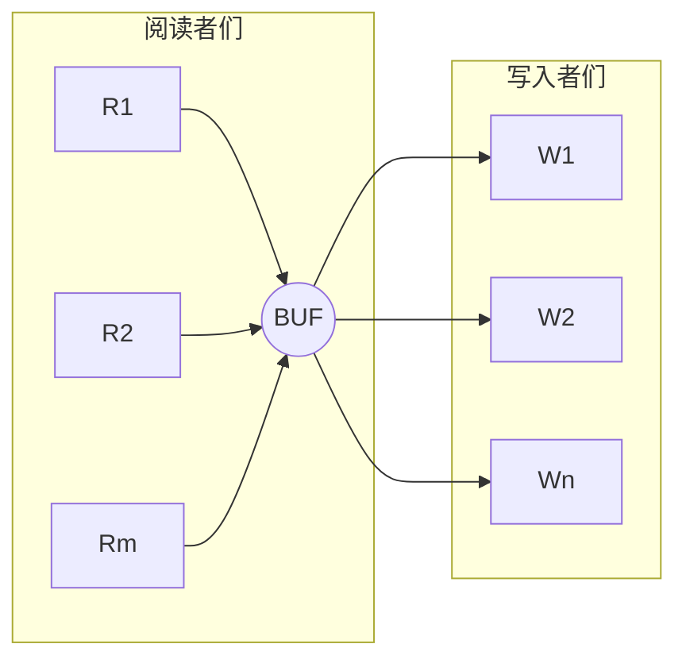
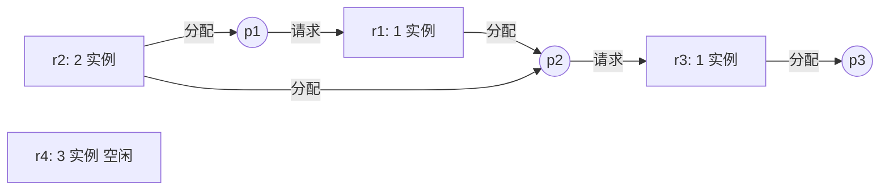
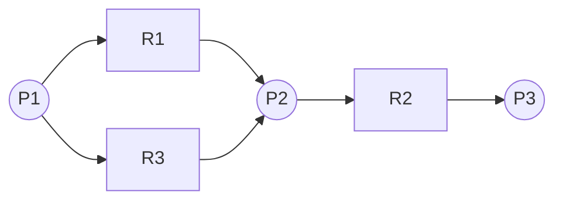

# 第 3 章 同步、通信与死锁（后半 96-182 页）

> 接 part1。前半已覆盖：临界区、PV、生产者-消费者、哲学家。
> 后半压轴：读者-写者、理发师、管程、进程通信、死锁、银行家算法。

## 总览（一句话能说清的故事）

后半页的整体逻辑：
1. **更难的同步问题**（读者-写者 / 理发师）— 让你练 PV 嵌套 + 计数器配合互斥锁的套路。
2. **管程**（Monitor）— 信号量太散乱，容易写错。把"互斥+条件等待"封装到一个模块里，编译器/运行时帮你保证一次只有一个进程进。
3. **进程通信**（IPC）— 共享内存+PV 是低层；高层是消息传递（直接/间接）、管道、信箱。
4. **死锁**（压轴）— 资源竞争 + 推进顺序不当 → 四必要条件 → 三种处理方法（预防/避免/检测）→ 银行家算法是必考计算题。

---

## 3.9 读者-写者问题（Readers-Writers）

> 日常类比：图书馆里**很多人可以同时读同一本书**（读不冲突），但**写书时谁都不许碰**（写者要独占）。

### 问题描述（p100）

两组并发进程共享一个文件 F：
- 多个读者**可以同时读**；
- 写者**必须独占**（写时其他读/写都得等）；
- 写者写完前已有的读/写都得退出。

### 模型图（p101，原图见 img-101-013，已转 mermaid）



- 阅读者关于 ReadCount 互斥（计数读者数）
- 写入者关于 BUF 互斥（独占写）
- 阅读者和写入者关于 BUF 互斥（读时不能写）

三层关系：
- 读者之间不互斥（可并发读）；
- 写者之间互斥（独占写）；
- 读者群与写者之间互斥（一组进读，另一组就得等）。

### 信号量设置（p102）

```c
int ReadCount = 0;              // 当前正在读的人数
semaphore Mutex_ReadCount = 1;  // 保护 ReadCount 的互斥锁
semaphore Mutex_BUF = 1;        // 文件本身的访问锁
```

**关键直觉**：
- `ReadCount` 是"有几个人在读书"的计数器，多人改它要互斥（用 `Mutex_ReadCount`）。
- `Mutex_BUF` 是"占着图书馆"的锁——**第一个读者**进来要去抢这个锁（替整个读者群占着），**最后一个读者**走时才放。中间的读者只改计数器、不动 BUF 锁。

### 完整 PV 解（p103）— 读者优先版

```c
process reader_i() {
  while (1) {
    /* 阅读者计数器登记 */
    P(Mutex_ReadCount);
    readcount++;
    /* 第一个阅读者去申请 BUF（替整组读者占锁）*/
    if (readcount == 1)
      P(Mutex_BUF);
    V(Mutex_ReadCount);

    /* 读文件 */;

    /* 阅读者计数器注销 */
    P(Mutex_ReadCount);
    readcount--;
    /* 最后一个阅读者去释放 BUF */
    if (readcount == 0)
      V(Mutex_BUF);
    V(Mutex_ReadCount);

    sleep(10);
  }
}

process writer_j() {
  while (1) {
    P(Mutex_BUF);
    /* 写文件 */;
    V(Mutex_BUF);
    sleep(10);
  }
}
```

### 信号量变化范围（p104）

- `Mutex_ReadCount: [-(m-1), 1]` — 最坏情况 m 个读者同时申请，1 个进入临界区，剩 m-1 个排队。
- `Mutex_BUF: [-n, 1]` — n 个写者+整组读者(算 1)都可能在排队。

### 踩坑提醒（写者饥饿）

这版是**读者优先**：只要不断有读者来，写者会被无限延迟（饥饿）。要让写者公平，需要更复杂的"读者写者公平版/写者优先版"——本课件没展开，考试通常考这个**读者优先版**。

---

## 3.10 哲学家进餐问题补充（p90-91）

> 前半已经讲过基础版的死锁解，这里只补**正确解法**的关键。

### 三种避免死锁的办法（p90）

1. **至多允许 4 个哲学家同时吃**（5 把叉子，限制申请数 → 必有 1 人能拿到 2 把）；
2. **奇偶号取叉顺序不同**（破坏循环等待——奇号先左后右，偶号先右后左）；
3. **必须能同时拿到两把才拿，否则一把都不拿**（破坏部分分配条件）。

### 一种正确解（p91）— 限制为 4 个哲学家

```c
semaphore fork[5];
for (int i = 0; i < 5; i++) fork[i] = 1;

cobegin
  process philosopher_i() {  // i = 0,1,2,3 (只允许 4 个！)
    while (true) {
      think();
      P(fork[i]);
      P(fork[(i+1) % 5]);
      eat();
      V(fork[i]);
      V(fork[(i+1) % 5]);
    }
  }
coend
```

注：另两种解法（奇偶号顺序、原子拿两把）的伪代码课件未给，考试要会复述思路。

---

## 3.11 睡眠理发师问题（Sleeping Barber）

> 日常类比：理发店有 1 位理发师 + 1 把理发椅 + N 把候客椅。没顾客就睡觉，顾客来了就叫醒理发师。

### 问题描述（p105）

- 理发师 1 个、理发椅 1 把、候客椅 N 把；
- 没顾客 → 理发师在椅子上睡觉；
- 顾客来 → 没人就**叫醒**理发师；理发师在剪 → **有空候客椅就坐下等，没空就走**。

### 信号量设置（p106）

```c
int waiting = 0;            // 等候顾客数
int CHAIRS = N;             // 候客椅总数
semaphore customers = 0;    // 等待理发的顾客数（理发师睡在这上面）
semaphore barbers = 0;      // 准备好理发的理发师数（顾客等在这上面）
semaphore mutex = 1;        // 保护 waiting
```

**直觉**：
- `customers` 像"顾客取号机"：顾客 +1，理发师 -1（没号就睡）。
- `barbers` 像"叫号机"：理发师就绪 +1，顾客 -1（理发师没空就坐等）。

### 完整 PV 解（p107-108）

```c
process barber() {
  while (true) {
    P(customers);   // 没顾客就睡（阻塞在这里）
    P(mutex);
    waiting--;       // 等候顾客数 -1
    V(barbers);      // 准备好理发了
    V(mutex);
    cut_hair();      // 临界区外理发
  }
}

process customer_i() {
  P(mutex);
  if (waiting < CHAIRS) {  // 有空椅子吗？
    waiting++;
    V(customers);    // 叫醒理发师（或排队）
    V(mutex);
    P(barbers);      // 等理发师准备好
    get_haircut();
  } else {
    V(mutex);        // 满了，走人
  }
}
```

### 踩坑提醒

- `waiting++` 必须在 `V(customers)` 之前——否则理发师可能先醒过来去 `waiting--`，结果减成负数。
- 顾客拿到 `mutex` 后判断 + 修改 + 释放 `customers`，必须**整体在 mutex 临界区内**。

---

## 3.12 管程（Monitor，3.4）— 高级同步机制

### 为什么要管程（p110）

> 信号量功能强大但**散在各进程里**，容易写错（漏掉 V、PP 顺序错就死锁）。管程把"互斥 + 条件等待"封装成一个**模块/类**，编译器或运行时保证调用安全。

### 管程定义（p110）

- **管程** = 过程 + 变量 + 数据结构 组成的特殊模块/软件包；
- 进程**只能通过管程内的过程**访问其内部数据，不能直接访问；
- **任一时刻最多只有一个活跃进程在管程内** → 互斥由管程本身保证（程序员不再写 PV）。

> 类比：管程像**银行营业厅**。所有人想存钱取钱必须排队叫号进柜台（管程过程），柜台后面的账本（变量）外人摸不到。同一时间只有一个客户在柜台。

### 管程 vs 进程（p112，6 点对比）

| 维度 | 进程 | 管程 |
|---|---|---|
| 数据结构 | 私有 PCB | 公共数据结构（条件变量等） |
| 操作 | 顺序执行 | 同步 + 初始化 |
| 设计目标 | 系统并发 | 共享资源互斥 |
| 角色 | 主动（调用者） | 被动（被调用） |
| 并发性 | 进程间可并发 | 子程序，不与调用者并发 |
| 生命周期 | 动态、有生命周期 | 资源管理模块 |

### 条件变量 condition variable（p113-115）

光有互斥还不够——进程发现"条件不满足"时需要**主动让出管程**让别人进来，等条件变了再唤醒。这就是 **条件变量** + `wait` / `signal`。

- `x.wait` — 调用进程**因 x 条件被阻塞**，加入 x 的等待队列，**释放管程**让别人进来。
- `x.signal` — 调用进程发现 x 条件**已满足**，唤醒 x 等待队列中的一个进程。

> 注意：条件变量**不是计数器**（和信号量不同！）。`signal` 时如果没人等，这个信号就**丢了**。所以 `wait` 之前必须先 if/while 检查条件。

### 用管程解决生产者-消费者（p116-118）

```c
monitor ProducerConsumer {
  condition full, empty;
  int count;

  void insert(int item) {
    if (count == N) wait(full);  // 缓冲池满，生产者等
    insert(item);
    count = count + 1;
    if (count == 1) signal(empty);  // 第一个产品，叫醒消费者
  }

  int remove() {
    if (count == 0) wait(empty);  // 空，消费者等
    remove = remove_item;
    count = count - 1;
    if (count == N - 1) signal(full);  // 让出位置，叫醒生产者
    return remove;
  }

  count = 0;
}
end monitor

void producer() {
  while (true) {
    item = produce_item;
    ProducerConsumer.insert(item);
  }
}

void consumer() {
  while (true) {
    item = ProducerConsumer.remove();
    consume(item);
  }
}
```

**对比信号量版**：少了 `mutex`、`P/V` 的繁琐——管程外壳自动互斥，条件变量管"什么时候等什么时候醒"。

---

## 3.13 进程通信 IPC（3.5）

### 进程通信概念（p120）

进程通信 = 进程之间**信息交换**。

按交换信息量分两类：
- **低级通信原语**：互斥、同步机构（PV、管程）— 信息量小，主要是同步信号。
- **高级通信原语**：直接通信、间接通信 — 信息量大，传递实际数据。

### 高级通信的两种方式（p120-121, 127）

| 方式 | 寻址 | 原语 |
|---|---|---|
| **直接通信** | 显式指定对方进程 ID | `Send(P, Msg)`, `Receive(P, Msg)` |
| **间接通信** | 通过"信箱"中转 | `Send(A, Msg)`, `Receive(A, Msg)` |

> 直接通信 = 直接打电话给某人；间接通信 = 往邮箱投信，谁有钥匙谁来取。

### 消息队列（p122-124）

一个进程可能与多个进程通信。把消息组织成**队列**，链指针串起来，**头指针放在 PCB 里**。

数据结构：
```c
type Msg = record         type PCB = record
  MsgSend;                  ...
  MsgSize;                  Msgmq;       // 消息队列首指针
  MsgText;                  MsgMutex;    // 互斥信号量
  MsgNext;                  MsgSm;       // 资源信号量
end                         ...
                          end
```

**发送过程**（p124）：
1. 发送进程在自己地址空间设**发送区**，填消息正文 / 发送者 ID / 长度；
2. 调用 `send` 原语 → 系统申请缓冲区，把发送区拷过去；
3. 找接收者 PCB，把缓冲区**挂到接收进程的消息队列上**。

**接收过程**：
1. 接收进程调用 `receive` → 从自己消息队列摘下一条；
2. 把数据拷到指定的**接收区**。

### 同步机制（p126）

```
发送时:                  接收时:
  wait(mutex);            wait(swait);     // 没消息就等
  将消息链入队列;          wait(mutex);
  signal(mutex);          从队列摘消息;
  signal(swait);          signal(mutex);
```
- `mutex`：保护消息队列指针。
- `swait`：消息资源数（接收方在没消息时阻塞）。

### 间接通信（信箱）的实现（p127-128）

- **信箱** = 信箱特征（容量、格式、指针）+ 信箱体（存放信件）。
- **发送**：信箱未满 → 投入并唤醒等待者；满了 → 发送方阻塞。
- **接收**：信箱有信 → 取出并唤醒等待者；无信 → 接收方阻塞。

> 课件没展开管道（pipe）/ 共享内存 / 信号 / socket。这些是 OS 课的**典型补充考点**，需要时另查。

---

## 3.14 死锁基本概念（3.6）

### 死锁定义（p130）

**一组进程因竞争资源或彼此通信而永远阻塞**，称这组进程处于死锁。

> 日常类比：两个独木桥相遇——A 不退 B 不退，僵在那里谁都过不去。

### 直观例子

- **交通死锁**（p131，原图见 img-131-097，文字描述代替）：单行桥两边都开车上来——A→ ←B 在桥中相遇，必须有一辆倒退（释放资源）才能解。**可能饿死**（一直被让的那个永远走不了）。
- **进程死锁**（p133，原图见 img-133-099，复杂时空图保留）：进程时空图，两进程同时申请打印机+绘图仪，路径相交进入"不安全区域"（阴影区域 = 必死锁区）。


### 死锁产生的原因（p134-136）

1. **资源不足**（多进程争抢）；
2. **进程推进顺序不当**（请求/释放资源顺序错误）。

### 资源分类（p140）

| 维度 | 类型 | 说明 |
|---|---|---|
| 是否可抢占 | **可抢占资源** | 系统能强行剥夺（CPU、内存）→ 不引起死锁 |
| | **不可抢占资源** | 进程不主动释放就不能拿走（打印机、文件锁）→ 易引死锁 |
| 使用方式 | **共享资源** | 多进程同时用（只读文件） |
| | **独享资源** | 一次一进程（打印机） |

**进程因竞争"独享 + 不可抢占"资源而死锁。**

### 不死锁的资源数公式（p137-138，必考小题）

> 系统某类资源 m 个，n 个进程，每个需 k 个该资源。
> **当 `n*k <= m + (n-1)` 时，系统不会死锁。**

直觉证明：最坏情况每个进程拿到 k-1 个（差 1 个就完成）。这时分配出去 `n*(k-1)` 个，系统至少还得剩 1 个让某进程能完成。即 `m - n*(k-1) >= 1` → `n*k <= m + (n-1)`。

例（p137）：5 台打印机，每进程要 2 台 → `n*2 <= 5 + (n-1)` → `n <= 4`。即 N=1,2,3,4 都不会死锁，N=5 才可能死锁。

### 死锁四必要条件（p139-141，必考！）

> Coffman 1971 总结，**同时具备**才发生死锁，**破坏任意一个**就能消除。

| # | 条件 | 含义 |
|---|---|---|
| ① | **互斥条件** | 资源一次只能给一个进程 |
| ② | **不可抢占条件** | 资源只能由占有者主动释放 |
| ③ | **部分分配条件**（请求保持） | 进程已占有部分资源，还在申请其他资源 |
| ④ | **循环等待条件**（环路） | 存在进程环 P1→P2→...→Pn→P1，每个都在等下一个占有的资源 |

### 进程-资源分配图（p142-145）

> **图论建模死锁**。圆 = 进程，方框 = 资源类（方框内黑点 = 资源实例数）。

- **请求边** `Pi → Rj`：进程 Pi 申请 Rj 类的一个资源（边从进程画到方框边）。
- **分配边** `Rj → Pi`：Rj 类的某个实例已分给 Pi（边从方框内某黑点画到进程）。

**示例图（p145，原图见 img-145-105，已转 mermaid）**：



- p1 占 r2 一个实例，等 r1；
- p2 占 r1+r2 各一个实例，等 r3；
- p3 占 r3 一个实例。
- p1 占 r2 一个实例，等 r1；
- p2 占 r1+r2 各一个实例，等 r3；
- p3 占 r3 一个实例。

### 资源分配图判断死锁（p146-149）

| 分配图状况 | 是否死锁 |
|---|---|
| 无环 | **一定无死锁** |
| 有环 + 每类只有一个资源 | **一定死锁**（环 = 死锁充要条件） |
| 有环 + 至少一类有多个资源 | **可能死锁**（环只是必要条件） |

例（p149）：在 p145 例子上加边 `p3→r2` → 形成环 `p1→r1→p2→r3→p3→r2→p1`。但 r2 有 2 个实例，未必死锁，得用化简法判断。

### 死锁定理（化简法，p178）

判断"有环但多资源"是否死锁的方法：

1. 若进程 Pi 的所有请求都能被满足 → 把 Pi 的**所有请求边和分配边都消掉**（变成孤立结点）→ 释放它的资源。
2. 重复 1，看能否把所有进程都化简成孤立结点。

**死锁定理**：当且仅当资源分配图**不可完全化简**时，系统处于死锁。

---

## 3.15 死锁处理：预防 + 避免

三种基本方法（p152-153，对比表）：

| 方法 | 时机 | 思路 | 优点 | 缺点 |
|---|---|---|---|---|
| **预防** Prevention | 系统设计时 | 破坏 4 必要条件之一 | 简单 | 资源利用率低，进程初始化延长 |
| **避免** Avoidance | 资源分配时 | 运行时检查是否进入"安全状态" | 不必剥夺 | 必须知道未来资源需求，可能长阻塞 |
| **检测+解除** Detection | 死锁后 | 允许发生，事后检测并恢复 | 资源利用率最高 | 通过剥夺解除会有损失 |

### 死锁预防（破坏四条件，p154-157）

| 破坏条件 | 方法 | 备注 |
|---|---|---|
| ① 互斥 | 资源可同时访问（如 SPOOLing 池化） | 大多数物理资源做不到 |
| ③ 部分分配 | **预先静态分配法**：进程启动前一次拿全 | 简单安全，但**资源浪费严重 + 延迟运行** |
| ② 不剥夺 | 剥夺式调度：申请新资源时如不能满足，**释放已占有的所有资源** | 适合 CPU、内存这类可保存恢复的资源 |
| ④ 循环等待 | **有序资源使用法**：所有资源排序号，进程按**编号递增顺序**申请 | 利用率较高，但限制设备类型扩充 |

例（p157）：PA 用 R1→R2，PB 用 R2→R1，动态分配可能死锁。给 R1=1, R2=2，强制都按递增申请 → PA: R1,R2，PB: R1,R2 → 不再有环。

### 死锁避免（运行时判断，p158）

**安全状态**：存在某个分配顺序 P1,P2,...,Pn，按此顺序为每个进程分配其**最大需求**的资源，每个都能完成。该序列称**安全序列**。

> 不安全 ≠ 死锁，但不安全可能进入死锁；安全则一定不死锁。

### 银行家算法（Banker's Algorithm，p159-176，必考计算题！）

> **类比**：银行家手里有一笔周转资金（系统资源）；客户分期申请贷款（进程申请资源）。银行家在每次贷款前**先模拟一遍"如果借了能否所有客户最终都还清"**——能就借，不能就让客户等。

#### 数据结构（多资源，p165-166，原图见 img-166-479，矩阵保留 + 转 markdown 表）

**例图（p166）**：5 进程 × 4 资源（磁带机/绘图仪/打印机/CD-ROM）

| 进程 | 已分配 (磁带,绘图,打印,CD) | 仍需要 (磁带,绘图,打印,CD) |
|---|---|---|
| A | 3, 0, 1, 1 | 1, 1, 0, 0 |
| B | 0, 1, 0, 0 | 0, 1, 1, 2 |
| C | 1, 1, 1, 0 | 3, 1, 0, 0 |
| D | 1, 1, 0, 1 | 0, 0, 1, 0 |
| E | 0, 0, 0, 0 | 2, 1, 1, 0 |

总资源 E=(6,3,4,2)，已分配 P=(5,3,2,2)，可用 A=(1,0,2,0)。


```
n 个进程，m 类资源
E[m]            // 系统总资源向量（Existing）
Available[m]   // 当前可用资源向量 = E - 已分配总和
Allocation[n][m] // 已分配矩阵：进程 i 已得资源
Claim[n][m] / Max[n][m] // 最大需求矩阵
Need[n][m]      // 还需矩阵 = Claim - Allocation
Request[i][*]   // 进程 i 当前的申请向量
```

例图：E=(6,3,4,2)（磁带机/绘图仪/打印机/CD-ROM），P=(5,3,2,2) 已分配总和，A=(1,0,2,0) 剩余。

#### 资源分配算法（p167，必背 4 步）

收到进程 Pi 的请求 Request[i, *]：

1. **若 Request[i,*] ≤ Need[i,*]** → 转 2；否则报错（申请超最大需求）。
2. **若 Request[i,*] ≤ Available[*]** → 转 3；否则 Pi 等待（资源不足）。
3. **试探性分配**：
   ```
   Allocation[i,*] += Request[i,*]
   Available[*]    -= Request[i,*]
   Need[i,*]       -= Request[i,*]
   ```
4. 执行**安全性测试算法**：
   - 若结果**安全** → 正式分配。
   - 若**不安全** → 撤销试分配（三个数组恢复），Pi 等待。

#### 安全性测试算法（p168，必背 6 步）

```
① 定义 Work[m]、布尔 possible、进程集合 rest
② 初始化：rest = 所有进程, Work = Available, possible = true
③ 在 rest 中找 Pk 满足: Need[k,*] ≤ Work[*]
④ 若找到 → 释放 Pk 资源:
     Work[*] += Allocation[k,*]
     rest = rest - {Pk}
     回到 ③
   若找不到 → 转 ⑤
⑤ possible = false, 算法停止
⑥ 若 rest = ∅ → 安全；否则不安全
```

> **直觉**：假装挨个让进程"完成 → 还回资源"。能让所有进程都假装完成 → 就有安全序列。卡在中间不能继续 → 不安全。

#### 单资源例子（p163-164）

- 系统：12 台打印机，3 个进程；P1 max=10 已 5、P2 max=4 已 2、P3 max=9 已 2，剩 12-5-2-2=3。
- 安全序列：**P2 → P1 → P3**
  - P2 还需 2，剩 3 ≥ 2 → P2 完成，归还后剩 5。
  - P1 还需 5，剩 5 = 5 → P1 完成，剩 10。
  - P3 还需 7，剩 10 ≥ 7 → P3 完成。

#### 多资源完整例（p169-176，**必看！**）

系统：A=10, B=5, C=7。5 个进程，T0 时刻：

| Process | Allocation A B C | Claim A B C | Need A B C |
|---|---|---|---|
| P0 | 0 1 0 | 7 5 3 | 7 4 3 |
| P1 | 2 0 0 | 3 2 2 | 1 2 2 |
| P2 | 3 0 2 | 9 0 2 | 6 0 0 |
| P3 | 2 1 1 | 2 2 2 | 0 1 1 |
| P4 | 0 0 2 | 4 3 3 | 4 3 1 |

Available = E - Σ Allocation = (10,5,7) - (7,2,5) = **(3,3,2)**

**安全性测试**（找安全序列 {P1, P3, P4, P2, P0}）：

| 进程 | Work A B C | Need A B C | Allocation | Work+Alloc | possible |
|---|---|---|---|---|---|
| P1 | 3 3 2 | 1 2 2 | 2 0 0 | 5 3 2 | TRUE |
| P3 | 5 3 2 | 0 1 1 | 2 1 1 | 7 4 3 | TRUE |
| P4 | 7 4 3 | 4 3 1 | 0 0 2 | 7 4 5 | TRUE |
| P2 | 7 4 5 | 6 0 0 | 3 0 2 | 10 4 7 | TRUE |
| P0 | 10 4 7 | 7 4 3 | 0 1 0 | 10 5 7 | TRUE |

→ T0 安全。

**子问题**：P1 申请 Request1 = (1, 0, 2)。

- 检查 Request1 ≤ Need1 = (1,2,2) ✓
- 检查 Request1 ≤ Available = (3,3,2) ✓
- 试分配后：Available 变 (2,3,0)，P1 的 Allocation=(3,0,2), Need=(0,2,0)
- 跑安全性测试 → 找到序列 {P1, P3, P4, P0, P2} → 安全 → **批准分配**。

**反例（p176）**：若 P4 申请 (3,3,0) → Available 不足，直接拒绝。即使 P0 申请 (0,2,0) 看似可分，但分完后会进入不安全状态 → 拒绝。

### 例题（p151，原图见 img-151-478，已转 mermaid）



资源分配图：P1→R1→P2→R2→P3, P1→R3→P2（每个 R 都只有 1 个实例）。

- (1) 分析当前是否死锁：图中无环（R1, R3 已分给 P2，P2 占 R1, R3 申请 R2，R2 已分给 P3，但 P3 没申请别的）→ **无环，无死锁**。
- (2) P3 再申请 R3 时：增加边 P3→R3，R3 已分给 P2，P2 申请 R2，R2 分给 P3 → 形成环 P3→R3→P2→R2→P3 → **死锁**（每类资源只有 1 个实例 + 有环 = 充要条件）。

---

## 3.16 死锁检测与解除（p177-182）

### 检测思想（p177-179）

> 不预防、不避免，**让死锁自然发生**，但定期检查并恢复。

- 系统保存资源请求和分配信息；
- 用算法检查是否**有环**或**不可化简**；
- 检测算法 ≈ 安全性测试算法，区别在于：
  - **避免算法**用 Need（最大需求）判断是否进不安全状态；
  - **检测算法**用 Request（**当前**申请）判断当下是否真的死锁。

### 检测算法（p180-181）

数据结构：
- `Available[m]` — 各类剩余资源；
- `Allocation[n][m]` — 已分配；
- `Request[n][m]` — **当前**请求；
- `Work[m]` — 工作向量；
- `finish[n]` — 布尔标志。

算法步骤：

```
(1) Work[*] = Available[*]
(2) for k = 1..n:
      if Allocation[k,*] != 0: finish[k] = false
      else: finish[k] = true
(3) 寻找 k 满足: finish[k] == false && Request[k,*] ≤ Work[*]
    找不到 → 转 (5)
(4) Work[*] += Allocation[k,*]
    finish[k] = true
    转 (3)
(5) 若存在 k 使 finish[k] == false → 系统死锁
    且这些 finish[k]==false 的 Pk 就是死锁进程
```

### 死锁解除（p182）

发现死锁后采取策略恢复系统：

1. **撤销进程并剥夺资源**（杀掉死锁进程，资源还给系统）；
   - 可全部撤销，也可逐个撤销直到死锁解除（代价小）。
2. **使用挂起 / 解除挂起机构**（让某些进程换出到外存，等死锁解开再换入）。

> 实际系统（如 Linux 内核 OOM killer）大都用方法 1，按某个代价函数选受害者。

---

## 后半部分速查表

| 主题 | 关键句 | 必背 |
|---|---|---|
| 读者-写者 | 第一个读者抢 BUF 锁，最后一个释放 | `if (readcount==1) P; if (readcount==0) V` |
| 哲学家避死锁 | 限 4 / 奇偶序 / 同时拿两把 | 三种思路 |
| 理发师 | customers 计顾客，barbers 计理发师，mutex 保护 waiting | 完整 PV 4 步 |
| 管程 | 编译器保证一次一个进程；条件变量 wait/signal **不计数** | 用管程改写生产者-消费者 |
| IPC | 直接 vs 间接（信箱）；消息队列挂在 PCB 上 | 发送/接收 + mutex/swait 同步 |
| 死锁 4 必要条件 | 互斥 / 不可抢占 / 部分分配 / 循环等待 | 同时具备才死锁，破坏任一可消除 |
| 不死锁公式 | n*k ≤ m+(n-1) | 必考小题 |
| 资源分配图 | 无环 → 无死锁；有环+每类 1 个 → 死锁 | 化简法 |
| 银行家算法 | 试分配 → 安全性测试 → 安全才正式分配 | 4 步分配 + 6 步安全性测试 |
| 死锁解除 | 撤销 / 挂起 | 配合检测使用 |

## 综合考点

### 高频计算题型

1. **不死锁数公式**：给 m, k，问 n 最大取多少不死锁；或反过来。
2. **资源分配图判定**：画图后问是否死锁，用化简法。
3. **银行家算法**：
   - 给 Allocation/Max/Available，求 Need 矩阵；
   - 求 T0 时刻安全序列；
   - 收到某 Request，判断是否能分配，若能写出新状态。
4. **PV 写代码**：读者-写者 / 理发师 / 哲学家变种。

### 高频概念题

- 4 必要条件分别如何破坏？预防 vs 避免 vs 检测的区别？
- 安全状态、不安全状态、死锁状态的关系（**安全 → 不死锁；不安全 ≠ 死锁；死锁必不安全**）。
- 资源分配图、死锁定理、检测算法的关系。
- 管程 vs 信号量优劣对比。

### 易错点提醒

- **读者-写者优先级**：本课件给的是**读者优先**版，要会指出"写者可能饥饿"。
- **银行家算法的 Need = Claim - Allocation**，别和 Request 混。
- **检测 vs 避免算法**：避免用 Need，检测用 Request。
- **条件变量 vs 信号量**：条件变量 signal 没人等就丢失，信号量 V 会累积。
- **死锁的资源类型条件**：通常考的是"独享 + 不可抢占"资源；CPU 这种可抢占资源不会死锁。

## 待澄清

1. **管道 / 共享内存 / 信号 / socket** 等具体 IPC 机制课件没展开，考试可能简答题考。需补充：
   - 管道：单向、有名/无名、Linux `pipe()` 系统调用；
   - 共享内存：mmap / shmget；
   - socket：本地 + 网络通信通用接口。
2. **管程的两种 signal 语义**：Hoare 型（signal 后立刻让出）vs Mesa 型（signal 不让出）— 课件没区分，但操作系统考研常考。
3. **读者-写者的写者优先版** PV 解（用第二个 mutex 阻塞后续读者）— 课件未给。
4. **银行家算法的局限**：必须预知最大需求（实际系统难做到），所以工业界很少用，主要用预防或检测。

## 与前半的衔接

- 前半已经给了**信号量 PV** 和**生产者-消费者、哲学家**的基础解；
- 后半在此基础上：
  - 加难度（读者-写者、理发师）— 练 PV 嵌套；
  - 换工具（管程）— 信号量太散乱的解决方案；
  - 进一步抽象（IPC）— 通信不仅是同步信号，还要传数据；
  - 最后压轴**死锁** — 同步机制用错的后果，以及如何系统化处理。

---

> 本章结束。后续 Ch4 讲存储管理（虚拟内存、分页、分段），与同步互斥的关系：进程切换时的 TLB / Cache 一致性也涉及类似互斥问题，但不再是 PV 这种应用层同步。
