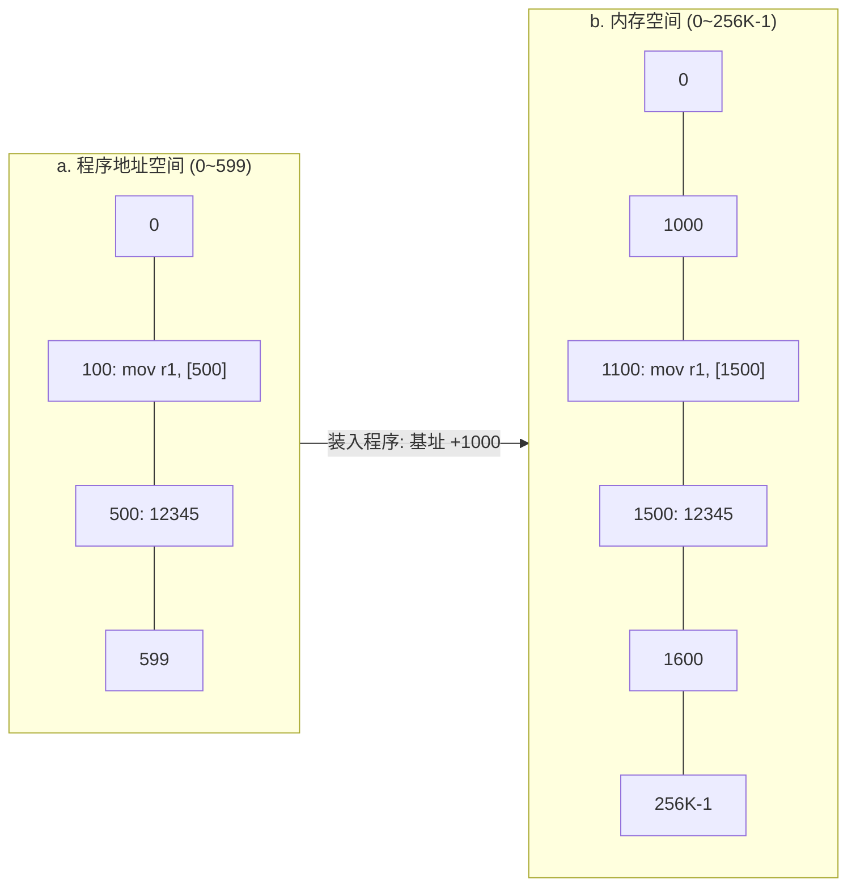
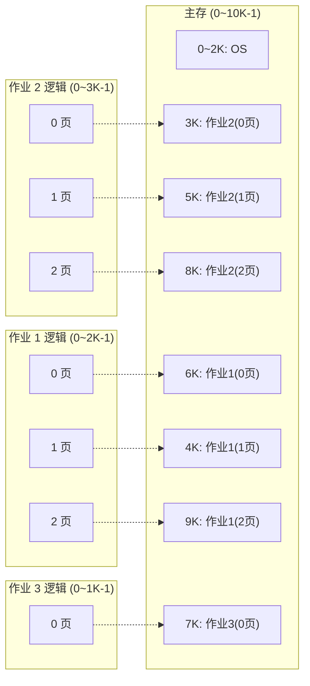

# 第 4 章 存储管理 — 章节笔记

> 来源：北邮《操作系统》课件 198 张幻灯片（`index.md`）
> 风格：先类比再定义，公式可背，例题可算，面试常考点单独标注。

---

## 4.1 存储管理的目标

### 4.1.1 我们要解决什么问题

**类比**：内存就像图书馆的"开架阅览区"——空间有限、想看的书很多、还不能让两个读者抢同一本书。OS 作为"图书管理员"要同时做四件事：

1. **主存分配/回收**：把有限的内存切给多个程序用，回收后还能给下一个用。
2. **地址转换/重定位**：屏蔽物理细节，让程序员写代码时不用关心"我会被装到内存哪个位置"。
3. **存储保护/共享**：A 程序不能踩 B 程序的内存；但共享代码段（比如 libc）允许多程序映射同一份。
4. **存储扩充**：内存不够？让程序"看上去"有比物理内存大得多的空间——这就是后面虚存的根。

### 4.1.2 三级存储器层次（slide-008/009/010）

**核心矛盾**：速度 vs 成本。越快的存储越贵越小，越慢的越便宜越大。

| 层级 | 名字 | 典型容量 | 访问时间 | 带宽 | 谁管 |
|------|------|----------|----------|------|------|
| L1 | 寄存器 | < 1 KB | 0.25–0.5 ns | 20–100 GB/s | 编译器 |
| L2 | Cache | > 16 MB | 0.5–25 ns | 5–10 GB/s | 硬件 |
| L3 | 主存 | > 16 GB | 80–250 ns | 1–5 GB/s | OS |
| L4 | 磁盘 | > 100 GB | 5,000,000 ns（5ms） | 20–150 MB/s | OS |

**面试要点**：磁盘比主存慢 **5 个数量级**——这就是为什么"缺页一次代价巨大"，也是后面所有页面置换算法的优化动机。

CPU 内部本身已经有多级存储（寄存器 + Cache + 段部件 + 分页部件），分页/分段不是 OS 凭空发明，而是硬件提供的能力。

### 4.1.3 物理地址 vs 逻辑地址

- **物理地址**：内存按字节编号，0、1、2... 是一维线性的，唯一的。
- **逻辑地址（虚地址）**：用户程序用的地址，**总是从 0 开始**。
- **为什么不直接用物理地址**？
  - 用户得自己算位置（每搬一次家整个程序都要改）
  - 多道程序同时跑就乱了
  - 程序不可移植

---

## 4.2 程序装入与链接

### 4.2.1 三种链接

| 时机 | 谁来做 | 什么时候定地址 |
|------|--------|----------------|
| **静态链接** | 链接器 | 编译完成后，所有外部引用全部解析完成 |
| **动态链接** | 装入时 | 装入内存时再解析共享库 |
| **运行时链接** | 进程运行中 | 第一次用到符号才解析（dlopen） |

### 4.2.2 三种装入

| 方式 | 程序里的地址 | 缺点 |
|------|--------------|------|
| **绝对装入** | 写死的物理地址 | 必须装到特定位置，多任务下完全不可行 |
| **可重定位装入** | 相对地址，装入时一次性改写 | 装入后不能搬家 |
| **动态运行时装入** | 相对地址，运行时硬件翻译 | 需要 MMU 硬件支持，但灵活 |

### 4.2.3 三种地址重定位

- **静态重定位**：装入时由装入程序把"逻辑地址 + 装入基址"算成物理地址。简单不要硬件，但程序装入后**搬不动**。
- **动态重定位**（现代 OS 都用这个）：执行每条指令时由硬件**重定位寄存器**做加法。基址寄存器内容由 OS 用特权指令设置，程序可以随便搬家。
- **运行时链接重定位**：动态链接库地址在运行时确定。

**记忆点**：动态重定位是虚拟存储的基础，没有 MMU 的硬件支持就没有现代 OS。

**slide-020 装入示意**（原图已转 mermaid）：程序里写 `mov r1, [500]` 引用的是程序地址空间内 500 地址；装入时把整个程序基址搬到主存 1000，那条指令"在物理上"就要去访问主存 1500：



每个程序内地址 d 装入后变成 `1000 + d`。这就是静态重定位的"一次性改写"，动态重定位则是 MMU 在每次访问时即时做这个加法。

### 4.2.4 存储保护

- **界地址寄存器**（上限/下限）：CPU 检查每个访问地址 ∈ [下限, 上限]，越界就异常。
- **存储保护键**：每块内存有一个键，PSW 里有"钥匙"，访问时比较——配钥匙才能开门。

---

## 4.3 连续分配

### 4.3.1 单一连续分配
内存只装一个用户程序 + OS。早期单道系统用，现在没人用了。

### 4.3.2 固定分区

把主存预先切成 N 个固定大小的分区，每个分区给一个作业用。

- **大小相等**：管理简单；但小程序浪费、大程序装不下。
- **大小不等**（多个 small/medium/large 池）：缓解但不解决。

**关键数据结构**：MBT（存储分块表）= 分区的"大小、位置、是否已用"三元组。

**优点**：管理简单，硬件只需一对界地址寄存器。
**缺点**：必有**内部碎片**（程序比分区小，剩下空间浪费）；并发数固定。

### 4.3.3 动态分区（可变分区）

进程来了再动态切一块"刚好够用"的分区。

**slide-037 例题（必考原型）**：
- 物理内存 2560KB，OS 占 0–400K
- 5 个进程：P1=600KB(t=10)、P2=1000KB(t=5)、P3=300KB(t=20)、P4=700KB(t=8)、P5=500KB(t=15)

**slide-038 演变图**（原图已转表）：

| 阶段 | 事件 | 内存布局（自上而下） |
|---|---|---|
| (a) | 初始 | OS(0–400K) ＋ 空闲 400K–2560K（2160K 大空闲） |
| (b) | P1/P2/P3 装入 | OS / P1(400–1000) / P2(1000–2000) / P3(2000–2300) / 空闲(2300–2560，260K) |
| (c) | P2 离开 | OS / P1 / **空洞(1000–2000)** / P3 / 空闲——**外部碎片首次出现** |
| (d) | P4 装入空洞 | OS / P1 / P4(1000–1700) / **空洞(1700–2000，300K)** / P3 / 空闲 |
| (e) | P3 离开 | OS / P1 / P4 / 空洞 / **空洞(2000–2300)** / 空闲——两段空洞分裂 |
| (f) | P5 装入 | OS / P1 / **P5(900–1000?)** / P4 / 空洞 / 空洞 / 空闲——内存被切得更碎 |

**记忆点**：动态分区天然产生**外部碎片**——所有空闲加起来够，但每块都太小。这是后续"分页"出现的动机。

#### 数据结构
- 已分配区表 + 未分配区表（FBT）
- 链表法：空闲块自身存"长度 + 下一块地址"

#### 分配算法（必背）

| 算法 | 怎么找 | 排序方式 | 优点 | 缺点 |
|------|--------|----------|------|------|
| **首次适应 (First Fit)** | 从头找第一个能塞下的 | 地址递增 | 高地址大块得以保留；时间快 | 低地址越来越碎 |
| **下次适应 (Next Fit)** | 从上次找到的位置继续 | 同上 | 分布均匀 | 大块容易被切碎 |
| **最佳适应 (Best Fit)** | 找差距最小的 | 大小递增 | 大块得以保留 | **小空闲块越来越多**（最碎） |
| **最坏适应 (Worst Fit)** | 找最大的切 | 大小递减 | 剩下的还能用 | 大作业进不来 |

**slide-046 例题对比**：内存有空隙序列，进程到达顺序不同，不同算法的成败也不同。**结论：没有银弹**。

#### 回收时合并
释放分区时检查上下相邻——合并相邻空闲分区（避免新生碎片）。

### 4.3.4 内部碎片 vs 外部碎片（高频面试）

| | 内部碎片 | 外部碎片 |
|---|----------|----------|
| 在哪 | 已分配分区**内部**没用满 | 分区**之间**的小空隙 |
| 谁产生 | 固定分区、分页 | 动态分区、分段 |
| 怎么消除 | 让分区粒度更细（极限就是分页） | 紧凑（compaction，移动程序）|

### 4.3.5 内存不足的应对

- **移动技术（紧凑）**：把零散程序挤到一头，腾出大空闲。**必须用动态重定位**，否则程序搬家就跑不起来。
- **对换（swapping）**：低优先级或时间片用完的进程，整个 PCB 写到磁盘，腾内存给别人。
- **覆盖（overlay）**：一个程序内部分段，主程序常驻，不常用的子程序按需替换。**用户负担重**，早期用，现在被虚存替代。

---

## 4.4 分页存储管理

### 4.4.1 核心概念（slide-062 起）

**类比**：图书馆把每本书都拆成大小一样的"册"（如 4KB），书架上每个格子也是同样大小。一本书的不同册可以放在书架的任意格子里——管理员靠一张"目录表"记录"第几册放在第几格"。

| 词 | 在 OS 里 | 在比喻里 |
|---|---------|---------|
| 页（Page） | 逻辑空间的一块 | 书的一册 |
| 页框（Frame）/页架/块 | 物理内存的一格 | 书架格子 |
| 页表（PMT） | 页号 → 页框号的映射表 | 这本书的目录 |

**关键设计**：页大小 = 页框大小，**固定**且通常是 2 的幂（如 4KB = 2¹²）。

### 4.4.2 地址转换（必背公式）

逻辑地址 A，页大小 L：
```
页号 p = INT[A / L]
页内偏移 d = A mod L
物理地址 = 页框号 × L + d
```

**slide-073 例题**：进程页表已知，每页 1024 字节，逻辑地址 2865 求物理地址：
- p = INT[2865/1024] = 2
- d = 2865 mod 1024 = 817
- 查页表，第 2 页 → 第 6 块
- 物理地址 = 6 × 1024 + 817 = **6961**

### 4.4.3 slide-065 映射图直觉（原图已转 mermaid）

三个作业的逻辑空间都被切成 1KB 等大页，物理主存按 1KB 分页框；OS 占 0–2K，下面交错装着各作业的页（作业 1 的 0/1/2 页可以散布在物理空间任意位置）。**核心点**：同一作业的页**不要求物理连续**——这就是分页的革命性突破。



页在主存中的次序由分配时决定——作业 1 三页可能错落在 6K/4K/9K，作业 2/3 同理，但每个作业自己看是连续的（0、1、2 页）。

### 4.4.4 页表的烦恼 → 多级页表

**问题**：32 位地址空间 + 4KB 页 → 1M 个页表项 × 4B = **每进程 4MB 页表**。100 个进程就 400MB！

**多级页表**思路：
- 把页表本身**也分页**（页表页）
- 一级页目录指向各级页表页
- **只有当前用到的页表页才装入主存**

代价：访问数据要 3 次访存（页目录 → 页表页 → 数据）。**TLB 就是来缓解这个的**。

### 4.4.5 反向页表（IPT）

**思路反过来**：不按逻辑页号建表，按**物理页框号**建表。
- 表大小 = 物理页框数（与逻辑空间无关）
- 用 hash 把虚拟页号映射到表项
- **64MB 主存 + 4KB 页只需 64KB 反向页表**——非常省

### 4.4.6 TLB（快表/Translation Lookaside Buffer）

**类比**：图书管理员每查一次页表都要去远处书柜（主存）翻目录太慢，就在桌上摊开**最近常用的几条目录**——这就是 TLB，本质是关联高速缓存。

**关键公式 — 平均访存时间 EAT**：

```
EAT = (1 - p) × (TLB + 主存)
    + p × (TLB + 2 × 主存)
```

- p = TLB 缺失率
- TLB = 快表查询时间（如 20ns）
- 主存 = 一次访存时间（如 100ns）
- TLB 命中：1 次主存（直接拿数据）
- TLB 缺失：先访存查页表 + 再访存取数据 = 2 次主存

**例**：TLB=20ns，主存=100ns，命中率 80%：
- EAT = 0.8 × (20+100) + 0.2 × (20+200) = 96 + 44 = **140ns**

### 4.4.7 分页的优缺

- 优点：无外部碎片；只有每个进程**最后一页**有内部碎片（最多半页）
- 缺点：必须**一次全部装入**；硬件支持成本高；不便于按逻辑共享

---

## 4.5 分段存储管理

### 4.5.1 为什么分段（slide-082 起）

分页是 OS 强加的**等大切分**（用户不感知，物理单位）。分段是程序员**主动按逻辑模块**切（用户感知段号，逻辑单位）。

**典型分段**：代码段 / 数据段 / 栈段 / 堆段 / 共享库段。每段功能独立、长度天然不同。

### 4.5.2 段式逻辑地址（二维）

```
逻辑地址 V = (S, W)
S = 段号
W = 段内偏移
```

vs 分页的一维地址：分页地址 A 是一维的，硬件自动切成 (页号, 页内偏移)；分段则程序员**显式**给出 S 和 W。

### 4.5.3 段表（slide-090 例子）

每个进程一张段表，每行：

| 段号 | 段长 | 段基址（在主存中的起始地址）|
|------|------|----------------------------|

slide-090 的作业 1 有 5 个段（M、X、Y、A、B），段表记录每段长度和被装入主存的起点。**段表寄存器**保存当前进程段表的起址和长度。

**slide-090 例（原图已转表）**——作业 1 的段表与主存装入：

| 逻辑段号 | 段名 | 段长 | 段地址（主存起点） | 主存中位置 |
|---|---|---|---|---|
| 0 | M | K | 3200 | 3200 起 |
| 1 | X | P | 1500 | 1500 起 |
| 2 | Y | L | 6000 | 6000 起 |
| 3 | A | N | 8000 | 8000 起 |
| 4 | B | S | 5000 | 5000 起 |

注意 5 个段在主存中**完全不连续**（1500、3200、5000、6000、8000），但作业 1 自己看仍是按段号 0~4 索引的二维地址空间——这就是分段在主存里的真实形态。

### 4.5.4 地址转换（slide-088）

```
1. 用 S 查段表 → 得 (段长, 段基址)
2. 检查 W < 段长？否则越界异常
3. 物理地址 = 段基址 + W
```

比分页多一步**段长检查**，安全性更高。

### 4.5.5 分段优缺

| | 分页 | 分段 |
|---|------|------|
| 切分单位 | 物理（OS 决定，等大） | 逻辑（用户决定，不等长）|
| 地址 | 一维 | 二维 |
| 共享/保护 | 难（按物理页粒度）| 易（按逻辑模块）|
| 碎片 | 内部碎片 | **外部碎片**（段长不等） |

---

## 4.6 段页式

**思路**：段提供逻辑结构（共享、保护、模块化），页解决主存分配（无外部碎片）。

### 4.6.1 划分
- 主存：等大页框（与分页相同）
- 逻辑：先分段（按程序模块）→ 每段内部再分页

### 4.6.2 三维逻辑地址

```
V = (S, P, d)
S = 段号
P = 段内页号
d = 页内偏移
```

### 4.6.3 数据结构（三层索引）
- **作业表**：作业号 → 段表起址
- **段表**：段号 → 该段页表起址 + 段是否在内存
- **页表**：页号 → 页框号 + 页是否在内存

### 4.6.4 地址转换
1. 查 TLB（带 S+P 联合作为 key），命中直接拼地址
2. 缺失 → 段表查页表起址 → 页表查页框号
3. 段不在 → 缺段中断；页不在 → 缺页中断
4. 共需 **3 次访存**（段表 + 页表 + 数据），TLB 命中可降为 1 次

### 4.6.5 优缺
- 优点：兼具段的共享/保护和页的高利用率
- 缺点：每段平均一页内部碎片（比纯分页多）；硬件复杂；管理开销大

---

## 4.7 虚拟存储管理（重头戏）

### 4.7.1 局部性原理（虚存的理论基石）

**类比**：你在一段时间内只看图书馆的几本相关书（**空间局部性**），一本书翻开后短时间内反复用（**时间局部性**）。所以——**没必要把整个图书馆都搬到桌上**。

| 局部性 | 含义 | 典型来源 |
|--------|------|----------|
| **时间局部性** | 刚访问的指令/数据短时间内还会访问 | 循环、函数反复调用 |
| **空间局部性** | 访问了某地址，附近地址也会被访问 | 顺序执行、数组/记录 |

**结论**：进程不必全部装入内存就能跑——只把"当前要用的部分"调进来即可。剩下放在磁盘，需要时再换。

### 4.7.2 虚拟存储器定义

> 在具有层次结构存储器的计算机系统中，采用**自动**实现部分装入和部分对换功能，为用户提供一个比物理内存容量大得多的、可寻址的"内存储器"。

**类比**：图书馆的"开架阅览区"（主存）只有 100 本书的座位，但全馆（外存）有 10 万本。读者（程序员）写借书条时**假装**可以借任何一本——管理员（OS+MMU）后台帮他换书，他感受不到。

### 4.7.3 物质基础（实现条件）
- 较大容量的辅存（页文件 / swap）
- 一定容量的主存
- 地址变换机构（MMU）

虚拟空间限制：
- **指令地址场长度**（主要原因）— 32 位机器最多 4GB 虚拟空间
- 外存大小

### 4.7.4 请求分页

实存分页要求"一次全部装入"，虚存改为"用到才装"。

**页表扩展**（必备字段）：

| 字段 | 含义 |
|------|------|
| 页号 | 逻辑页号 |
| 内存块号 | 物理页框号 |
| **驻留位（中断位）** | 该页是否在主存 |
| **修改位（M / Dirty）** | 在内存时被改过吗（决定是否要写回磁盘） |
| **引用位（R）** | 最近访问过吗（用于 LRU/CLOCK）|
| 保护位 | 读/写/执行权限 |

外页表：页号 → 磁盘物理地址（系统启动时建立，存磁盘上）。

### 4.7.5 缺页中断处理流程（slide-115，必背 7 步）

1. **挂起**当前进程
2. 查**外页表**，找到该页在磁盘的位置
3. 主存**有空闲页框**？有 → 转 6
4. **无空闲** → 用置换算法选淘汰页；检查修改位
5. 修改位=1 → 写回磁盘原位
6. **调页**：把目标页装入分配到的页框，修改页表
7. 返回断点，**重新执行**被中断的指令

**关键细节**：是"重新执行"那条访问指令，不是从断点继续——因为指令可能正执行到一半就缺页。

### 4.7.6 缺页率公式

```
缺页率 f = F / A
其中  A = 总访问次数 = S（成功）+ F（缺页）
```

**slide-155 例题（程序局部性威力）**：3 页内存，1 页存程序，2 页存数据；数组 100×100，每页放 200 个数。

```c
// 程序 A：按行遍历 — 与存储顺序一致
for (i=1; i<=100; i++)
  for (j=1; j<=100; j++)
    A[i][j] = 0;
// 缺页 = 10000/200 = 50 次

// 程序 B：按列遍历 — 与存储顺序相反
for (j=1; j<=100; j++)
  for (i=1; i<=100; i++)
    A[i][j] = 0;
// 缺页 = 10000/2 = 5000 次  ← 100 倍差距！
```

**面试常考**：相同算法，仅访问顺序不同 → 性能差 100 倍。这就是"程序员要懂局部性"的核心理由。

影响缺页率的因素：
- 内存页框数（多 → 缺页少）
- 页大小（小 → 页表大但缺页粒度细）
- 替换算法
- 程序特性（局部性好坏）

### 4.7.7 页面置换算法（必考重点）

#### (1) OPT — 最佳置换（理论基线）
- 淘汰**未来最久不被访问**的页
- 无法实现（要预知未来）
- 用作其他算法的对比基准

#### (2) FIFO — 先进先出
- 淘汰**进入内存最早**的页
- 实现简单：维护页框队列
- **Belady 异常**（slide-160）：访问串 4,3,2,1,4,3,5,4,3,2,1,5——分配 3 个页框 vs 4 个页框，**4 个页框反而缺页更多**！原因：FIFO 与局部性矛盾，被淘汰的不一定是不再用的。

#### (3) LRU — 最近最少使用
- 淘汰**最久没被访问**的页（基于"最近用过的还会用"的假设）
- **不会有 Belady 异常**
- 实现成本高：
  - 页面淘汰队列（每访问一次调整队列）
  - 引用位法（NRU 近似）
  - 计数法（LFU 变体）
  - 计时法 / 老化算法（多位寄存器右移）

**slide-165–166 例子**：3 个页框，访问 4,3,0,4,1,1,2,3,2，淘汰序列演变看得很清楚。

#### (4) CLOCK — 时钟（OS 实际常用）

**类比**：把所有页框排成一圈，有一根指针（时钟指针）。

```
基本 CLOCK：
  - 每页有引用位 R
  - 访问页时 R=1
  - 淘汰时从指针位置扫描：
    - 遇 R=1 → R=0，跳过
    - 遇 R=0 → 选中淘汰，指针前进
```

**改进 CLOCK**（结合修改位 M 和引用位 R 的 4 种组合）：
1. (R=0, M=0) — 最优先淘汰（既老又干净，不用写回）
2. (R=0, M=1) — 老但脏（要写回）
3. (R=1, M=0) — 最近用但干净
4. (R=1, M=1) — 最近用且脏

扫描两遍：第一遍找 (0,0)；找不到则第二遍找 (0,1)，过程中把 R 清 0。

#### (5) Second Chance — 第二次机会
是 FIFO 的改进，碰到 R=1 的"重新当作新页放队尾"。CLOCK 是它的环形版本。

#### slide-180 性能比较（同访问串 2,3,2,1,5,2,4,5,3,2,5,2，3 个页框）

| 算法 | 缺页次数 |
|------|---------|
| OPT | 6 |
| LRU | 7 |
| CLOCK | 8 |
| FIFO | 9 |

**记忆**：OPT < LRU < CLOCK < FIFO（一般情况下）。

### 4.7.8 工作集模型 / 抖动（高频考点）

**类比**：你写论文时桌上摊开的几本最相关的书 = 工作集。窗口尺寸 Δ 就是你"最近多久内用过的算"——比如最近 30 分钟用过的书都摆桌上。

#### 工作集定义

```
W(t, Δ) = {进程在时间窗口 (t-Δ, t] 内访问过的页面集合}
```

slide-185 经典图：
- 引用串 ...2 6 1 5 7 7 7 5 1 6 2 3 4 1 2 3 4 4 4 3 4 3 4 4 1 3 2 3 4 4 4 3 4 4 4...
- 在 t1 时刻，向前看 Δ 个引用 → WS(t1) = {1, 2, 5, 6, 7}
- 在 t2 时刻 → WS(t2) = {3, 4}（局部性变了，工作集也变了）

**驻留集（resident set）**：进程实际驻留在内存的页集合。

#### 工作集策略
1. 监视每个进程的工作集
2. 仅当工作集**全部**装入内存时才让进程运行
3. 定期清出"不在工作集"的页

#### 抖动（Thrashing）

- **现象**：CPU 大部分时间在处理缺页中断而非执行用户代码
- **原因**：分给进程的页框 < 工作集 → 频繁淘汰马上又要用的页 → 又缺页 → 恶性循环
- **对策**：
  - 工作集模型（保证驻留集 ≥ 工作集）
  - 缺页频率（PFF）算法：动态调整驻留集大小
  - 实在不行：挂起一些进程（减少多道程度）

#### 缺页频率（PFF）算法
监测连续缺页之间的时间间隔：
- 间隔 > 阈值 τ → 工作集变了，移出窗口内未引用的页
- 间隔 < 阈值 τ → 进程页框不够，加分配

### 4.7.9 页面分配/置换策略组合

| 分配 | 置换 | 典型应用 |
|------|------|----------|
| 固定 + 局部 | 经典做法 | 简单 OS |
| 可变 + 全局 | 灵活 | SVR4 |
| 可变 + 局部 | 平衡 | Windows NT |
| 固定 + 全局 | 不合理 | 不用 |

---

## 4.8 章末速查 + 计算题模板

### 4.8.1 必背公式

```
分页地址转换：
  p = INT[A / L]
  d = A mod L
  物理地址 = 页框号 × L + d

平均访存时间（带 TLB）：
  EAT = (1-p)(TLB + Mem) + p(TLB + 2 × Mem)

缺页率：
  f = F / A = 缺页次数 / 总访问次数

多级页表项数：
  虚拟空间 / 页大小 = 一级页表项数
```

### 4.8.2 地址转换计算题模板

> 题：32 位逻辑地址，页大小 4KB，进程页表如下，求逻辑地址 0x12345 的物理地址。

1. 页大小 4KB = 2¹² → 偏移占低 12 位
2. 0x12345 的二进制低 12 位是偏移 d，高 20 位是页号 p
3. 0x12345 = 0001 0010 0011 0100 0101，**p = 0x12 = 18**, **d = 0x345**
4. 查页表第 18 项 → 假设得页框号 0x7
5. 物理地址 = 0x7 × 0x1000 + 0x345 = **0x7345**

### 4.8.3 缺页计算题模板

> 题：进程分配 3 个页框，访问串 7,0,1,2,0,3,0,4,2,3,0,3,2，问 OPT/LRU/FIFO 各缺页几次？

固定流程：
1. 画三行表格（每个页框一行）+ 顶部访问序列
2. 每访问一页，已在内存 → 命中（标 H）；不在 → 缺页（标 F），按算法选淘汰页
3. 数 F 的总数

**OPT 选淘汰的诀窍**：往后看，谁最远才被用就淘汰谁；后面再也不用的优先淘汰。
**LRU 选淘汰的诀窍**：往前看，谁最久没用就淘汰谁。
**FIFO**：维护进入顺序队列，淘汰队首。

### 4.8.4 概念区分速查

| 容易混 | 要点 |
|--------|------|
| 内部 vs 外部碎片 | 内部 = 分区**里**没用满；外部 = 分区**间**的小空隙 |
| 分页 vs 分段 | 物理 vs 逻辑；一维 vs 二维；OS 决定 vs 程序员决定 |
| TLB vs Cache | TLB 缓存"页表项"；Cache 缓存"数据" |
| 缺页中断 vs 越界 | 缺页 → 调页继续跑；越界 → 杀进程 |
| 工作集 vs 驻留集 | 工作集 = 应该在的；驻留集 = 实际在的 |
| Belady 异常 | 仅 FIFO 会出现；LRU/OPT 不会 |
| OPT 不能实现的原因 | 要预知未来访问串 |

### 4.8.5 面试高频问

1. **为什么有了分页还要分段**？分页解决物理利用率，分段解决逻辑结构（共享、保护、动态扩展）。
2. **TLB 命中率为什么能这么高**？局部性原理 + 关联高速缓存的并行查找。
3. **缺页时为什么是"重新执行指令"**？指令可能 fetch 一半就缺页，操作数可能跨页，状态难恢复 → 整条指令重做最简单。
4. **抖动怎么解决**？工作集 + PFF + 必要时挂起进程降低多道程度。
5. **写时复制（COW）和虚存什么关系**？fork 后父子进程共享物理页，写入时才复制——是请求分页的延伸应用。
6. **为什么大多数 OS 选 CLOCK 而不是 LRU**？真正的 LRU 维护开销太高（每次访问都要更新顺序）；CLOCK 用引用位近似，性能接近 LRU 但开销小得多。

---

## 索引（按 slide 号回查 index.md）

- 三级层次：slide-008/009/010
- 重定位类型：slide-17~21
- 动态分区例题：slide-37/38（含 5 进程表 + 6 步演变）
- 适应算法：slide-44~49
- 移动/对换/覆盖：slide-53~60
- 分页基础：slide-62~75
- 分页地址转换例：slide-72/73
- 分页映射图：slide-65
- 分段：slide-82~98
- 段表/段地址转换：slide-87/88/90
- 虚存概念：slide-100~106
- 缺页处理 7 步：slide-115
- 多级页表 / 反向页表：slide-119~126
- TLB：slide-129
- 段页式：slide-131~141
- 局部性 / 缺页率：slide-154~156
- OPT/FIFO/LRU/CLOCK：slide-158~180
- 工作集：slide-185~191
- PFF：slide-196/197
