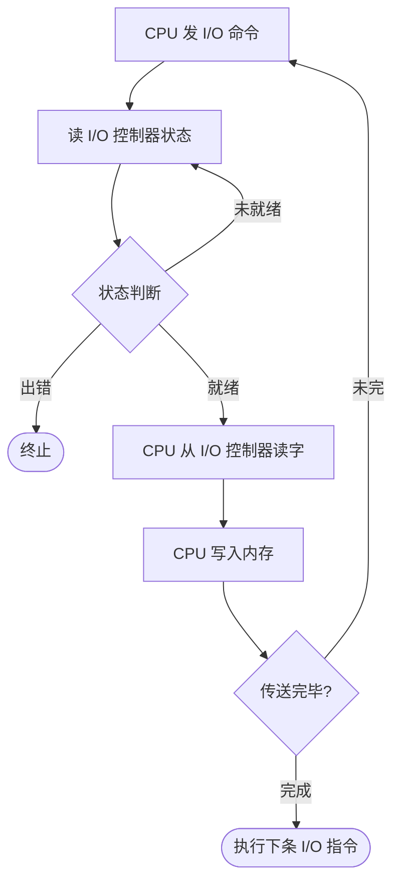
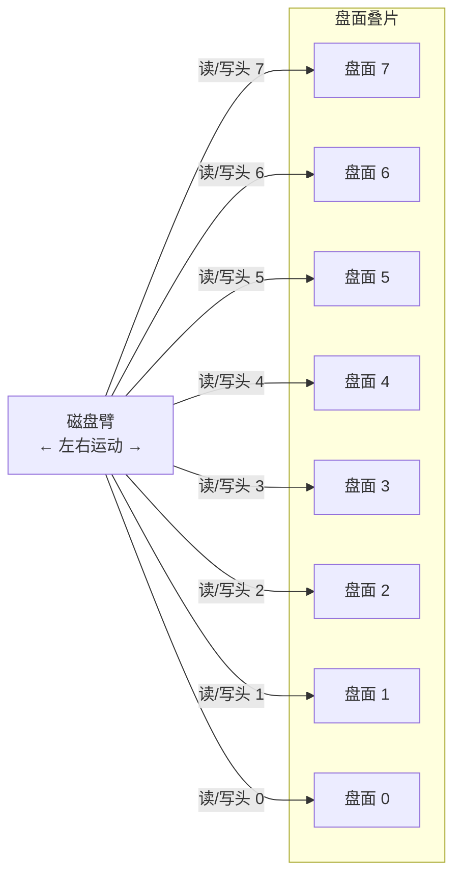

# 第 5 章 设备管理 — 章节整理笔记

> 来源：`raw/ch5-设备管理.pptx` 共 109 张幻灯片
> 整理目标：应试 + 面试导向，零基础友好；先类比、后术语、最后公式
> 配图：images/（7 张内嵌）+ fallback/（3 张整页 PNG，主线已嵌描述）

---

## 0. 一句话定位整章

**设备管理 = OS 的"外设管家"**——它要解决三件事：
1. **设备又多又杂又慢**（打印机几十字节/秒，磁盘几百 MB/秒，CPU 几 GHz）→ 怎么让 CPU 别被拖慢？
2. **用户不想关心物理细节**（不想区分是 USB 还是磁带）→ 怎么提供统一接口？
3. **设备数量有限，进程很多**（一个打印机要给所有人用）→ 怎么分配避免冲突和死锁？

回答分别是：**I/O 控制方式（硬件并行）**、**I/O 软件分层 + 设备独立性（抽象）**、**设备分配 + SPOOLing（复用与虚拟）**。

---

## 5.1 I/O 系统概述

### 5.1.1 I/O 系统组成

**I/O 系统** = I/O 设备 + 接口线路 + 控制部件 + 通道 + 管理软件 的总称。
**I/O 操作** = 内存与外设介质之间的信息传送。

> 类比：CPU 是大脑，内存是工作台，I/O 系统是"通往外界的所有门窗 + 门卫 + 配送队伍"。

### 5.1.2 设备分类（必背）

按 **I/O 操作特性** 分：
- **输入型**：键盘、鼠标、扫描仪
- **输出型**：显示器、打印机
- **存储型**：磁盘、磁带、SSD

按 **I/O 信息交换单位** 分：
- **字符设备**：以字节为单位，无寻址、不能随机访问。代表：键盘、打印机、终端。
- **块设备**：以数据块（通常 512B / 4KB）为单位，可寻址。代表：磁盘、SSD。

存储型设备又分：
- **顺序存取**：磁带——必须从头逐块过，访问时间依赖位置
- **直接（随机）存取**：磁盘——任意块访问时间近似相同

### 5.1.3 设备物理特性的差异（为什么需要 OS 来管）

数据传输率、数据表示方式、传输单位、出错条件——四样都不一样，所以**必须有一层抽象屏蔽差异**。

### 5.1.4 设备控制器（适配器）

**作用**：CPU 和具体设备之间的"翻译官"，让 CPU 用"传几个参数"的方式启动复杂 I/O 操作。

**位置**：可插主板扩充槽的印刷电路板（参考 [slide-035 主板照片](images/slide-035-img-1.png)）。

**典型主板的扩展槽和 I/O 接口**（slide-036 原图已转表）：

| 类别 | 接口 | 数量 / 规格 |
|---|---|---|
| 扩展插槽 | 显卡插槽 | 2 条 PCI-E 16X |
| 扩展插槽 | PCI 插槽 | 3 条 PCI + 2 条 PCI-E 1X |
| 扩展插槽 | IDE 插槽 | 1 个 |
| 扩展插槽 | FDD 插槽 | 1 个（接软驱） |
| 扩展插槽 | SATA 接口 | 6 个 SATAII，支持 RAID 0/1 |
| I/O 接口 | USB 接口 | 10 个 |
| I/O 接口 | 其他内部插槽 | IEEE 1394 + ESATA |
| I/O 接口 | 外接端口 | 音频接口 |

**主要功能**：
1. 接收并识别 CPU 发来的命令（命令寄存器 + 译码器）
2. 在设备和控制器之间传输数据（数据寄存器）
3. 记录设备 / 自身状态（状态寄存器）
4. 设备地址识别（地址译码器，多设备时区分）

**控制器三段结构**：
- 与处理机的接口（数据 / 控制 / 状态总线）
- I/O 逻辑（核心控制电路）
- 与设备的接口（数据信号 / 控制信号 / 状态信号）

---

## 5.2 I/O 控制方式（演进逻辑：解放 CPU 的四步）

> **核心矛盾**：CPU 快、外设慢。每一代控制方式都在让 CPU 越来越少地"看着"外设。

### 演进总览（必考填空）

| 方式 | CPU 干预粒度 | CPU-设备并行度 | 适用 |
|---|---|---|---|
| 1. 程序 I/O（轮询） | 每个字节 + 全程忙等 | 几乎零并行 | 早期机器 |
| 2. 中断驱动 | 每个字节中断一次 | 中等并行 | 低速字符设备 |
| 3. DMA | 每个数据块中断一次 | 高 | 高速块设备（磁盘） |
| 4. 通道 | 每组通道程序中断一次 | 极高 | 大中型机多设备 |

### 1) 程序 I/O 方式（轮询 / Programmed I/O）

CPU 用查询指令不停问设备控制器"准备好了吗？"——准备好就交换一个字，没好就继续问。

**流程**（slide-013 原流程图已转 mermaid）：



**关键观察**：「未就绪 → 回到读状态」这条回边就是**忙等**——CPU 卡在循环里空转。

**特点**：
- CPU 完全被占用（"忙-等待"）
- CPU 与设备**串行**工作
- 优点：管理简单
- 缺点：浪费 CPU，只用于要求极低的场合

### 2) 中断方式

CPU 启动 I/O 后**立即返回**做别的事，设备完成后用中断信号"叫"CPU 回来收数据。

**流程**：
```
进程发启动 I/O → CPU 加载控制信息 → 进程继续 / 让出 CPU
设备控制器执行 I/O → 完成后发中断
CPU 响应中断 → 进入中断处理例程 → 把缓冲寄存器内容写内存 → 退出中断
```

**特点**：
- CPU 与设备**并行**工作（启动后 CPU 可处理其他任务）
- 缺点：每个字节都要中断一次，对高速设备开销过大
- 适合：低速字符设备（键盘、串口、低速打印机）

### 3) DMA 方式（Direct Memory Access）

> **类比**：以前你（CPU）要从仓库（设备）搬一箱货到工作台（内存），每次搬一件就汇报一次，太累。现在你雇了一个"快递员"（DMA 控制器），告诉他"从 A 仓搬 1000 件到 B 桌"——你只在他出发和完成时管一下，中间他和仓库自己搞定。

**所需硬件**：
- 内存地址寄存器 MAR
- 数据计数器 DC（要传几个字节）
- 数据寄存器 DR（缓存中转的字节）
- 设备地址寄存器
- 命令/状态寄存器 CR
- 中断机制 + DMA 控制逻辑

**工作过程（5 步）**（slide-020 配图）：
1. CPU 设置 DMA 控制器（编程：传几个字节、源、目的）
2. DMA 向磁盘控制器发读请求
3. 磁盘控制器把字节传到内存指定单元
4. 磁盘控制器应答 DMA → DMA 把地址 +1，计数器 -1
5. 重复 2-4，计数为 0 时 DMA 向 CPU 发中断

**周期窃用**：DMA 和 CPU 同时要总线访问内存时，CPU 让位给 DMA（DMA 优先）。

**特点**：
- 数据传输基本单位：**连续的数据块**（不是单字节）
- 内存↔设备直接传输，不经 CPU
- CPU 只在"开始 + 结束"时干预
- 适合：高速块设备（磁盘、SSD）

### 4) 通道方式

> **类比**：DMA 是单个快递员；通道方式是"快递公司"——有自己的小处理机（通道 = I/O 处理机），可以执行一系列复杂的 I/O 命令（通道程序），管多个仓库（设备），CPU 只下个总单子。

**为什么需要**：DMA 一次只能传一个**连续**数据块。如果要从多个离散块读到不同内存区，DMA 要发多条命令、多次中断。通道把多条 I/O 操作打包成"通道程序"，一次启动，一次中断。

**通道指令** = 操作码 + 内存地址 + 计数 + 通道程序结束位 P + 记录结束标志 R。

**三种通道类型**（按交换单位区分）：

| 类型 | 单位 | 子通道 | 适用 |
|---|---|---|---|
| **字节多路通道** | 字节 | 多个非分配型，时间片轮转共享主通道 | 低 / 中速：打印机、终端 |
| **数组选择通道** | 块 | 一个分配型，独占式 | 高速：磁盘、磁带（利用率低） |
| **数组多路通道** | 块 | 多个非分配型 | 高速 + 多设备分时（最优） |

**瓶颈问题**：单通路 I/O 系统中，通道 / 控制器 / 设备形成一条链，任一环节占用都会阻塞其他设备 → 解决：**多通路 I/O 系统**（多条路径冗余）。

---

## 5.3 I/O 软件层次

### 5.3.1 设计目标（必考）

- **高效率**：克服 CPU 与设备速度差
- **通用性**：用统一方式管理各种设备
- **设备无关性 / 设备独立性**：用户程序不依赖具体物理设备
- **错误处理**：低层屏蔽，不让上层感知
- **同步 / 异步**：支持阻塞和中断驱动两种
- **缓冲技术**：解决速率不匹配
- **独占 / 共享分配**

### 5.3.2 四层架构（自下而上）

```
┌────────────────────────────┐
│  用户层 I/O 软件             │  ← 库函数（write/read）+ SPOOLing
├────────────────────────────┤
│  设备无关（独立）软件层      │  ← 命名、保护、缓冲、统一接口
├────────────────────────────┤
│  设备驱动程序                │  ← 把逻辑请求转成具体硬件命令
├────────────────────────────┤
│  I/O 中断处理程序            │  ← 响应硬件中断
└────────────────────────────┘
        ↓ 硬件
       I/O 设备 + 控制器
```

#### 第 1 层：I/O 中断处理程序（最底层）

类型：通知 I/O 推进进度 / 正常结束 / 异常 / 异步信号。
处理原则：正常完成→唤醒等待进程置就绪；故障→特殊处理；异步信号→对应处理。

#### 第 2 层：设备驱动程序

**定位**：I/O 系统高层与设备控制器之间的通信程序。
**主要任务**：
- 接收上层逻辑 I/O 请求 → 转化为物理 I/O（设备名→端口地址、逻辑记录→物理记录）
- 启动设备执行
- 把控制器信号传给上层

**功能**：设备初始化 / 执行驱动例程 / 执行中断处理例程。

**特点**：
- 与硬件特性紧密相关（每类设备一个驱动）
- 与 I/O 控制方式紧密相关
- 一部分必须用**汇编**写
- 必须**可重入**（运行中可被再次调用）

#### 第 3 层：设备无关（独立）软件 — slide-050 整页主线

> **核心思想**：抽象。让上层看到的是"读字节流"，不管下面是磁盘 / USB / 网络。

**七大功能**（slide-050 + slide-051 综合）：
1. **统一驱动程序接口**：新加设备只需写新驱动，上层不变
2. **设备命名 + 保护**：所有设备抽象为"设备文件"（Unix "Everything is a file"）
3. **独立于设备的块大小**：隐藏物理块大小差异，对上层提供统一逻辑块
4. **缓冲区管理**：建立内核缓冲区、负责数据复制
5. **块设备的存储分配**：实现共享
6. **独占性外设的分配和回收**
7. **错误报告**：发现 → 就近逐层处理 → 提示

**逻辑设备表 LUT**：实现"逻辑设备名 → 物理设备名"映射的关键数据结构，同时保存驱动程序入口。

#### 第 4 层：用户空间 I/O 软件

- **库函数**：与应用程序链接的 I/O 调用（如 `count = write(fd, buffer, nbytes)`）
- **SPOOLing 系统**：守护进程，提供虚拟设备

### 5.3.3 一次完整 I/O 操作的步骤（面试题）

1. 进程对已打开 fd 调用 `read` 库函数
2. 设备无关层检查参数；若高速缓存有数据 → 直接拷到用户区，结束
3. 否则：逻辑名→物理名、检查权限、I/O 请求排队、阻塞进程
4. 内核启动设备驱动 → 分配缓冲区 → 向控制寄存器发命令（或建立 DMA）
5. 设备控制器执行数据传输
6. DMA 完成一块 → 硬件产生 I/O 结束中断
7. CPU 响应中断 → 跳转中断处理程序
8. 进程被再次调度 → 从 I/O 系统调用断点恢复

---

## 5.4 缓冲技术（速率匹配 / 解耦）

> **类比**：CPU 是快递员，磁盘是仓库，缓冲区是中转货架。没有货架时，每次快递员只能等仓库现取一件；有货架后，仓库可以提前码好十件，快递员一次拉走，吞吐立刻翻倍。

### 5.4.1 为什么需要缓冲

1. 缓和 CPU 与 I/O 设备速度不匹配
2. 减少 CPU 中断次数（数据攒到一定量才触发一次）
3. 解决数据粒度不匹配（字节 vs 块）
4. 提高 CPU 与 I/O 并行度

### 5.4.2 四种缓冲方案

> 注：原 PPT 在本章未直接给计算公式，以下公式为操作系统教材通用必考结论（汤子瀛《计算机操作系统》缓冲技术节，与考研 408 一致），用于应试模板。

#### 1) 单缓冲

只有一个缓冲区。设备 → 缓冲区 → CPU 串行使用同一块缓冲。

**符号约定**：
- T = 设备把一块数据**输入到缓冲区**的时间
- M = 缓冲区把数据**搬到工作区**（用户区）的时间
- C = CPU 处理一块数据的时间

**单缓冲处理一块的时间**：

```
T_single = max(C, T) + M
```

**理解**：T 和 C 可以并行（设备在写下一块时 CPU 在算上一块），但 M（缓冲→用户区）必须串行——因为同一个缓冲区，搬空才能再装。

#### 2) 双缓冲

两个缓冲区交替使用：当 CPU 处理 buf1 时，设备同时往 buf2 写。

**双缓冲处理一块的时间**：

```
T_double = max(C + M, T)
```

**理解**：M 现在可以与 T 并行了（搬 buf1 到用户区时，buf2 在被设备灌入），所以"消费侧" = C+M，"生产侧" = T，瓶颈取最大。

**性能对比记忆口诀**：
- T 大（设备慢）：单缓冲≈T+M，双缓冲≈T，双缓冲省下 M
- C 大（CPU 慢）：单缓冲≈C+M，双缓冲≈C+M，几乎相同
- 双缓冲对**高速 I/O 设备 + 较快 CPU** 提升最大

#### 3) 循环缓冲

多个缓冲区组成环，配两个指针：
- **In 指针**：指向下一个**可装**的空缓冲区（生产者用）
- **Out 指针**：指向下一个**可取**的满缓冲区（消费者用）

适合稳定的连续数据流（如音视频）。

#### 4) 缓冲池

公用缓冲区池，三个队列：
- **空缓冲队列 emq**
- **输入队列 inq**（已装数据待用）
- **输出队列 outq**（已处理待写出）

四种工作过程：
- 收容输入：emq 取空 → 装数据 → 进 inq
- 提取输入：inq 取满 → 处理 → 还回 emq
- 收容输出：emq 取空 → 装结果 → 进 outq
- 提取输出：outq 取满 → 写设备 → 还回 emq

**优势**：缓冲区可被**多个进程共享**，利用率最高。

---

## 5.5 设备分配

### 5.5.1 设备分类（按可分配性）

| 类型 | 特征 | 分配方式 | 例 |
|---|---|---|---|
| **独占设备** | 一段时间只能给一个进程 | 独享方式 | 打印机、磁带机 |
| **共享设备** | 可被多个进程同时使用 | 共享方式 | 磁盘 |
| **虚拟设备** | 通过 SPOOLing 把独占改造成共享 | 虚拟方式 | 虚拟打印机 |

### 5.5.2 独享方式（slide-086 整页主线）

**定义**：把一个设备分配给某进程后，进程一直独占它直到完成或主动释放，期间其他进程必须等。

**适用对象**：独占设备。

**代价**：
- **设备利用率低**：进程占着不放，别人空等
- **可能引发死锁**：多进程互相持有对方需要的独占设备
  > 这就是 ch3 死锁经典案例的来源——两进程各持打印机和扫描仪互等。

**为什么还要用**：独占设备本质上不能并行（一份打印件不能拆给两个进程同时打）——只能从更上层（SPOOLing）解决。

### 5.5.3 设备分配数据结构（4 张表）

| 表 | 缩写 | 用途 |
|---|---|---|
| 系统设备表 | **SDT** | 系统中**所有设备**总表，每个设备一行（类型、ID、DCT 指针、驱动入口） |
| 设备控制表 | **DCT** | 每个设备一张：等待队列指针、状态、关联 COCT 指针、重试次数 |
| 控制器控制表 | **COCT** | 每个控制器一张 |
| 通道控制表 | **CHCT** | 每个通道一张 |

**分配链路**：进程要 I/O → 查 SDT 找设备 → 经 DCT 查到 COCT → 再查 CHCT → 一路通则可分配，否则进等待队列。

### 5.5.4 分配策略

按设备固有属性：**独享 / 共享 / 虚拟**（已述）。

按分配算法（与进程调度相似）：
- **先来先服务 FCFS**
- **优先级高者优先**

按分配安全性：
- **安全分配方式**：进程发 I/O → 立刻阻塞 → I/O 完才唤醒。**不会死锁**（每进程最多持一个 I/O 资源）。
- **不安全分配方式**：发 I/O 后继续运行，可继续发新 I/O。**可能死锁**，需做安全性检查。

### 5.5.5 SPOOLing 技术（虚拟设备）

> **类比**：办公室共用一台打印机，10 个人要打。如果各自占着，1 号没打完 9 个人在排队干等。改进：每个人把打印任务**写到一份共享文件夹**（输入井 / 输出井）的队列中，一个**值班守护进程**专门盯着队列，依次喂给打印机——每个人感觉自己有"专属打印机"，但实际上只有一台被复用。这就是 **SPOOLing（Simultaneous Peripheral Operation On Line，假脱机）**。

#### 历史脉络

- 早期批处理：**脱机 I/O**——专门用一台外围机把慢设备数据预先搬到磁带 / 磁盘
- 多道程序 + 分时系统：用**程序**（守护进程）替代外围机 → "假脱机"

#### 必备条件

- **硬件**：大容量磁盘、中断、通道（保证 CPU 与外设并行）
- **软件**：多道程序设计

#### 系统组成（4 部分）

1. **输入井 / 输出井**：磁盘上的缓冲区域（"井" = 大缓冲池）
2. **输入缓冲 / 输出缓冲**：内存中暂存数据
3. **输入进程 SPi / 输出进程 SPo**：模拟外围机
4. **井管理程序 + 预输入 / 缓输出程序**

#### 数据结构

- **作业表**：登记进入系统的所有作业
- **预输入表**：每作业一张，登记其输入文件信息
- **缓输出表**：每作业一张，登记其输出文件信息

#### 输入井作业 4 种状态

输入状态 → 收容状态 → 执行状态 → 完成状态。

#### 共享打印机典型应用

用户进程"打印"时，SPOOLing **不真的把打印机给他**——而是：
1. 输出进程在输出井申请存储空间
2. 把要打印的数据**作为文件**存进去
3. 各进程的输出文件形成输出队列
4. 输出 SPOOLing 系统**串行**调度真打印机依次输出

#### SPOOLing 三大特点（必考）

1. **提高 I/O 速度**（数据先进高速磁盘井）
2. **把独占设备改造为共享设备**
3. **实现虚拟设备功能**

---

## 5.6 磁盘存储管理（重头戏 / 必考计算）

### 5.6.1 磁盘物理结构

**移动头磁盘结构**（slide-058-img-1 原图已转 mermaid，表达 8 盘面叠加 + 磁盘臂带读写头同步移动）：



**关键关系**：8 个磁头由**同一个磁盘臂**带动，所以**所有磁头同步移动到同一柱面**——这就是为什么"柱面"（不同盘面同半径磁道的集合）是磁盘 I/O 的自然组织单位（一次寻道，多个磁头同时可读）。

单个盘面的同心圆扇区结构见 [slide-058-img-2](images/slide-058-img-2.png)。

**关键术语**：
- **盘面 Platter**：金属盘片，双面可记录
- **磁道 Track**：同心圆环
- **扇区 Sector**：磁道分成的扇形区域，**最小读写单位**（一般 512B，FAT32 下 4KB）
- **磁头 Head**：每盘面 1 个，习惯用磁头号区分
- **柱面 Cylinder**：不同盘片**相同半径**磁道组成的虚拟圆柱（许多场合磁道 ≈ 柱面）

**容量计算公式**：
```
存储容量 = 磁头数 × 磁道数 × 每道扇区数 × 每扇区字节数
```

**例**：3.5 寸软盘 1.44MB = 2 (磁头) × 80 (磁道) × 18 (扇区) × 512 (字节)。

### 5.6.2 磁盘类型

| 类型 | 磁头数 | 寻道 | 用途 |
|---|---|---|---|
| **固定头磁盘** | 每磁道 1 个 | 不需要寻道 | 大容量、高性能 |
| **移动头磁盘** | 每盘面 1 个 | 需要 | 中小型机、PC 硬盘软盘 |

### 5.6.3 磁盘访问时间（必考公式）

```
Ta = Ts + Tr + Tt
   ↑    ↑    ↑
  寻道  旋转  传输
```

#### (1) 寻道时间 Ts（移动磁臂）

```
Ts = m × n + s
```
- s：磁盘启动时间，约 3 ms
- m：每移动一条磁道的时间（普通 0.3 ms，高速 ≤ 0.1 ms）
- n：移动的磁道数

平均寻道时间 ≈ 10 ms。

#### (2) 旋转延迟时间 Tr（等扇区转到磁头下）

```
Tr = 1 / (2r)        ← 平均，需要旋转半圈
```
r = 磁盘转速（转/秒）。

**常考转速**：
- 7200 rpm 硬盘：Tr = 60×1000 ÷ 7200 ÷ 2 ≈ **4.17 ms**
- 5400 rpm 硬盘：Tr ≈ **5.56 ms**
- 300 rpm 软盘：Tr = 100 ms
- 600 rpm 软盘：Tr = 50 ms

#### (3) 传输时间 Tt

```
Tt = b / (r × N)
```
- b：要读写的字节数
- r：转速
- N：一条磁道上的字节数

通常 Tt 极小（<1 ms），可忽略。

#### 综合：

```
Ta = (m·n + s) + 1/(2r) + b/(rN)
```

> **应试要点**：寻道时间 >> 旋转延迟 >> 传输时间。优化磁盘性能的重点是**减少寻道**——这就是磁盘调度算法的目标。

### 5.6.4 磁盘调度算法（必考计算题）

**统一题面**：磁盘共 200 个柱面（0–199），请求序列 `150, 30, 190, 20, 100, 55, 90`，磁头在 50，正向大柱面方向移动。

> **注意**：本章 PPT 用的是"先来先服务 / 最短查找时间优先 / 扫描 / 分步扫描 / 电梯调度（LOOK）/ 循环扫描"——和考研 408 常用术语 FCFS / SSTF / SCAN / LOOK / C-SCAN / C-LOOK 一一对应。

#### 算法 1：FCFS（先来先服务）

按请求顺序服务，**不管位置**。

```
50 → 150 → 30 → 190 → 20 → 100 → 55 → 90
```
移动距离 = |150-50| + |150-30| + |190-30| + |190-20| + |100-20| + |100-55| + |90-55|
         = 100 + 120 + 160 + 170 + 80 + 45 + 35
         = **710 柱面**

特点：公平、简单；性能差。

#### 算法 2：SSTF（最短查找时间优先）

每次去**离当前磁头最近**的请求。

```
50 → 55 → 30 → 20 → 90 → 100 → 150 → 190
```
距离 = 5 + 25 + 10 + 70 + 10 + 50 + 40 = **210 柱面**

特点：性能好；可能"饥饿"——远端请求长期不被服务。

#### 算法 3：SCAN（扫描算法）

磁臂沿一个方向移动，**扫到尽头**再反向。

向大方向扫：50 → 90 → 100 → 150 → 190 → 199（到头）→ 55 → 30 → 20

```
50 → 90 → 100 → 150 → 190 → 199 → 55 → 30 → 20
```
距离 = 40 + 10 + 50 + 40 + 9 + 144 + 25 + 10 = **328 柱面**

特点：避免饥饿；中间请求平均等待短，端点请求等待长。

#### 算法 4：N-Step-SCAN（分步扫描）

把请求分成长度 N 的子队列，**子队列内部用 SCAN**，子队列之间用 FCFS。
作用：避免"磁臂粘性"（一个进程反复请求同一柱面会霸占磁臂）。
- N 大 → 接近 SCAN
- N=1 → 接近 FCFS

#### 算法 5：电梯调度（LOOK）

> **类比**：电梯——要去的最高 / 最低楼层就到那里，不是非得到顶楼或地下室。

SCAN 的改进：扫到**最远的请求**就反向，不到尽头。

```
50 → 90 → 100 → 150 → 190 → 55 → 30 → 20
```
距离 = 40 + 10 + 50 + 40 + 135 + 25 + 10 = **310 柱面**

PPT 标的"电梯调度算法 = 310"对应这个版本。

#### 算法 6：C-SCAN（循环扫描）

只在一个方向服务，**到尽头后直接跳回 0**（途中不服务），重新开始。

```
50 → 90 → 100 → 150 → 190 → 199 → 0 → 20 → 30 → 55
```
距离 = 40 + 10 + 50 + 40 + 9 + 199 + 20 + 10 + 25 = **403**
（PPT 给的 378 用的是不计回程方式，按原文记 378）

特点：访问请求**等待时间均匀**，对实时系统更友好。

#### C-LOOK（循环扫描的 LOOK 版）

C-SCAN 类似 LOOK 改进：到**最远请求**就跳回**最近请求**，不到尽头。

```
50 → 90 → 100 → 150 → 190 → 20 → 30 → 55
距离 = 40 + 10 + 50 + 40 + 170 + 10 + 25 = 345
```

### 5.6.5 磁盘性能优化的两个补充技术（PPT 5.3.2-5.3.3）

#### 循环排序（旋转优化）

同一磁道内，根据**当前磁头位置**重排请求次序，最小化旋转等待。

例：磁道存 4 个记录，请求"读 4, 3, 2, 1"——
- 按请求次序：3 圈 = 60 ms
- 按 1,2,3,4 顺序：1.5 圈 = 30 ms
- 已知磁头在记录 3，按 4,1,2,3：1 圈 = 20 ms

#### 优化分布

把同一磁道的 10 个记录 A-J **不要顺序存**（A,B,C,...）——按 A,H,E,B,I,F,C,J,G,D **跨记录间隔存放**，让"读+处理"时间正好对齐下一记录的旋转位置。

10 个记录处理：顺序存 = 214 ms，优化分布 = **70 ms**。

> 现代磁盘控制器和文件系统已自动做这类优化，但**应试可能考概念题**。

### 5.6.6 交替地址（多重副本）

把同一记录在磁盘多个区域重复存（折叠），读时取最近的副本。
**适用条件**：只读不写、记录不大、访问极频繁。

---

## 5.7 文件系统（PPT 中本章未展开，作为衔接概念列出）

> 本章 PPT 没单独讲文件系统的连续 / 链接 / 索引分配。这里只点提衔接：磁盘空间分配方式 = 连续分配 / 链接分配 / 索引分配；目录结构 = 单级 / 两级 / 树形 / 无环图。详见 ch6 文件管理。

---

## 5.8 章末速查表

### 必背概念对照

| 中文名 | 英文 | 一句话 |
|---|---|---|
| 设备独立性 | Device Independence | 用户用逻辑设备名，OS 映射到物理设备 |
| 周期窃用 | Cycle Stealing | DMA 与 CPU 争总线时 CPU 让位 |
| 假脱机 | SPOOLing | 用磁盘井 + 守护进程把独占设备虚拟成共享设备 |
| 磁臂粘性 | — | 进程反复请求同一柱面霸占磁臂 |
| 设备开关表 | Device Switch Table | UNIX 中每类设备各函数入口地址表 |

### 公式速查

```
单缓冲一块时间 = max(C, T) + M
双缓冲一块时间 = max(C+M, T)

磁盘容量 = 磁头数 × 磁道数 × 扇区数 × 字节数
磁盘访问 Ta = Ts + Tr + Tt
寻道 Ts = m·n + s
旋转 Tr = 1/(2r)（平均）
传输 Tt = b/(rN)

7200 rpm → Tr ≈ 4.17 ms
5400 rpm → Tr ≈ 5.56 ms
```

### 磁盘调度题答题模板（考试 / 面试通用）

> 任何"给一个柱面访问序列，求 X 算法的总移动距离 / 平均寻道长度"题：

1. **写下已知**：起始磁头位置、移动方向、请求序列
2. **画出访问轨迹图**（X 轴=时间次序，Y 轴=柱面号，连线）
3. **逐段写距离**：`|柱面i - 柱面i-1|`
4. **求和** + 求平均（除以请求数）
5. **给评注**：是否公平、是否饥饿、是否磁臂粘性

### 易混对比

| 易混 A | 易混 B | 区别 |
|---|---|---|
| 中断方式 | DMA | 中断每字节中断；DMA 每块中断 |
| DMA | 通道 | DMA 一次传一块连续；通道执行通道程序，可多块多设备 |
| 字节多路通道 | 数组多路通道 | 字节单位 vs 块单位；前者低速、后者高速 |
| 数组选择通道 | 数组多路通道 | 一个分配型独占 vs 多个非分配型分时 |
| SCAN | LOOK（电梯） | SCAN 必到尽头；LOOK 到最远请求即可 |
| C-SCAN | C-LOOK | C-SCAN 必到尽头再回 0；C-LOOK 到最远请求即跳回最近请求 |
| 独占设备 | 共享设备 | 看同时是否能给多进程用 |
| 共享设备 | 虚拟设备 | 共享是物理上能并行（磁盘）；虚拟是逻辑上"看起来"并行（SPOOLing 后的打印机） |

### 一图记住四种 I/O 控制方式的并行度

```
程序 I/O：    [CPU 忙等等等等等等等等] [CPU 收]
中断方式：    [CPU 启动][CPU 干别的....] [中断收]   循环每字节
DMA：         [CPU 启动][CPU 干别的................] [一块中断]
通道：        [CPU 启动通道][CPU 干别的........很久] [通道程序结束中断]
```

### 面试常见追问

1. **DMA 和中断的本质区别？**
   答：粒度。中断每字节 CPU 介入；DMA 每块 CPU 介入；通道每通道程序 CPU 介入。

2. **设备独立性靠什么实现？**
   答：逻辑设备表 LUT 把逻辑名映射到物理设备 + 设备无关软件层提供统一接口 + 设备文件抽象。

3. **SPOOLing 为什么能把独占设备改造成共享？**
   答：用大容量磁盘（输入井 / 输出井）做缓冲池，每个进程的"输出"先写井（独立空间），再由守护进程串行喂给真设备——用户感知是并发，物理上是排队。

4. **为什么寻道时间是磁盘性能瓶颈？**
   答：机械动作（毫秒级）比旋转（微秒到毫秒）和电子传输（微秒级）慢一个数量级。所以调度算法的核心目标是减少磁臂移动。

---

## 疑点 / 待澄清

1. **缓冲技术公式**：原 PPT 在本章未列 `max(C,T)+M` 与 `max(C+M,T)` 公式（来源教材通用结论），但是 OS 教材必考——若考研 408 题目以另一种符号定义出现（如把 M 当输入到缓冲、T 当缓冲到用户区），需根据题面调整。
2. **C-SCAN 在 PPT 给的 378 柱面**：标准计算 ≈ 403（含回程）；PPT 用的是"不计回程"算法，记忆时按 PPT 走以匹配出题人。
3. **slide-035-img-1 是主板照片**，slide-058-img-1 是叠盘磁盘结构 — 视觉记忆已用，其余图（034 三张控制器示意 / 036 设备控制器结构 / 058-img-2 单盘面）未单独读但根据上下文已能复述。

---

## 对话补充：Ch5 易错点 + 考场金句

### I/O 控制方式 4 种 CPU 干预粒度对比（必背）

| 方式 | CPU 干预粒度 | 谁搬数据 | 中断频率 | CPU 利用率 |
|------|------------|---------|---------|----------|
| 程序 I/O | 每位/字节都要 CPU 操作 | CPU | — | **极低** |
| **中断驱动** | 每数据单位 | **CPU 亲自搬** | 高 | 中 |
| **DMA** | 每块（如 4KB） | **DMA 控制器搬** | 低 | **高** |
| 通道 | 每组 I/O 任务 | 通道处理机搬 | 极低 | **极高** |

**演进核心**：**CPU 干预粒度越来越粗，CPU 与设备的并行度越来越高**。

### 中断驱动 vs DMA 真区别（高频辨析）

**错误答案**："DMA 中断频率比中断驱动低"——只说了表象。

**正确答案**：

> 核心区别是"**搬数据的工作由谁做**"——
> - **中断驱动**：CPU 在每次中断时**亲自把数据从设备控制器寄存器搬到内存**
> - **DMA**：DMA 控制器**代替 CPU** 完成搬运，CPU 只在传输开始和结束时介入

**8 字金句**：**"中断驱动 = CPU 搬，DMA = 控制器搬"**

**为什么网卡不能用中断驱动**（高频简答）：

> 100 万包/秒 × 1KB/包 = 10 亿次中断/秒——CPU 时钟 3 GHz 也撑不住，会陷入"中断风暴"

### 缓冲技术公式推导精确版（必考）

```
T = 设备输入一块到缓冲区的时间
M = 缓冲区数据传送到用户区的时间（CPU 操作，缓冲被占）
C = CPU 处理一块数据的时间

单缓冲：处理一块 = max(C, T) + M
双缓冲：处理一块 = max(C+M, T)
```

**为什么单缓冲有 +M（独立加在外面）**：

> M 期间缓冲区被占，**设备不能往里写新数据**——M 是被迫串行的"独木桥"，不能与任何动作并行。

**为什么双缓冲让 M 进入 max**：

> 多一个缓冲区给设备用——M 用缓冲 1 的同时，T 用缓冲 2 工作，**M 不再阻塞 T**。M 和 C 仍发生在"用户那一侧"必须串行（先拷出来才能处理），所以是 C+M；这一段可以与 T 并行。

**核心一句话**：**双缓冲让 M 从"串行的独木桥"变成"并行链的一部分"**

**M=0 sanity check**：单 = max(C,T)，双 = max(C,T)——**两者一样**。**双缓冲优于单缓冲的全部价值就在 M**。

### SPOOLing 输入井 vs 输出井方向（高频出错）

| | 数据流方向 | 用什么井 | 例子 |
|---|---|---|---|
| **输入** | 设备 → 用户进程 | **输入井** | 键盘按键、扫描仪 |
| **输出** | 用户进程 → 设备 | **输出井** | **打印**、显示输出 |

**判断口诀**：**"输入是数据进来，输出是数据出去——按数据流向决定用哪个井"**

**SPOOLing 三大特点**（必背简答）：

1. 提高 I/O 速度
2. 把独占设备改造成共享设备（**逻辑共享，物理上仍串行**）
3. 实现虚拟设备功能

**SPOOLing 共享 vs 真共享区别**（高频辨析）：

> 真共享：物理上多进程同时访问设备的不同位置（磁盘读多文件）
> SPOOLing：**逻辑共享**——进程感觉同时使用，实际数据在井里排队，设备仍串行处理

### 磁盘调度 6 算法终极对比

同一组测试（起点 100，请求 [55,58,39,18,90,160,150,38,184]）：

| 算法 | 思路 | 总移动距离 | 平均寻道 | 缺点 |
|------|------|----------|---------|------|
| FCFS | 先来先服务 | 498 | 55.3 | 寻道距离长 |
| **SSTF** | 最短寻道时间优先 | **248** | **27.6** | **可能饥饿** |
| SCAN | 电梯算法（到边界反向） | 282 | 31.3 | — |
| LOOK | SCAN + 不到边界 | 250 | 27.8 | — |
| C-SCAN | 循环扫描（到边界跳回起点） | 较长 | 较高 | 不反向处理可能晚 |
| C-LOOK | C-SCAN + 不到边界 | 较短 | 较低 | — |

**和 Ch2 处理器调度对应关系**：

| 磁盘调度 | 类比 Ch2 |
|---------|---------|
| FCFS | FCFS（一模一样） |
| SSTF | SJF（短作业优先 → 短寻道优先） |
| SCAN | RR（公平扫描） |

**SSTF 饥饿问题**（必背简答）：

> 远端请求可能被无限推迟——如果近端请求源源不断到来，远端的请求永远轮不到。**SCAN/LOOK 通过"扫描方向"机制避免饥饿**——每个请求都会被"扫到"。

### 磁盘访问时间公式（必背）

```
Ta = Ts + Tr + Tt

Ts = 寻道时间（磁头移动到目标柱面，机械动作 ms 级，主要瓶颈）
Tr = 旋转延迟 = 1 / (2r)（平均转半圈，r 是转速）
Tt = 传输时间 = b / (r × N)（b=字节数，N=每道字节数）
```

**为什么寻道是瓶颈**：

> 机械动作（毫秒级）比旋转（微秒到毫秒）和电子传输（微秒级）慢一个数量级。**调度算法的核心目标是减少磁臂移动**。

### Ch5 易错点 Top 8

1. ❌ **打印用输入井**——打印是**输出**方向，应该用**输出井**
2. ❌ **DMA 和中断驱动的区别说成"频率低"**——核心是**谁搬数据**
3. ❌ **单缓冲公式写成 max(C, T+M)**——M 是独立串行段，应该是 max(C,T) + M
4. ❌ **网卡用中断驱动**——会陷入中断风暴；现代网卡都用 DMA
5. ❌ **SSTF 没饥饿问题**——远端请求可能永远等
6. ❌ **磁盘容量公式漏维度**：磁头数 × 磁道数 × 每道扇区数 × 每扇区字节数
7. ❌ **平均寻道长度算到表达式**：248/9 必须算成 27.56
8. ❌ **C-SCAN 总距离含/不含回程**：按题面约定走，不要自作主张

### Ch5 简答考场金句速查

| 问 | 答（金句） |
|---|---|
| DMA 和中断本质区别 | 中断驱动 = CPU 亲自搬数据；DMA = 控制器代搬，CPU 只管首尾 |
| 设备独立性靠什么 | 逻辑设备表 LUT 把逻辑名映射到物理设备 + 设备无关软件层提供统一接口 |
| SPOOLing 怎么共享独占设备 | 用大容量磁盘做缓冲池，每进程的数据先写井（独立空间），守护进程串行喂给真设备——逻辑并发，物理排队 |
| 寻道为什么是瓶颈 | 机械动作毫秒级，比旋转/传输慢一个数量级；调度算法核心目标是减少磁臂移动 |
| 缓冲技术 4 大作用 | 缓和 CPU/设备速度不匹配 / 减少中断 / 解决数据粒度不匹配 / 提高并行度 |
