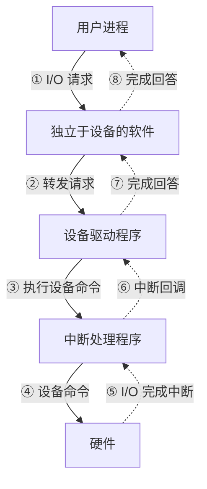

# 操作系统总复习提纲

> 20 页文字层完整提取（全文已直接整理在本页），第 20 页 I/O 层次图已 Read 转成 mermaid 内嵌（见本文末），原图已清理。
> 这是**考前总图**，按章节列考点条目，配合各章 `notes.md` 一起看。

---

## 第 1 页

**文字：**

```
第一章 OS概述
1、OS的定义与作用
2、OS的特征和功能
3、操作系统管理资源的主要技术
  复用、虚拟、抽象
4、用户接口
5、OS的内核结构
   单内核、微内核
6、OS的种类，
7、OS的发展简史，未来趋势
```

---

## 第 2 页

**文字：**

```
操作系统接口
n   联机命令接口
    n 联机命令
    n 终端处理程序

    n 命令解释程序

n   程序接口
    n 系统调用与一般过程调用的区别
    n 中断与陷入

n   图形用户接口
```

---

## 第 3 页

**文字：**

```
计算机系统层次结构
用户1    用户2     用户3     用户4          用户n
                              …


财务系统   航空订票   上网浏览     电子商务   …   科学计算
              (应用软件)
  编译程序 汇编程序     数据库    …     实用程序
              (支撑软件)

               操作系统
              (系统软件)

              计算机硬件
```

---

## 第 4 页

**文字：**

```
操作系统定义
           多道程序设计
                                OS的作用
           进程基本概念
                                 OS特征
           进程同步互斥
                              OS的主要功能
           进程间通信
                                 OS分类
            进程调度
                               OS结构设计
             死锁


              处理机管理         基本概念
   I/O系统
I/O控制方式
  缓冲技术                                      用户接口
I/O软件组成                操作      作业管理        作业基本概念
            设备管理                         批处理系统作业管理
 设备独立性                 系统      用户接口
  设备分配                                    分时系统作业管理
  驱动程序
 虚设备技术
  通道技术
  磁盘调度          文件管理        存储管理


            文件基本概念            程序的装入与链接
           文件的逻辑结构             存储管理任务
           文件的物理结构             动态分区分配
             文件目录               交换技术
            外存空间管理             页式存储管理
           文件共享与保护             段式存储管理
            数据一致性               段页式
                               虚拟存储技术
```

---

## 第 5 页

**文字：**

```
并发                   处理机管理
                 共享                   存储管理
                 虚拟                   设备管理
                 异步                   文件管理
                                      用户接口
    单内核                                                虚拟
    微内核                                                复用
                                                       抽象
                       OS特征         OS功能

          OS内核结构                           OS管理手段

                              操作系
          OS分类                统基本
                              概念             硬件运行环境

 批处理操作系统
  分时系统
 实时操作系统            操作系统定义           操作系统设计
                                                      CPU状态
个人计算机操作系统                                             系统堆栈
 网络操作系统                                               中断技术
 分布式操作系统              有效管理                             时钟
                      合理调度          操作系统设计目标
                                                       通道
                      使用方便          操作系统结构设计
                                                      地址映射
  吞吐量
                                                      存储保护
  时间片
  虚机器
```

---

## 第 6 页

**文字：**

```
第二章 处理器管理与调度
1、处理器的结构与组成
  ALU MCU 寄存器 指令集
2、处理机调度的基本概念和种类
 长期调度、中期调度、短期调度
3、选择调度算法的准则，周转时间，带权周转
 时间，响应时间
4、常见调度算法，抢占，响应比
  FIFO, 短作业优先、最高响应比、时间片轮
转、优先级、多级反馈队列
```

---

## 第 7 页

**文字：**

```
第二章 进程的基本概念
1、进程概念 ,和程序的区别与联系
2、进程的基本状态及状态转换的原因
3、进程的组成结构，PCB的作用
4、进程控制的原语操作
5、线程的概念，与进程的区别
6、线程的实现方式
  ULT KLT
```

---

## 第 8 页

**文字：**

```
第三章 进程同步、死锁
1、并发进程的表示：有向图、伪码。
2、并发进程常见错误及其原因
(1)结果不唯一、永远等待
(2)对于共享资源的使用过程不封闭
3、进程互斥、临界区原则
4、信号量及P/V操作，物理意义、解决同步互斥的方法
5、几种经典同步问题及其变型
   n 同步约束条件的分析，信号量的初值的设定

   n 单缓冲区的一个生产者一个消费者同步问题

   n 多缓冲区的多个生产者多个消费者同步问题

   n 多个生产者多个消费者多个缓冲区的同步问题

   n 阅读者、写入者问题

   n 哲学家就餐问题
```

---

## 第 9 页

**文字：**

```
6、管程的概念与应用
7、进程间通信的原理和实现方法
  管道、 信箱、缓冲、中断
```

---

## 第 10 页

**文字：**

```
死锁

1、死锁的基本概念
2、产生死锁的根本原因
  资源不足、 进程推进顺序不当
3、处理死锁的基本方法
4、死锁产生的原因，四个必要条件
 （1）静态资源分配法
 （2）有序资源使用法
5、死锁的预防，进程资源图
6、利用银行家算法避免死锁
7、死锁的检测与解除
```

---

## 第 11 页

**文字：**

```
进程
          顺序环境                        进程状态及转换
          并发环境                         进程控制块
        与时间有关的错误                       系统并发度
         不可再现性                         进程控制
                                       进程特性
                                       可重入程序


            多道程序设计                    进程基本概念


   进程同步互斥                      进程               死锁
                               管理


                进程间通信               进程调度

   进程同步
                                调度算法选择原则     死锁的有关结论
   进程互斥          共享内存             算法：       产生死锁的必要条件
    临界区          消息缓冲             先进先出        死锁预防
  进程同步机制      Send/Receive原语     时间片轮转        死锁避免
    信号量          管道通信            基于优先数       死锁检测解除
   P、V操作            信箱           高响应比优先       资源分配图
生产者与消费者问题
  读者写者问题                          抢占式
 哲学家进餐问题                         实时调度技术
```

---

## 第 12 页

**文字：**

```
第四章 存储管理
n 重定位的基本概念：为什么要引入
n 如何提高内存利用率：离散分配、对换机制、动态链

  接、虚拟存储器、存储器共享
n 动态分区分配方式：分配、回收算法

n 基本分页存储管理方式：为什么引入；地址变换机构
  和过程（含具有快表的情况）
n 基本分段存储管理方式：为什么引入；地址变换机构
  和过程（含具有快表的情况）；信息的共享和保护
n 虚拟存储器的基本概念：为什么要引入；特征；实现
  虚拟存储的关键技术
n 请求分页系统的基本原理：页表机制；地址变换过程；
  页面置换算法
```

---

## 第 13 页

**文字：**

```
方法 单一       分区式          页式          段式       段页式
功能  连续区      固定      可变 静态     动态
适用环   单道     多道           多道          多道       多道
境
虚拟空   一维     一维           一维          二维       二维
间
重定位   静态     静态      动态   动态          动态       动态
方式
分配方   静态连续   静态 动态连续区     静态或动态页      动态段为单位   动态分配页为
式     区                   为单位非连续      非连续      单位非连续

释放    执行完后   执行完后全 分区     执行   淘汰与执   淘汰与执行完   淘汰与执行
                          完后   行完后释
      全部释放   部释放   释放     释放   放
                                      后释放      完后释放
保护    越界保护   越界保护与保护键 越界保护与控          越界保护与控   越界保护与
                      制权保护            制权保护     控制权保护
内存扩   覆盖与交   覆盖与交换        覆盖   虚拟存    虚拟存储     虚拟存储
充     换                   交换   储
共享    不能     不能           较难          方便       方便
硬件支   保护用寄   保护用寄存器，重 地址变换机构，         段式地址变换机构， 段式地址变换机
                      中断机构，保护         保护与中断机构， 构，保护与中断
持     存器     定位机构                     动态连接机构    机构，动态连接
                          机构
                                                机构
```

---

## 第 14 页

**文字：**

```
典型问题
n 存储器管理的基本任务
n 动态重定位的概念、实现方式，什么情况下需要重定位

n 比较固定分区与可变分区

n 基于空闲分区链的内存分配与回收算法的应用实例：首次

  适应法，循环首次适应法，最佳适应法
n 在某分页系统中，给定内存容量和物理块大小，计算物理

  块的数量；对给定的进程页表，将给定的逻辑地址，计算
  出其对应的物理地址并画出地址变换流程图。
n 在某分段系统中对给定的进程段表，将给定的逻辑地址，

  计算出其对应的物理地址并画出地址变换流程图。
n 请求分页系统过程的各种问题，并用流程图的方式表示地
  址变换过程
n 对给定的问题，按各种页面置换算法，写页面调入过程，
  计算和分析缺页率，并对多种算法的性能作比较分析
```

---

## 第 15 页

**文字：**

```
高速缓存
                     内存管理分配回收
          内存
                       存储共享
          磁盘
                       存储保护
                       内存扩充
         系统区
                       地址映射
         用户区


         存储体系        存储管理任务

                                      装入与链接
                存储         其他         对换技术
                管理                    覆盖技术


     存储管理方案          虚拟存储管理


     段式存储管理
     页式存储管理
     段页式存储管理

                                 虚拟存储器
                                虚拟存储技术
用户程序划分                          程序局部性原理
 逻辑地址                           虚拟页式管理
内存空间划分                          虚拟段式管理
 内存分配                           页面淘汰算法
 管理考虑                           抖动（颠簸）
 硬件支持
地址映射过程
```

---

## 第 16 页

**文字：**

```
第五章设备管理
I/O 控制方式：四种I/O 方式的基本原理；四种I/O 方式由
  低到高效的演变
缓冲管理
n 缓冲的概念，为什么引入缓冲

n 单缓冲如何提高I/O 速度，它存在哪些不足，双缓冲、循
  环缓冲又如何提高CPU 与I/O 设备的并行性
n 缓冲池是为了解决什么问题而引入，引入缓冲池后系统将

  如何处理I/O 设备和CPU 间的数据输送
n 缓冲池的工作方式及Getbuf和Putbuf过程

设备独立性
n 什么是设备独立性

n 如何实现设备独立性

设备驱动程序
```

---

## 第 17 页

**文字：**

```
虚拟设备和SPOOLing 技术
n 什么是虚拟设备

n 什么是SPOOLing技术，SPOOLing系统的组成

n 如何利用SPOOLing技术实现共享打印机


磁盘调度
n 磁盘调度的目标

n 磁盘访问时间的计算

n FCFS、SSTF、SCAN、CSCAN 等算法的应用及这些调度算法
  的演变过程，分别解决了哪些问题；各算法的性能比较
```

---

## 第 18 页

**文字：**

```
典型问题
n 各种I/O 控制方式的比较
n 为什么引入缓冲区

n 缓冲如何提高I/O 速度

n 为什么引入设备独立性，如何实现

n 什么是虚拟设备，实现虚拟设备的关键技术

n SPOOLing技术的组成，如何利用SPOOLing 技术实现共享打
  印机
n 设备处理程序的功能和处理过程

n 对各种磁盘调度算法，计算访问次序和平均寻道时间，性

  能
n 磁盘访问时间的组成和计算
```

---

## 第 19 页

**文字：**

```
设备管理重要性
                          用户进程
          设备独立性
                         与设备无关软件
          设备分类
                         设备驱动程序
         设备管理任务
                         中断处理程序
         设备管理功能


             基本概念        I/O软件组成


缓冲技术                设备             设备驱动程序
                    管理


         虚设备技术       设备处理          磁盘存储管理


                                   磁盘访问时间
                                   磁盘调度
SPOOLing技术           设备管理             l先来先服务
 共享打印机              设备分配回收
                    独占设备分配           l最短寻道时间优先
                    共享设备分配           l扫描（电梯算法）
                                     lCSCAN
```

---

## 第 20 页 — I/O 软件的层次（复习重点）

第五章设备管理的总结图，把 I/O 软件分成五层（自上而下）：

1. **用户进程**（最上层）— 发起 I/O 请求
2. **独立于设备的软件**（设备无关层）— 提供统一接口、缓冲、命名、保护
3. **设备驱动程序** — 翻译为具体设备命令
4. **中断处理程序** — 处理设备完成时的中断信号
5. **硬件**（最下层）— 真正执行 I/O

图上左侧画"I/O 请求"箭头自上而下流（用户 → 硬件），右侧画"I/O 完成后的回答"箭头自下而上流（硬件 → 用户）。底部强调"系统的分量及各层的主要功能"。

**记忆点（考点）**：
- 五层从上到下、从抽象到具体
- "请求路径"和"回答路径"反向，每层各司其职
- 这是考"设备管理软件层次"题的标准答案模板

原 I/O 软件层次图已转 mermaid（双向流：上层发请求→下层逐层向下，硬件完成后→应答逐层向上）：



**记忆点**：实线 = 请求路径（自上而下），虚线 = 应答路径（自下而上）。每层各司其职，是考试"设备管理软件层次"题的标准答案模板。

---
